# The ultra-scale playbook

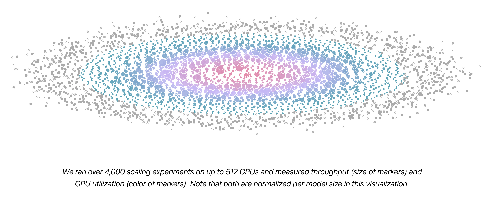

수천 개의 GPU가 완벽한 조화를 이루며 윙윙거린다. 오늘날 가장 강력한 AI 모델을 훈련하기 위해 필요한 것은 바로 그것이다 — 최근까지도 엘리트 연구소들만이 다룰 수 있던 컴퓨팅 파워의 교향곡이다. 오픈소스는 이 풍경을 변화시켰지만, 완전히 바꾸지는 못했다. 그렇다, 당신은 최신 Llama나 DeepSeek 모델을 다운로드할 수 있다. 그렇다, 그들의 기술 및 실험 보고서를 읽을 수도 있다. 그러나 가장 어려운 부분 — 이러한 거대한 시스템을 훈련하기 위해 GPU를 조율하는 데 필요한 훈련 코드, 지식, 그리고 기술들 — 은 여전히 복잡성에 싸여 있고, 서로 단절된 논문들과 종종 비공개된 코드베이스 속에 흩어져 있다.

이 오픈소스 책은 그 상황을 바꾸기 위해 존재한다. 기초부터 시작하여, 우리는 대규모 언어 모델(LLM)의 훈련을 단일 GPU에서 수십, 수백, 심지어 수천 개의 GPU로 확장하는 데 필요한 지식을 안내할 것이다. 이 과정에서 이론은 실제 코드 예제와 재현 가능한 벤치마크를 통해 설명할 것이다.

이러한 모델을 훈련하는 데 사용되는 클러스터의 크기가 커짐에 따라, 데이터 병렬화, 텐서 병렬화, 파이프라인 병렬화, 컨텍스트 병렬화, 그리고 ZeRO 및 커널 퓨전과 같은 다양한 기술들이 개발되었다. 이 기술들은 GPU가 항상 최대한으로 활용되도록 보장한다. 이것은 훈련 시간을 크게 단축시키며, 이 값비싼 하드웨어를 가장 효율적으로 활용할 수 있게 해준다. 이러한 분산 훈련 기술은 초기 모델을 구축할 때뿐만 아니라, 대규모 모델을 특수한 데이터에 맞춰 파인튜닝할 때에도 필수적인 기술로 자리잡았다. 이러한 파인튜닝은 종종 최고의 성능을 만들어낸다. 이 책에서는 가장 단순한 것부터 가장 정교한 것까지 이 모든 기술들을 점진적으로 다루며, 각 기법이 어디서 비롯되었는지 이해할 수 있도록 하나의 일관된 이야기 흐름을 유지할 것이다.

우리는 당신이 현재의 LLM 아키텍처에 대한 기본적인 지식을 가지고 있고, 딥러닝 모델이 어떻게 훈련되는지 대략적으로 알고 있다고 가정할 것이다. 하지만 분산 훈련에는 생소할 수도 있다. 필요하다면, DeepLearning.ai의 훌륭한 강의나 PyTorch 튜토리얼에서 모델 훈련의 기초에 대한 정보를 얻을 수 있다. 이 책은 이전에 우리가 작성한 프리트레이닝용 데이터 처리에 대한 블로그 글(소위 “FineWeb 블로그 포스트”)에 이은 삼부작의 두 번째 편으로 볼 수 있다. 두 글을 모두 읽으면, 오늘날 고성능 LLM이 어떻게 구축되고 있는지를 완전히 이해하는 데 필요한 핵심 지식의 거의 전부를 갖추게 될 것이다. 다만, 그 레시피를 완성하는 데 필요한 비장의 소스 — 데이터 혼합과 아키텍처 선택에 관한 부분 — 만이 빠져 있을 것이다 (삼부작의 마지막 편을 기대하라…).

책은 다음 세 가지 일반적인 기반 위에 구성되어 있다.

1. **이론과 개념에 대한 간단한 소개**: 코드와 실험으로 들어가기 전에, 각 기법이 어떤 방식으로 작동하는지, 그리고 그 장점과 한계가 무엇인지 높은 수준에서 이해하길 바란다. 예를 들어, 언어 모델의 어떤 부분이 메모리를 소모하는지, 그리고 그것이 훈련 중 언제 발생하는지를 배우게 될 것이다. 또한, 모델을 병렬화하여 메모리 제약을 회피하고 GPU를 확장함으로써 throughput을 높이는 방법도 배우게 될 것이다. 그 결과, Transformer 모델의 메모리 사용 구조를 계산하는 아래 위젯이 어떻게 작동하는지도 이해할 수 있을 것이다.

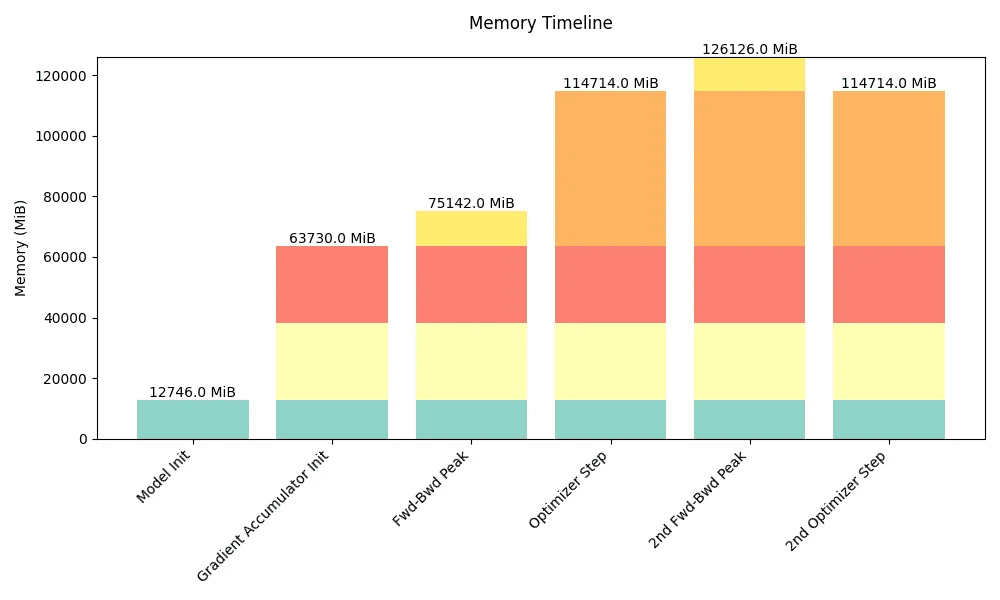

1. **명확한 코드 구현**: 이론은 하나의 출발점일 뿐이며, 실제로 무언가를 구현할 때 수많은 예외 상황과 중요한 세부사항들이 드러난다. 그래서 가능한 경우 구현 레퍼런스를 함께 제공한다. 상황에 따라 다음 두 가지 코드 레퍼런스를 사용한다:

- Picotron 저장소는 교육을 목적으로 구축되었기 때문에, 개념을 일반적으로 단일의 독립적이고 짧은 파일들로 구현한다.
- 반면, 실제 서비스에 적합한 코드를 살펴보고자 할 때는 Nanotron 구현을 참고한다. 이 구현은 Hugging Face에서 사용하는 실제 훈련 코드베이스이다.

1. **실제 훈련 효율 벤치마크**: LLM 훈련을 실제로 어떻게 확장할지는 사용 중인 인프라(칩 종류, 인터커넥트 등)에 따라 달라지므로, 단일한 보편적 레시피를 제공할 수는 없다. 대신, 다양한 설정들을 벤치마킹하는 방법을 제공한다. 이것이 우리가 자체 클러스터에서 수행한 것이다. 우리는 512개의 GPU까지 활용하여 4,100회 이상의 분산 실험(테스트 러닝 포함 총 16,000회 이상)을 수행하며 가능한 분산 훈련 구조와 모델 크기들을 폭넓게 탐색했다.

보시다시피, 다루어야 할 내용이 매우 많다. 본격적인 분산 훈련의 현장으로 들어가기 전에, 이 책에서 다룰 도전 과제들을 간단히 고찰해보자.

## 고수준 개요

이 책에서 다루는 모든 기법들은 다음 세 가지 핵심 도전 과제 중 하나 또는 그 이상을 해결하는 것을 목표로 한다. 이들은 책 전반에서 반복해서 마주치게 될 것이다:

1. **메모리 사용량**: 이는 절대적인 제약이다 — 훈련 스텝이 메모리에 적재되지 않으면 훈련을 진행할 수 없다.
2. **연산 효율성**: 우리는 하드웨어가 대부분의 시간을 계산에 사용하길 원한다. 따라서 데이터 전송이나 다른 GPU의 작업을 기다리는 데 소요되는 시간을 줄여야 한다.
3. **통신 오버헤드**: 통신 오버헤드는 GPU를 유휴(idle) 상태로 만들기 때문에 최소화해야 한다. 이를 위해 노드 내부(빠른)와 노드 간(느린) 대역폭을 최대한 활용하고, 통신(communication)과 계산(compute)을 최대한 겹치게 하려고 노력할 것이다.

여러 상황에서, 우리는 이들 세 요소(계산, 통신, 메모리) 중 하나를 다른 것과 맞바꾸는 전략을 사용할 수 있다 (예: 재계산이나 텐서 병렬화). 올바른 균형을 찾는 것이 훈련 확장의 핵심이다.

이 책에서 많은 내용을 다루는 만큼, 전체 구조를 파악하고 주요 개념을 빠르게 정리할 수 있도록 치트시트를 준비했다. 이 치트시트를 항상 곁에 두고 험난한 여정을 항해하라!


## 첫걸음: 단일 GPU에서의 훈련

모델 훈련을 다수의 GPU로 확장하기 전에, 아주 기본적인 훈련 과정을 빠르게 복습해보자. 모델이 단일 GPU에서 훈련될 때, 훈련은 일반적으로 세 단계로 구성된다:

- 입력을 모델에 통과시켜 출력을 생성하는 순전파
- 그래디언트를 계산하는 역전파
- 그래디언트를 사용하여 파라미터를 갱신하는 최적화 단계

전체 흐름은 대략 다음과 같다:

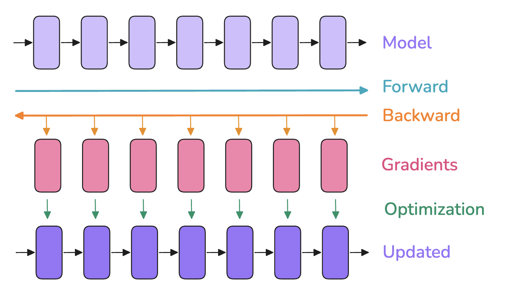

이 그림에서, 첫 번째 줄의 상자는 모델 내의 연속된 층들을 나타내며(마지막 줄도 마찬가지다), 분홍색 상자는 역전파 동안 계산된 각 층에 해당하는 그래디언트이다.

**배치 사이즈(bs)**는 모델 훈련에서 중요한 하이퍼파라미터 중 하나로, 모델의 수렴과 throughput에 모두 영향을 미친다.

작은 배치 사이즈는 훈련 초기에 최적 학습 지점에 빠르게 도달하는 데 유리할 수 있다. 하지만 훈련이 진행됨에 따라 작은 배치 사이즈는 그래디언트를 계속 불안정하게 만들고, 모델이 최적의 성능으로 수렴하지 못할 수도 있다. 반대로, 아주 큰 배치 사이즈는 매우 정확한 그래디언트를 계산해주지만, 각 훈련 토큰을 덜 효과적으로 활용하게 되어 수렴이 느려지고, 계산 자원이 낭비될 수 있다. 이 주제에 대한 초기 논의는 OpenAI의 대용량 배치 훈련 논문이나 MiniMax-01 기술 보고서의 4.2절에서 확인할 수 있다.

(예를 들어, DeepSeek-V3/R1 훈련에서는 훈련 초반 4690억 개의 토큰에 대해 배치 사이즈를 3,072 입력 시퀀스에서 15,360까지 점진적으로 증가시켰고, 이후 남은 훈련 동안에는 15,360 입력 시퀀스를 유지하였다.)

배치 사이즈는 주어진 텍스트 데이터셋을 훈련하는 데 걸리는 시간에도 영향을 준다: 작은 배치 사이즈는 같은 샘플 수에 대해 더 많은 옵티마이저 스텝을 요구하고, 옵티마이저 스텝은 계산 시간 측면에서 비용이 크기 때문에 전체 훈련 시간이 더 길어진다. 그렇긴 해도, 배치 사이즈는 최적 배치 사이즈를 중심으로 어느 정도 폭넓게 조정해도 모델 성능에 큰 영향을 주지 않는 경우가 많다. 즉, 최종 모델 성능은 보통 배치 사이즈의 정확한 값에 대해 민감도가 낮다.

LLM 프리트레이닝 커뮤니티에서는 배치 사이즈를 샘플 수가 아니라 토큰 수 단위로 보고하는 것이 일반적이다 (bst = batch size tokens). 이렇게 하면 훈련 지표가 입력 시퀀스 길이에 영향을 받지 않게 된다.

단일 머신에서 훈련하는 가장 단순한 경우, 샘플 단위 배치 사이즈(bs)와 토큰 단위 배치 사이즈(bst)는 모델 입력 시퀀스 길이(seq)를 사용하여 다음과 같이 계산할 수 있다:

$bst = bs ∗ seq$
이후로는 편의상 배치 사이즈를 샘플 기준으로 표기하지만, 시퀀스 길이를 곱하면 토큰 기준으로 환산할 수 있다.

최근 LLM 훈련의 적정 배치 사이즈는 대체로 배치당 4~60M 토큰 범위에 해당한다. 배치 사이즈와 훈련 말뭉치 크기는 해마다 꾸준히 증가해왔다: Llama 1은 약 1.4T 개 토큰을 ~4M 토큰 배치 사이즈로 훈련했고, DeepSeek은 약 14T 개 토큰을 ~60M 토큰 배치 사이즈로 훈련했다.

이렇게 대규모 배치 사이즈로 모델 훈련을 확장하면 처음 맞닥뜨리게 되는 도전 과제는 바로 **메모리 부족(OOM) 문제**이다. 목표 배치 사이즈의 전체 배치를 GPU 메모리에 담을 수 없을 때 우리는 무엇을 해야 할까?

먼저 OOM 문제가 발생하는 원인을 살펴보자. 이것은 모델 훈련 시 메모리 요구사항에 대한 직관을 얻는 데 도움이 될 것이다.

### 트랜스포머의 메모리 사용

신경망 모델을 훈련할 때, 우리는 다음과 같은 항목들을 메모리에 저장한다:

- 모델 가중치
- 모델 그래디언트
- 옵티마이저 상태
- 그래디언트를 계산하는 데 필요한 액티베이션(activation)

> 📝 참고
>
> 모델의 메모리 요구량을 정확히 계산할 수 있을 것 같지만, 실제로는 몇 가지 추가적인 메모리 사용 요인이 있어서 정확하게 계산하기가 어렵다:
>
> - CUDA 커널은 일반적으로 1~2GB의 GPU 메모리를 요구한다. 이것은 `import torch; torch.ones((1, 1)).to("cuda")` 실행 후 `nvidia-smi`로 확인해볼 수 있다.
> - 중간 버퍼와 중간 결과값도 메모리를 차지하며, 일부 메모리는 단편화로 인해 사용 불가능해진다.
>
> 이 두 항목은 일반적으로 작고 일정한 요소이므로 여기서는 무시한다.

이 항목들은 모두 텐서로 저장되며, 텐서는 다양한 shape와 precision(정밀도)을 가진다. 형태는 배치 사이즈, 시퀀스 길이, 모델의 히든 차원, 어텐션 헤드 수, vocabulary 크기, 그리고 이후에 다룰 모델 샤딩 여부와 같은 하이퍼파라미터에 의해 결정된다. 정밀도는 FP32, BF16, FP8 같은 형식을 말하며, 각각 하나의 값을 저장하는 데 4바이트, 2바이트, 1바이트를 요구한다. 다양한 정밀도에 따른 트레이드오프는 “혼합 정밀도 훈련” 섹션에서 자세히 다룰 예정이지만, 여기서는 정밀도에 따라 메모리 요구량이 달라진다는 점만 기억하자.

그렇다면 이러한 변수들을 통해 메모리 사용량을 빠르게 판단할 수 있는 방법은 무엇일까? 간단한 방법은 직접 측정하는 것이다.

**메모리 사용량 프로파일링**

PyTorch 프로파일러를 사용하면 훈련 동안 메모리가 어떻게 할당되는지 파악할 수 있다. 메모리 사용은 고정된 값이 아니라 훈련 중, 그리고 각 훈련 스텝 안에서 크게 변동된다:

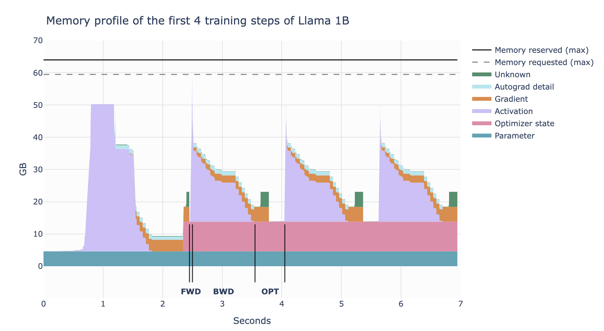

첫 번째 스텝은 이후의 스텝들과 확연히 다르게 보이는데, 그 전에 일반적인 훈련 스텝의 구성부터 살펴보자. 먼저 순전파를 진행하면서 액티베이션이 급격히 증가하고, 역전파 중에는 그래디언트가 점점 누적되며, 역전파가 전파되면서 그래디언트 계산에 사용되었던 액티베이션이 점진적으로 제거된다. 마지막으로 최적화 단계에서 모든 그래디언트를 사용하여 옵티마이저 상태를 갱신한 후 다음 순전파를 시작하게 된다.

앞서 언급했듯이, 첫 번째 스텝은 다른 스텝들과 다르다: 액티베이션이 급격히 증가한 뒤 일정하게 유지된다. 왜 그럴까? 첫 스텝에서는 PyTorch의 캐시 할당기가 메모리 블록을 미리 할당하여 이후 스텝에서 메모리 탐색이 필요 없도록 준비 작업을 수행하기 때문이다 (자세한 내용은 Zach의 블로그 참고). 첫 스텝 이후에는 옵티마이저 상태가 메모리에 나타나며, 이것이 이후 스텝들의 메모리 사용량을 추가로 증가시키게 된다.

(가끔 첫 번째 스텝은 잘 되는데, 그 이후 스텝에서 OOM이 발생하는 현상을 본 적이 있는가? 이는 첫 번째 스텝 이후 옵티마이저 상태가 누적되면서 발생하는 현상이다.)

이제 메모리에 대한 개요를 얻었으니, 훈련 확장은 결국 계산 효율을 극대화하는 동시에 액티베이션, 파라미터, 그래디언트, 옵티마이저 상태의 메모리 요구량을 GPU 메모리 제약 내에 유지하는 싸움이라는 점을 이해할 수 있다.

**가중치, 그래디언트, 옵티마이저 상태에 필요한 메모리**

앞서 나열한 항목 중 처음 세 가지, 즉 모델의 가중치, 그래디언트, 옵티마이저 상태부터 살펴보자. 이들에 필요한 메모리는 비교적 쉽게 추정할 수 있다.

간단한 트랜스포머 LLM의 경우, 전체 파라미터 수는 다음과 같은 공식으로 계산된다:

$N = h ∗ v + L ∗ \left( 12∗ h^2 + 13∗ h \right) + 2h$

여기서 고정된 포지셔널 임베딩은 사용하지 않으므로 제외하였다.

이 공식에서 h는 히든 차원 수, v는 vocabulary 크기, L은 모델의 층 수를 의미한다. 이 식을 보면, 히든 차원이 커질수록 지배적인 항은 h²라는 점을 알 수 있다. h² 항만이 파라미터 수가 커질수록 이차적으로 증가하기 때문이다.

파라미터 및 그래디언트에 대한 메모리 요구량은 단순히 파라미터 수에 파라미터당 바이트 수를 곱하면 된다. 전통적인 정밀도(FP32) 훈련에서는 파라미터와 그래디언트 각각에 4바이트가 필요하다. Adam 옵티마이저를 사용하는 경우, 모멘텀과 분산값도 저장해야 하므로 옵티마이저 상태에는 파라미터당 추가로 8바이트(4바이트씩 두 개)가 필요하다. 요약하면 다음과 같다:

$m_{\text{params}} = 4∗N$

$m_{\text{grad}} = 4∗N$

$m_{\text{opt}} = (4 + 4)∗N = 8N$

이제 정밀도를 낮췄을 때 메모리 사용이 어떻게 바뀌는지 살펴보자. 안정성 문제 때문에 (이 책의 “혼합 정밀도 훈련” 섹션에서 다룰 예정) 우리는 보통 완전 저정밀도 훈련보다는 고정밀도와 저정밀도를 혼합한 "혼합 정밀도(mixed precision)" 방식을 사용한다. 현재는 대부분 BF16을 기본으로 사용하는데, 이는 파라미터 및 그래디언트 각각에 2바이트를 요구한다. 동시에 FP32로 된 가중치와 그래디언트의 복사본을 따로 저장하여 총 12바이트가 필요하다. 여기에 옵티마이저 상태도 저장해야 하며, Adam 옵티마이저의 경우 모멘텀과 분산값을 FP32로 저장하므로 각각 4바이트씩 필요하다.

요약하면 다음과 같다:

- $m_{\text{params}} = 2∗N$
- $m_{\text{grad}} = 2∗N$
- $m_{\text{params\_fp32}} = 4∗N$
- $m_{\text{opt}} = (4 + 4)∗N = 8N$

> 📝 참고
>
> 일부 라이브러리에서는 그래디언트를 FP32로 저장하기 때문에 추가적으로 $m_{\text{grad\_fp32}} = 4N$ 만큼의 메모리가 필요하다. 예를 들어 Nanotron은 작은 값에 대해 BF16이 손실이 많기 때문에 안정성을 우선시하여 FP32 그래디언트를 저장한다. 자세한 내용은 [DeepSpeed 관련 이슈](https://github.com/microsoft/DeepSpeed/issues/1773)를 참고하라.

> 📝 참고
>
> 문헌이나 코드베이스에서는 FP32 형식의 가중치 복사본(m_params_fp32)을 "마스터 웨이트(master weights)"라고 부르기도 한다.

흥미로운 점은, 혼합 정밀도 훈련은 실제로 메모리를 절약하지 않는다는 것이다. 단지 메모리 사용이 세 가지 항목(가중치, 그래디언트, 옵티마이저 상태)에 서로 다르게 분배될 뿐이며, 만약 그래디언트를 FP32로 누적한다면 전체적으로 FP32 훈련보다 4바이트 더 요구된다. 그럼에도 여전히 혼합 정밀도가 유리한 이유는 두 가지다: (1) 순전파/역전파를 저정밀도로 계산하면 GPU의 최적화된 저정밀 연산을 사용할 수 있어 속도가 빨라지고, (2) 순전파 중 액티베이션 메모리 요구량이 줄어들어 메모리 부담이 완화되기 때문이다.

다음은 모델 크기별 메모리 요구량을 FP32 또는 BF16 기준으로 정리한 표이다 (그래디언트를 FP32로 누적할 경우 포함):

| 모델 파라미터 수 | FP32 또는 BF16 (FP32 그래디언트 없음) | BF16 + FP32 그래디언트 누적 |
| ---------------- | ------------------------------------- | --------------------------- |
| 1B               | 16 GB                                 | 20 GB                       |
| 7B               | 112 GB                                | 140 GB                      |
| 70B              | 1120 GB                               | 1400 GB                     |
| 405B             | 6480 GB                               | 8100 GB                     |

(BF16 대신 FP8 훈련을 사용하면 메모리 사용을 더 줄일 수 있지만, 안정성이 낮아진다. 이는 현재 활발히 연구 중인 주제로, 이후에 자세히 다룰 예정이다.)

위에서 보듯이, **7B(!)** 파라미터만 되어도 가중치, 그래디언트, 옵티마이저 상태의 메모리 요구량이 상당히 커지고, 일반적인 GPU 메모리 용량(예: H100의 80GB)을 초과하기 시작한다.

하지만 지금은 아직 단일 GPU에 들어갈 수 있는 모델만 다룬다고 가정하자. 다음으로, 메모리 사용량에서 큰 비중을 차지하는 마지막 항목인 액티베이션을 살펴보자.

**액티베이션에 필요한 메모리**

액티베이션에 필요한 메모리는 가중치, 그래디언트, 옵티마이저 상태보다 계산이 조금 더 복잡하다. 그 이유는 액티베이션 메모리 요구량이 모델의 입력값에 의존하기 때문이다. 역전파 시 왜 액티베이션을 저장해야 하는지 잘 모르겠다면, [이 블로그 포스트](https://www.determined.ai/blog/act-mem-2)에서 간단히 복습할 수 있다. 역전파가 어떻게 계산되는지를 자세히 검토한 후, 혼합 정밀도에서 액티베이션에 필요한 총 메모리를 다음 공식으로 추정할 수 있다:

$m_{\text{act}} = L \cdot \text{seq} \cdot \text{bs} \cdot h \cdot \left( 34 + \frac{5 \cdot n_{\text{heads}} \cdot \text{seq}}{h} \right)$

여기서 L은 레이어 수, seq는 시퀀스 길이, bs는 샘플 기준 배치 사이즈, h는 히든 차원, n_heads는 어텐션 헤드 수이다.

이 숫자의 정확한 유도 과정을 알고 싶다면 NVIDIA의 recomputation 논문을 참고하면 된다. 이는 트랜스포머 층 내 각 연산 사이에 생성되는 중간 액티베이션의 크기를 모두 계산하는 것이다.

여기서 주목할 만한 점은, 메모리 사용량이 모델의 특정 구조에 대해 고정된 값이 아니라는 것이다. 오히려 배치 사이즈에는 선형적으로, 시퀀스 길이에는 이차적으로 증가한다. 즉, 배치 사이즈나 시퀀스 길이를 늘리면 액티베이션 메모리가 폭증한다. 이 공식을 사용하여, 예를 들어 Llama 모델(bs=1)의 다양한 시퀀스 길이에 따른 메모리 사용량 변화를 살펴볼 수 있다.

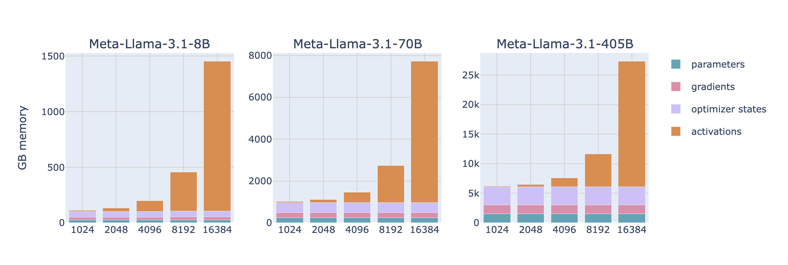

이 그래프들은 명확한 사실을 보여준다: 시퀀스 길이가 짧거나 배치 사이즈가 작은 경우, 액티베이션에 의한 메모리 사용은 거의 무시할 수준이지만, 약 2~4천 토큰 정도부터는 액티베이션이 상당한 메모리를 차지하기 시작한다. 반면, 파라미터, 그래디언트, 옵티마이저 상태에 의한 메모리 사용은 시퀀스 길이나 배치 사이즈에 거의 영향을 받지 않는다 (이 부분은 이후에 다룬다).

입력 토큰 수가 많은 경우(즉, 배치 사이즈 또는 시퀀스 길이가 큰 경우), 액티베이션은 단연코 가장 큰 메모리 부담 요인이 된다.

그렇다면 이 “액티베이션 폭증”을 억제할 방법은 없을까? 좋은 질문이다, 독자여!

이제 우리가 소개할 첫 번째 기법, **액티베이션 재계산(activation recomputation)** 이 등장할 차례다. 이 기법은 액티베이션 메모리 사용량을 제한하는 데 도움을 주며, 오늘날의 대규모 모델 훈련에서 필수 도구다.

### 액티베이션 재계산

액티베이션 재계산(activation recomputation)은 **그래디언트 체크포인팅(gradient checkpointing)** 또는 **리머터리얼라이제이션(rematerialization)** 이라고도 불리며, 기본 아이디어는 다음과 같다: 순전파 동안 일부 액티베이션을 버림으로써 메모리를 절약하고, 역전파 시 해당 액티베이션을 즉석에서 재계산하여 다시 만들어낸다는 것이다. 재계산을 사용하지 않으면, 우리는 모든 학습 가능한 연산 사이의 히든 상태(예: 피드포워드, LayerNorm 등)를 저장해 두었다가 역전파 시 그래디언트를 계산하는 데 사용한다. 반면, 재계산을 사용할 경우에는 모델 아키텍처 내의 몇몇 핵심 지점에서만 액티베이션을 저장하고, 나머지는 저장하지 않고 필요할 때 재계산한다. 요약하자면, 메모리를 절약하는 대신 일부 순전파를 다시 수행하는 셈이다.

전형적인 구조는 다음과 같다:


어떤 액티베이션을 저장할지 선택하는 전략은 다음과 같다:

- **Full:** 트랜스포머 모델의 각 층 사이 경계 지점마다 액티베이션을 저장하는 전략이다. 이 방식은 역전파 시 각 층을 다시 순전파하는 것을 의미하므로, 계산 비용이 가장 높지만 메모리는 가장 많이 절약된다. 보통 계산 시간 및 연산량이 30~40% 증가하며, 이 차이는 매우 뚜렷하다.
- **Selective:** Full보다 더 나은 전략이 존재한다. recomputation 논문의 저자들은 어떤 액티베이션이 가장 큰 메모리를 차지하면서도 재계산 비용(FLOPS)이 낮은지를 분석하였다. 그 결과, attention 연산이 이 범주에 해당하며, 이를 저장하지 않고 계산 비용이 큰 feedforward 연산 쪽을 저장하는 것이 효율적임을 밝혔다. GPT-3 (175B) 모델에서는 이를 통해 **액티베이션 메모리를 70% 절약하면서도 계산 비용은 2.7%만 증가하였다.**

(최신 모델인 DeepSeek-V3 등에서는 attention 액티베이션도 더 작게 저장하며, “Multi-Head Latent Attention (MLA)” 같은 방식을 사용하여 메모리 사용을 최적화한다.)

재계산 전략이 실제로 메모리 사용량을 얼마나 줄일 수 있는지, 선택적 재계산이 메모리 절약과 계산 비용 사이에서 얼마나 좋은 균형을 이루는지를 살펴보자:

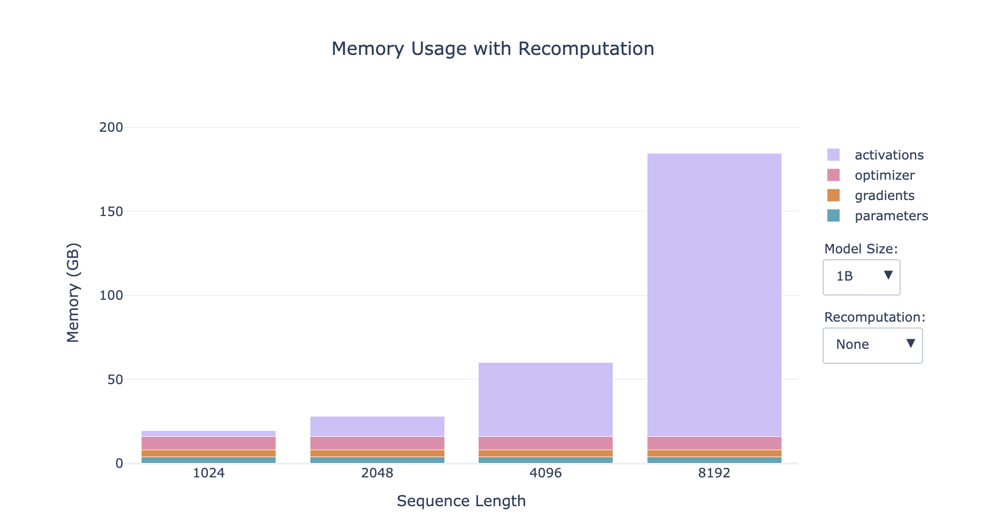

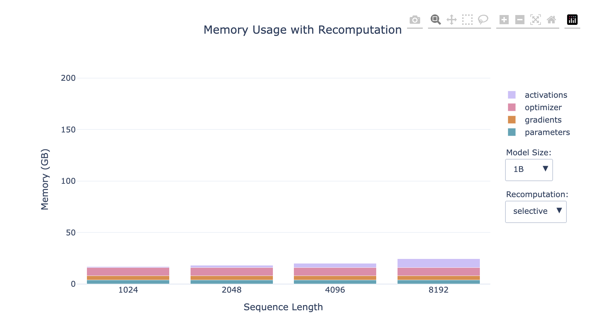

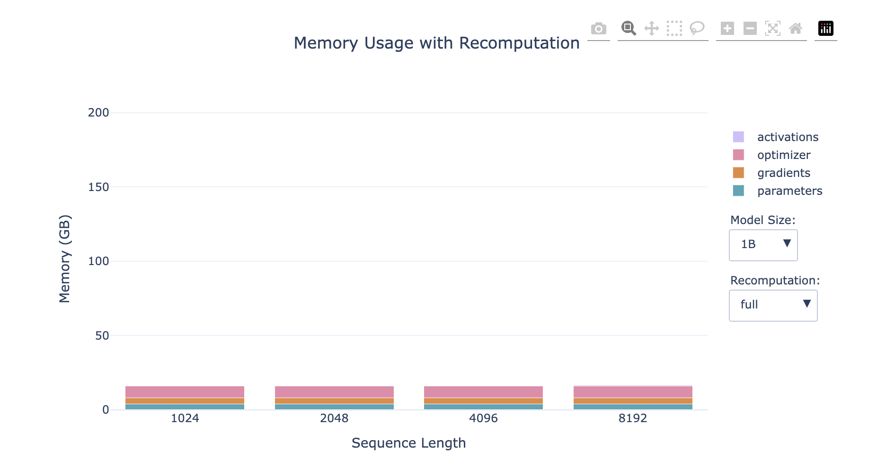

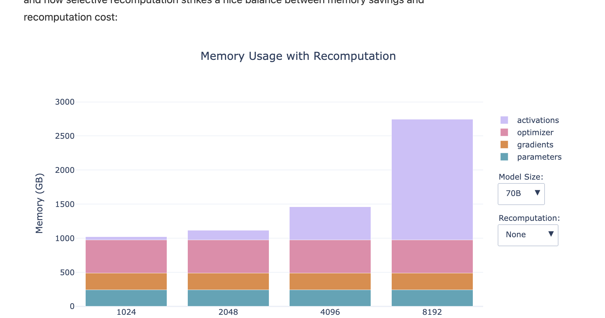

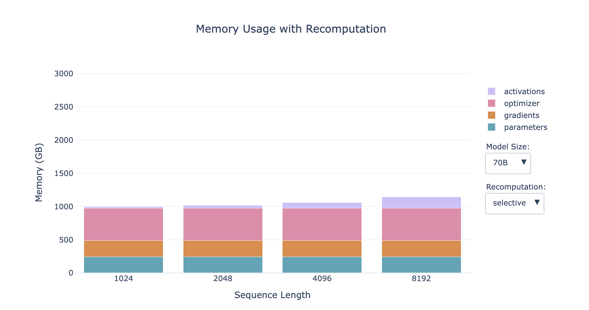

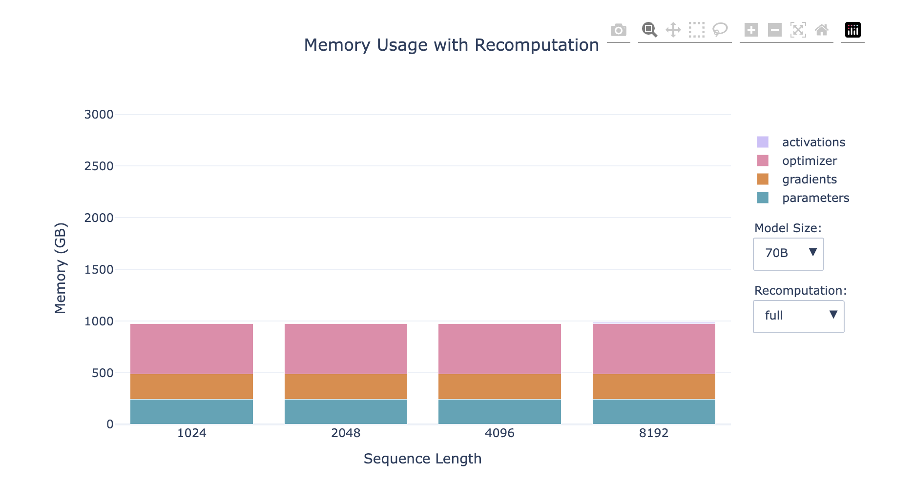

또한 눈에 띄는 경향은, 작은 모델일수록 긴 시퀀스에서 액티베이션이 차지하는 비중이 커지므로, 재계산 효과가 더욱 극적으로 나타난다는 점이다.

> 📝 참고
>
> 훈련 설정이 GPU, TPU, 혹은 기타 가속기를 얼마나 효율적으로 사용하는지를 측정할 때는, 재계산(recomputation) 을 고려하여 총 FLOPs(부동소수점 연산 횟수) 를 계산하고, 이를 GPU/TPU/가속기의 이론적인 최대 FLOPS(Floating Point Operations Per Second) 와 비교하는 것이 일반적이다. 훈련 스텝에서 FLOPs를 계산할 때 재계산을 포함시키면, 이는 하드웨어 FLOPs(hardware FLOPs) 라 불리며, 이는 가속기에서 실제로 수행된 연산 수를 의미한다. 이 하드웨어 FLOPs 값을 훈련 스텝에 걸린 시간(초)으로 나누면, 실제로 달성된 FLOPS 를 얻게 된다. 그리고 이 달성된 FLOPS 값을 해당 가속기의 이론적인 최대 FLOPS 로 나누면, **하드웨어 FLOPs 활용률(Hardware FLOPs Utilization, HFU)** 이 산출된다.
>
> 그러나 결국 가장 중요한 것은, 주어진 데이터셋에 대해 모델을 훈련하는 데 총 얼마나 시간이 걸리는가이다. 예를 들어, 여러 GPU/TPU/가속기를 비교할 때, 만약 어떤 가속기가 충분한 메모리를 제공하여 재계산 없이 훈련할 수 있고, 결과적으로 더 적은 총 연산량(더 낮은 hardware FLOPs)으로도 더 빠르게 훈련을 완료할 수 있다면, 이 경우에는 불이익을 받아서는 안 되며 오히려 장점으로 간주되어야 한다. 따라서 이와 같은 상황을 더 공정하게 반영하기 위해 **모델 FLOPs 활용률(Model FLOPs Utilization, MFU)** 이라는 대안적 지표가 존재한다. MFU는 HFU와는 달리, 모델의 순전파(forward pass)와 역전파(backward pass)를 수행하는 데 필요한 이론적인 연산량만 고려하며, 재계산에 의한 추가 FLOPs는 포함하지 않는다. 따라서 MFU는 훈련 구현 방식보다는 모델 자체의 구조와 특성에 더 특화된 지표라고 할 수 있다.

요즘 대부분의 훈련 프레임워크는 FlashAttention을 사용하며, 이는 attention 점수와 행렬을 역전파 시에 재계산함으로써 액티베이션 재계산을 기본적으로 포함한다. 따라서 FlashAttention을 사용하는 대부분의 사용자들은 이미 선택적 재계산 전략을 활용하고 있는 셈이다.

이제 알게 되었듯, 액티베이션 재계산은 FLOPs 수를 약간 증가시키지만, 메모리 접근에 따른 오버헤드는 크게 줄여준다.

이러한 절충은 고속 메모리가 제한된 하드웨어(GPU 등)에서 특히 유리하다. 왜냐하면 메모리 접근은 일반적으로 계산보다 느리기 때문이다. 추가적인 연산이 있음에도 불구하고, 전체적으로는 더 빠른 연산 성능과 훨씬 낮은 메모리 사용량이라는 효과를 얻을 수 있다.

재계산 기법을 통해 우리는 앞서 그래프에서 확인한 액티베이션 메모리 사용량 문제를 해결할 수 있다!

다만, 액티베이션은 여전히 배치 사이즈에 선형적으로 비례하며, 앞서의 바 그래프들은 모두 $bs=1$ 인 경우만을 다뤘기 때문에, 앞으로 배치 사이즈를 더 늘리면 다시 문제가 될 수 있다. 다행히도, 다음으로 소개할 두 번째 도구가 있다 — **그래디언트 누적(gradient accumulation)** 이 우리를 도와줄 것이다!

### 그래디언트 누적 (**gradient accumulation)**

그래디언트 누적(gradient accumulation)은 메모리 폭증을 피하기 위한 매우 직관적인 방법으로, 하나의 배치를 여러 개의 마이크로 배치(micro-batch) 로 나누는 것에서 출발한다. 이후 각 마이크로 배치에 대해 순전파와 역전파를 연속적으로 수행하고, 그래디언트를 계산한 뒤, 이름 그대로 이 그래디언트들을 누적한 후 최적화(옵티마이저)를 수행한다. 실제로는 그래디언트의 합계가 아니라 평균값으로 최적화를 수행하기 때문에, 결과는 그래디언트 누적 스텝 수에 의존하지 않게 된다.

각 순전파에서 사용되는 배치 사이즈를 마이크로 배치 사이즈(micro-batch size, $mbs)$라고 부르고, 최적화 단계 사이에 전체적으로 처리되는 배치 사이즈를 글로벌 배치 사이즈(global batch size, $gbs$)라고 하자. 예를 들어, 순전파/역전파를 8번 수행한 뒤 최적화 1회를 실행한다면, 글로벌 배치 사이즈는 마이크로 배치 사이즈의 8배가 된다.

지금까지 단순히 "배치 사이즈"라고 불렀던 것은, 사실상 이 "글로벌 배치 사이즈"를 의미한다. 이제부터는 용어를 더 정밀하게 정의함으로써 혼동을 피하려고 한다.

그래디언트 누적을 사용하는 경우, 글로벌 배치 사이즈는 다음과 같이 계산된다:

$bs=gbs=mbs×grad_{acc}$

그래디언트 누적을 통해 우리는 메모리 사용량을 고정한 상태로 사실상 무한대까지 배치 사이즈를 확장할 수 있다. 이 기법은 또한 액티베이션 재계산과 병행하여 사용할 수 있어, 추가적인 메모리 절약이 가능하다.


(그래디언트 누적을 사용하면, 훈련 스텝 동안 누적된 그래디언트를 저장하기 위한 버퍼가 필요해진다. 반면 그래디언트 누적을 사용하지 않을 경우에는, 역전파 중에 액티베이션을 제거하면서 동시에 그래디언트를 계산하므로 피크 메모리 사용량이 더 낮아진다.)

그래디언트 누적은 배치 사이즈에 선형적으로 비례하는 액티베이션 메모리 사용량을 줄이기 위해, 더 작은 마이크로 배치를 순차적으로 처리함으로써 전체 액티베이션과 그래디언트 저장량을 감소시킨다. 이 방식에서는 한 번에 하나의 마이크로 배치에 대한 액티베이션만 메모리에 보관하면 되기 때문에 전체 메모리 부담을 줄일 수 있다.

하지만 단점도 있다. 그래디언트 누적은 하나의 최적화 스텝마다 여러 번의 순전파/역전파를 필요로 하므로, 계산량이 늘어나고 훈련 속도가 느려질 수 있다. 이 세상에 공짜는 없다!

하지만 지금까지 내용을 주의 깊게 따라왔다면, 아마 눈치챘을 것이다. 각 마이크로 배치에 대한 순전파/역전파는 서로 독립적이기 때문에 병렬로 실행 가능하다. 순전파/역전파는 입력 샘플만 다를 뿐 서로 영향을 주지 않기 때문이다.

이제 우리는 훈련을 단일 GPU에서 여러 GPU로 확장할 준비가 되었다는 뜻이다!

그에 앞서, 훈련 중 계산과 통신이 어떻게 이루어지는지 시각화하는 방법을 간단히 살펴보자. 분산 훈련 도구 상자 중 가장 유용한 도구 중 하나인 **프로파일러(profiler)** 를 소개할 차례다. 이 도구는 GPU 간 통신과 계산이 실제로 어떻게 수행되고 있는지, 그리고 병목이 어디에 있는지를 이해하고 검증하는 데 매우 유용하다.

**GPU 연산 및 통신 프로파일링**

PyTorch의 프로파일러(profiler) 는 훈련 중 CPU와 GPU에서 실제로 어떤 일이 일어나는지를 정밀하게 추적하고 시각화할 수 있도록 해준다. 이 기능은 PyTorch에 기본 통합되어 있으며, 사용법도 비교적 간단하다. 다음은 사용 예시이다:

```python
with torch.profiler.profile(
    activities=[
        torch.profiler.ProfilerActivity.CPU,
        torch.profiler.ProfilerActivity.CUDA,
    ],
    schedule=torch.profiler.schedule(wait=1, warmup=1, active=3),
    on_trace_ready=torch.profiler.tensorboard_trace_handler('./log/profile'),
    with_stack=True
) as prof:
    for step in range(steps):
        train_step()
        prof.step()
```

이 코드는 TensorBoard 또는 Chrome의 trace viewer 에서 확인 가능한 trace log 를 생성한다. 이 trace에서는 다음과 같은 내용을 확인할 수 있다:

- CPU 쓰레드가 GPU에서 실행될 커널을 비동기적으로 실행하는 과정
- 여러 개의 CUDA 스트림이 연산과 통신을 병렬로 수행하는 모습
- 각 커널의 실행 시간과 메모리 할당 정보

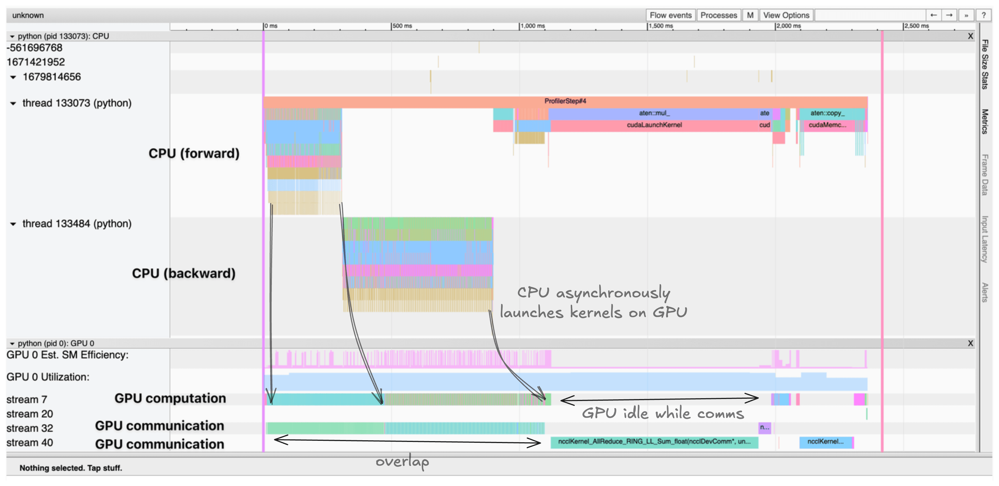

(예시 trace를 보면 CPU 쓰레드가 GPU에 커널을 비동기적으로 실행시키고, CUDA 스트림들이 서로 다른 작업(연산 및 통신)을 병렬로 수행하고 있는 것을 볼 수 있다.)

이러한 trace는 다음과 같은 병목 구간을 식별하는 데 유용하다:

- 연산과 통신이 직렬로 실행되고 있어 병렬화되지 않은 구간
- 데이터 전송을 기다리며 GPU가 유휴 상태(idle) 인 시간
- CPU-GPU 간의 메모리 이동 또는 CUDA 동기화(sync) 로 인한 대기 시간
- GPU에서의 커널 실행 준비 시간(launch overhead)

이러한 패턴을 이해하는 것은 분산 훈련 성능 최적화에 핵심적이다. 예를 들어, 이후에 다룰 주제처럼 그래디언트 동기화가 역전파 연산과 적절히 겹쳐져 수행되고 있는지를 trace를 통해 명확하게 확인할 수 있다.

이제 여러 개의 GPU가 장착된 더 큰 워크스테이션을 갖추고, 본격적인 확장 기법 중 첫 번째인 **데이터 병렬화(data parallelism)** 를 살펴볼 차례다. 사실 이것은 우리가 지금까지 본 그래디언트 누적의 병렬 버전이라 할 수 있다.

## 데이터 병렬화 (Data Parallelism)

데이터 병렬화(Data Parallelism, DP)의 기본 아이디어는 하나의 모델을 여러 GPU에 복제한 후, 각 GPU에서 서로 다른 마이크로 배치에 대해 순전파와 역전파를 병렬로 수행하는 것이다. 각 복제본을 모델 인스턴스(model instance) 라고 부른다. 이런 방식이 바로 데이터 병렬화라는 이름의 유래이다. 단순한 예제에서 데이터 병렬화를 본 적이 있을 수 있지만, 이 절에서는 훨씬 더 깊이 있게 다룰 예정이니 일반적인 개념을 알고 있더라도 계속 읽어보자.


(분산 통신 패턴인 broadcast, gather, all-reduce 등에 익숙하지 않다면, 별도로 준비된 “Appendix 0: 병렬 프로그래밍 단기 입문(Crash Course)”을 참조하면 된다.)

각 GPU가 서로 다른 마이크로 배치를 처리한다는 것은, GPU마다 계산되는 그래디언트가 다르다는 의미다. 따라서 각 GPU의 모델 인스턴스가 서로 동기화된 상태를 유지하기 위해, 모든 모델 인스턴스의 그래디언트를 평균 내는 연산이 필요하다. 이 연산을 all-reduce라고 부른다. 이는 역전파가 끝난 직후, 옵티마이저가 파라미터를 업데이트하기 전에 수행된다.

이것이 우리가 처음으로 마주하는 분산 통신 연산자이며, **all-reduce**는 GPU 인스턴스 간, 또는 노드 간 통신과 동기화를 처리한다.


가장 단순한(naive) 구현은, 모든 역전파가 끝난 후 각 GPU의 그래디언트를 all-reduce로 평균 내는 방식이다. 하지만 이러한 “연산 후 통신” 구조는 **절대 금물**이다. 그 이유는, 통신이 진행되는 동안 GPU들이 놀고 있기 때문이다. 이는 매우 비효율적이다.

따라서 연산과 통신을 최대한 겹쳐서 병렬로 수행하는 것이 훨씬 더 좋은 접근 방식이다.

우리의 첫번째 나이브한 구현보다 우리가 더 좋게 할 수 있도록 해주는 세가지 최적화 기법을 살펴보자.

**첫 번째 최적화: 역전파와 동시에 그래디언트 동기화 수행**

단순한 DP 방식의 주요 문제는 역전파(연산)가 끝난 뒤에야 그래디언트 동기화(통신)를 수행한다는 점이다. 이 질문을 던져보자: 연산과 통신을 동시에 수행할 수는 없을까? 그 답은 가능하다!

위 그림을 보면, 한 층의 그래디언트(분홍 박스)는 이전 층의 그래디언트가 아직 계산되지 않았더라도 먼저 all-reduce로 평균 낼 수 있다. 예를 들어, 가장 마지막 층의 역전파가 끝나면, 그 층의 그래디언트는 다른 층의 역전파가 진행 중일 때에도 바로 동기화할 수 있다.


이러한 방식은 PyTorch에서 각 파라미터에 **all-reduce 훅(hook)** 을 등록함으로써 가능하다. 특정 파라미터에 대한 그래디언트가 계산되는 즉시 all-reduce 연산이 실행되고, 나머지 파라미터에 대한 역전파는 계속 진행된다. 결과적으로 대부분의 all-reduce 연산이 역전파 계산과 겹쳐서 실행되며, 전체적인 훈련 속도도 빨라진다. 다음은 간단한 hook 등록 함수이다:

```python
def register_backward_hook(self, hook):
    """
    Registers a backward hook for all parameters of the model that
    require gradients.
    """
    for p in self.module.parameters():
        if p.requires_grad is True:
            p.register_post_accumulate_grad_hook(hook)
```

이 방식은 모델 전체의 역전파 시간 중 그래디언트 동기화를 기다리는 시간을 줄여준다. 하나의 훈련 스텝 안에서 역전파와 그래디언트 동기화를 병렬적으로 수행할 수 있어, 데이터 병렬화의 효율이 크게 향상된다.

- Picotron 예제: 겹침(overlap)을 포함한 DP 구현

  ```python
  class DataParallelNaive(nn.Module):
      """
      Naive Data Parallelism. Not used in practice. But it is a good starting point to understand how data parallelism works.
      It implements a simple all-reduce operation to synchronize gradients across multiple processes.
      And `no_sync` context manager to disable gradient synchronization.
      """
      def __init__(self, module):
          """
          Initializes the DataParallel wrapper for a given module.

          Args:
              module (nn.Module): The model to be wrapped for data parallelism.
              process_group (torch.distributed.ProcessGroup): The process group used for gradient synchronization.
                                                              It could be a data parallel or context parallel group.
          """
          super().__init__()
          self.module = module
          self.require_backward_grad_sync = True # whether to synchronize gradients during backward pass. Set to False when using gradient accumulation
          self.register_backward_hook(self._allreduce_grads)

      def forward(self, *inputs, **kwargs):
          return self.module(*inputs, **kwargs)

      def register_backward_hook(self, hook):
          """
          Registers a backward hook for all parameters of the model that require gradients.
          """
          for p in self.module.parameters():
              if p.requires_grad is True:
                  p.register_hook(hook)

      def _allreduce_grads(self, grad):
          """
          Performs an all-reduce operation to synchronize gradients across multiple processes.
          """
          # No synchronization needed during gradient accumulation, except at the final accumulation step.
          if self.require_backward_grad_sync:
              dist.all_reduce(grad, op=dist.ReduceOp.SUM, group=pgm.process_group_manager.cp_dp_group)
              grad /= pgm.process_group_manager.cp_dp_world_size
          return grad

      @contextlib.contextmanager
      def no_sync(self):
          """
          A context manager to temporarily disable gradient synchronization.
          This is useful for performing multiple backward passes during gradient accumulation without synchronizing
          gradients in between.
          """
          self.require_backward_grad_sync = False
          yield
          self.require_backward_grad_sync = True
  ```

이 코드는 연산과 통신의 겹침(overlap) 개념을 구현한 첫 번째 예제이다. 이는 이 책에서 여러 차례 강조하게 될 중요한 기법이며, 훈련 확장의 효율을 극대화하기 위한 핵심 전략이다. 하지만 우리는 더 효율적으로 발전시킬 수 있다!

**두 번째 최적화: 그래디언트 버킷팅(Bucketing)**

GPU는 작은 텐서 여러 개를 각각 처리하는 것보다 큰 텐서를 한 번에 처리할 때 더 효율적이다. 이는 통신 연산에도 그대로 적용된다. 따라서 각 그래디언트에 대해 개별적으로 all-reduce를 수행하는 대신, 여러 그래디언트를 “버킷(bucket)”으로 묶어 한 번의 all-reduce로 처리하는 것이 훨씬 효율적이다. 이는 다음과 같은 구조로 작동하게 된다:


이 전략을 이해하기 쉽게 말하자면: 많은 작은 물건을 각각 배송하는 대신, 박스에 묶어 한 번에 보내는 것과 같다. 그래디언트를 버킷으로 묶고, 각 버킷에 대해 하나의 all-reduce 연산만 수행하면, 통신 오버헤드를 크게 줄이고 속도도 향상시킬 수 있다.

- Picotron 예제: 버킷 DP 구현

  ```python
  class DataParallelBucket(nn.Module):
      """
      Data Parallelism with gradient grouped into buckets to reduce the communication overhead.
      """
      def __init__(self, module, bucket_cap_mb=25, grad_type = torch.float32):
          """
          Initialize the DataParallelBucket module.

          Args:
              module (nn.Module): The model to be parallelized.
              process_group: The process group for gradient synchronization, which can be either
                             a data parallel group or a context parallel group.
              bucket_cap_mb (int, optional): The maximum size of each gradient synchronization bucket in megabytes.
                                             Defaults to 25 MB.
              grad_type (torch.dtype, optional): The data type of gradients, defaulting to float32.
          """
          super().__init__()
          self.module = module
          self.require_backward_grad_sync = True # whether to synchronize gradients during backward pass. Set to False when using gradient accumulation
          grad_size = 2 if grad_type == torch.bfloat16 else 4 # float32 gradient: 4 bytes
          bucket_size = bucket_cap_mb * 1024 * 1024 // grad_size # number of gradients in one bucket
          self.bucket_manager = BucketManager(module.parameters(), pgm.process_group_manager.cp_dp_group, bucket_size, grad_type)
          self.register_backward_hook()
          self._post_backward_callback_set = False # whether the callback for wait gradient synchronization is set

      def forward(self, *inputs, **kwargs):
          return self.module(*inputs, **kwargs)

      def backward(self, input_tensor, output_tensor, output_tensor_grad):
          return self.module.backward(input_tensor, output_tensor, output_tensor_grad)

      def register_backward_hook(self):
          """
          Registers a backward hook to manually accumulate and synchronize gradients.

          This hook serves two main purposes:
          1. PyTorch does not natively support gradient accumulation with mixed precision.
          2. After gradient accumulation, it flags parameters as ready for synchronization.

          The gradient accumulation functions are stored to prevent them from going out of scope.

          References:
          - https://github.com/NVIDIA/Megatron-LM/issues/690
          - https://pytorch.org/docs/stable/generated/torch.autograd.graph.Node.register_hook.html
          - https://arxiv.org/abs/2006.15704 (page 5)
          """
          self.grad_accs = []
          for param in self.module.parameters():
              if param.requires_grad:
                  # Expand so we get access to grad_fn.
                  param_tmp = param.expand_as(param)
                  # Get the gradient accumulator function.
                  grad_acc_fn = param_tmp.grad_fn.next_functions[0][0]
                  grad_acc_fn.register_hook(self._make_param_hook(param, self.bucket_manager))
                  self.grad_accs.append(grad_acc_fn)

      def _make_param_hook(self, param: torch.nn.Parameter,bucket_manager: BucketManager):
          """
          Creates the a hook for each parameter to handle gradient accumulation and synchronization.
          """
          def param_hook(*unused):
              """
              The hook called after the gradient is ready. It performs the following:
              1. Accumulates the gradient into the main gradient.
              2. Adds a post-backward callback to wait for gradient synchronization completion.
              3. Marks the parameter as ready for synchronization.
              """
              if param.requires_grad:
                  assert param.grad is not None
                  param.main_grad.add_(param.grad.data) # accumulate the gradients
                  param.grad = None

                  # skip the gradient synchronization (gradient accumulation/PP micro batches)
                  if self.require_backward_grad_sync:
                      # Add a callback to wait for gradient synchronization. Ensures the callback is added only once.
                      # Callback is executed after the backward pass. It should be added per backward pass.
                      if not self._post_backward_callback_set:
                          Variable._execution_engine.queue_callback(self._post_backward)
                          self._post_backward_callback_set = True

                      # mark the parameter as ready for gradient synchronization.
                      bucket_manager.mark_param_as_ready(param)
          return param_hook

      @contextlib.contextmanager
      def no_sync(self):
          """A context manager to disable gradient synchronization."""
          self.require_backward_grad_sync = False
          yield
          self.require_backward_grad_sync = True

      def _post_backward(self):
          """
          A post-backward callback that waits for gradient synchronization to finish, then copies
          the synchronized gradients back to the parameters' grad attribute.

          This method is called after the backward pass and before the optimizer step.
          """
          self.bucket_manager.wait()
          self._post_backward_callback_set = False
          # copy to params.grad so we can use the optimizer to update the parameters
          for p in self.module.parameters():
              if p.requires_grad:
                  p.grad = p.main_grad.to(p.dtype) # In PyTorch, you cannot assign a gradient with one data type to a tensor of another data type.

      def reset(self):
          """
          Reset the bucket manager and zero out gradients in the model
          """
          self.bucket_manager.reset()

  ```

**세 번째 최적화: 그래디언트 누적과의 상호작용**

앞서 살펴본 바와 같이, 그래디언트 누적은 여러 번의 순전파 및 역전파를 수행한 후, `optimizer.step()`을 통해 파라미터를 갱신하는 방식으로 작동한다. 그래디언트 누적과 데이터 병렬화를 함께 사용할 경우, 그래디언트 동기화를 언제 수행할지에 주의해야 한다.

단순한 방식에서는, 누적 중인 각 역전파 단계마다 자동으로 all-reduce가 실행된다. 하지만 이는 비효율적이다. 마지막 스텝에서 한 번만 reduce를 수행하면 같은 효과를 내면서 오버헤드는 줄일 수 있다.

PyTorch에서는 보통 `model.no_sync()` 데코레이터를 통해 이를 해결한다. 이 데코레이터는 reduce가 필요 없는 역전파 단계에서 그래디언트 동기화를 비활성화한다.

> 📝 참고
>
> 통신 연산을 수행할 때 텐서는 메모리에서 연속적이어야(contiguous) 불필요한 메모리 복사를 피할 수 있다. 이를 최적화하기 위해, 보통 액티베이션이나 모델 파라미터의 크기에 맞는 연속적인 버퍼를 사전에 할당해두며, 이는 통신 속도를 높여준다. 하지만 동시에 훈련 중 피크 메모리 사용량을 일부 증가시키는 요인이 되기도 한다.

### 글로벌 배치 사이즈 재정의

이제 데이터 병렬성과 그래디언트 누적을 반영하여 배치 사이즈 공식을 다음과 같이 갱신할 수 있다:

$\text{bs} = \text{gbs} = \text{mbs} \times \text{grad\_acc} \times \text{dp}$

여기서

$grad\_acc$ 는 그래디언트 누적 스텝 수이고,

$dp$ 는 데이터 병렬화를 위해 사용되는 병렬 인스턴스 수이다.

목표 글로벌 배치 사이즈가 주어졌을 때, 그래디언트 누적 스텝 수와 데이터 병렬 프로세스 수를 서로 조절함으로써 훈련 속도를 높일 수 있다.

실제로는 데이터 병렬성(dp)을 가능한 한 최대화하려는 경향이 있다. 왜냐하면 데이터 병렬성은 본질적으로 병렬이지만, 그래디언트 누적은 순차적이기 때문이다. GPU 수가 충분하지 않아 데이터 병렬성만으로 목표 글로벌 배치 사이즈에 도달할 수 없는 경우, 그 위에 그래디언트 누적을 추가한다.

(데이터 병렬화에 대한 더 많은 자료는 다음 링크에서 확인할 수 있다:

[https://siboehm.com/articles/22/data-parallel-training](https://siboehm.com/articles/22/data-parallel-training))

훈련을 서로 다른 샘플에 분산시킬 수 있게 되면, 병렬화의 첫 번째 차원을 확보하게 된다. 이는 곧 1차원 병렬화(1D parallelism) 이며, 이후 우리는 총 다섯 가지 차원을 순차적으로 다루게 될 것이다.

### 지금까지의 여정

1차원 병렬 훈련(1D parallel training)을 설정하는 방법을 최적의 데이터 병렬 구조에 대한 초안 레시피와 함께 간단히 정리해보자.

1. 우선, 문헌을 참고하거나 모델 수렴 속도를 측정하는 실험을 통해 토큰 단위의 최적 (글로벌) 배치 사이즈를 결정한다.
2. 그다음, 마찬가지로 문헌을 참고하거나 실험을 통해 훈련 시 사용할 시퀀스 길이를 선택한다. 일반적으로 2k~8k 토큰은 현재 우리가 가진 평가 벤치마크 기준에서 안정적으로 잘 작동한다. (훈련 레시피는 여기서 깊이 다루지 않지만, 많은 팀들이 훈련 후반부에서 시퀀스 길이를 증가시키며, 더 긴 문맥을 포함한 데이터를 일부 섞어 오늘날의 긴 문맥 모델을 만든다.)
3. 이제 우리는 배치 사이즈 $gbs$ 를 알고 있다. 단일 GPU에서 사용할 수 있는 최대 로컬 배치 사이즈 $mbs$ 는 로컬 배치 사이즈를 점점 늘려가며 메모리가 부족해질 때까지 실험하여 찾는다.
4. 마지막으로, 사용할 수 있는 GPU 수를 확인하여 목표 $dp$ 값을 설정한다. $gbs$ 를 $dp$ 로 나누면, 원하는 $gbs$ 를 달성하는 데 필요한 그래디언트 누적 단계 수(grad_acc)를 계산할 수 있다.

(예를 들어, DeepSeek 및 Llama 모델은 메인 프리트레이닝 단계에서 4k 토큰 시퀀스 길이로 훈련된다.)

(프리트레이닝에서 2~8k 토큰이 잘 작동하는 이유는, 웹 상에서 그보다 더 긴 문서를 찾기가 매우 드물기 때문이다. 자세한 분석은 Harm de Vries의 [블로그 게시물](https://www.harmdevries.com/post/context-length/)을 참고하라.)

만약 그래디언트 누적 비율이 1보다 작다면, 즉 GPU가 너무 많아서 남아돌게 된다면(🤑), 세 가지 선택지가 있다: 모든 GPU를 사용하지 않거나, 더 큰 gbs를 시도하거나, 혹은 더 작은 mbs가 훈련 속도를 높일 수 있는지 테스트해본다. 마지막 경우에는, 가능한 mbs보다 더 작은 값을 선택하여 단일 GPU 효율성보다는 전체 throughput을 우선시하게 된다.

이제 구체적인 예제를 살펴보자. 최신 모델을 gbs = 4M 토큰, 시퀀스 길이 4k로 훈련하려고 한다고 해보자. 배치 사이즈는 4M / 4k = 1024개 샘플이며, 우리는 2의 제곱에 가장 가까운 수를 선택한다. 한 GPU에서 mbs = 2만 들어간다고 가정하고, 사용할 수 있는 GPU 수가 128개라고 하자. 이 경우 그래디언트 누적 스텝을 4로 설정하면, 총 1024 샘플 즉 4M 토큰을 매 훈련 스텝마다 처리할 수 있다. 이제 갑자기 GPU 수가 512개로 늘어난다면 어떻게 될까? mbs = 2를 유지하고, 그래디언트 누적 스텝을 1로 설정하면 동일한 gbs를 달성할 수 있으며, 훈련 속도도 더 빨라지게 된다.

> 📝 참고
>
> GPU 수가 512개 이상으로 증가하면, 사용되는 네트워크 환경에 따라 통신 연산이 **링 지연 시간(ring latency)** 의 영향을 받기 시작한다. 이는 신호가 링 구조 상 한 바퀴를 도는 데 걸리는 시간이다. 이 시점에서는 데이터 병렬 통신이 완전히 겹쳐서 실행되지 못하게 되고, 그 결과 계산 효율성이 떨어지며 throughput도 낮아진다. 이 경우에는 병렬화를 위한 다른 차원을 탐색하기 시작해야 한다.

데이터 병렬화는 all-reduce 그래디언트 동기화를 역전파 계산과 겹쳐 수행함으로써 시간을 절약하지만, 이 이점은 대규모 스케일에서는 점점 깨지기 시작한다. 왜냐하면 GPU 수가 수백, 수천 대로 늘어날수록 GPU 간 동기화에 드는 비용이 급격히 증가하고, 네트워크 대역폭 요구가 너무 커져 이점을 상쇄해버리기 때문이다. 결과적으로, GPU를 추가할수록 점점 훈련 구조의 효율성은 떨어지게 된다.

이러한 현상은 실제 벤치마크에서도 명확하게 관측된다:

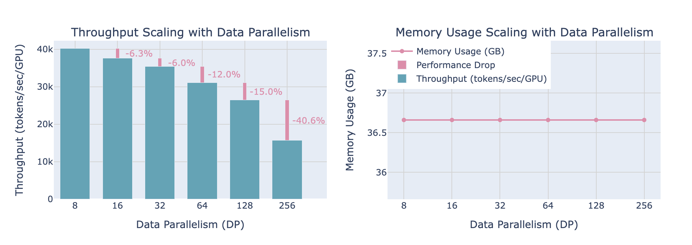

여기에서 볼 수 있듯이, 어느 한계를 넘어서면 throughput(throughput)이 꽤 급격히 감소하기 시작하는 반면, GPU당 메모리 사용량은 일정하게 유지되며, 더 많은 DP(rank)를 추가해도 영향을 받지 않는다.

데이터 병렬화는 더 많은 GPU에 걸쳐 훈련을 확장하기 위한 첫 번째(그리고 단순한) 전략이었다. 이 기법은 그래디언트 누적과 비슷하게 작동하지만, 마이크로 배치들에 대해 순전파와 역전파를 병렬로 실행함으로써 throughput을 증가시킨다.

그러나 주의 깊은 독자라면, 이 방식은 최소한 하나의 입력 샘플에 대한 순전파(mbs=1)를 GPU 메모리에 담을 수 있다는 전제를 필요로 한다는 점을 이미 알아차렸을 것이다. 하지만 이것이 항상 가능한 것은 아니다! 보다시피, 더 큰 모델들은 액티베이션 재계산(activation recomputation)을 사용하더라도 단일 GPU에 들어가지 않는 경우가 자주 있다:

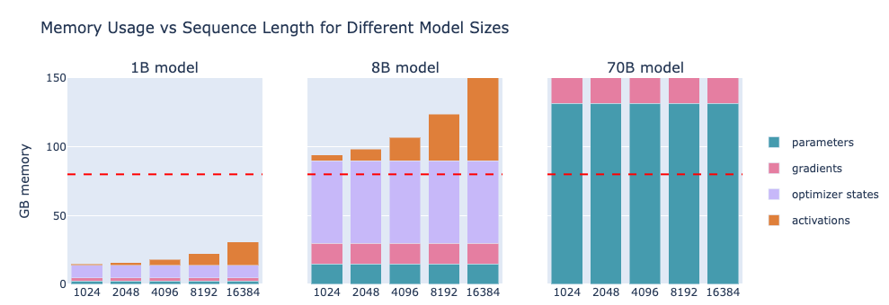

우리는 또한 데이터 병렬화가 일정 수준 이상의 스케일에서는 통신 오버헤드라는 제한을 가지기 시작한다는 것도 보았다. 그렇다면, 더 큰 모델이나 더 큰 배치 사이즈를 다룰 때 사용할 수 있는 다른 방법은 없을까? 다행히도 몇 가지 해결책이 있다. 이들은 일부 텐서를 CPU로 옮기거나, 가중치/그래디언트/옵티마이저 상태 텐서를 여러 GPU 장치에 걸쳐 나누는 방식을 포함한다.

이러한 분할에는 두 가지 주요 접근 방식이 있다: 병렬화(parallelism: 텐서 병렬, 컨텍스트 병렬, 또는 파이프라인 병렬)와 샤딩(sharding: DeepSpeed ZeRO 또는 PyTorch FSDP). 이 두 방식은 어느 정도 서로 독립적이며, 실제로는 결합하여 사용할 수도 있다!

샤딩 패러다임은 데이터 병렬화와 밀접한 관련이 있으므로, 먼저 ZeRO 기법을 살펴보며 이를 탐구해보자.

### Zero Redundancy Optimizer (ZeRO)

이번 섹션에서는 LLM 훈련 시 메모리 중복을 줄이기 위해 설계된 메모리 최적화 기술인 DeepSpeed ZeRO를 소개한다.

데이터 병렬화는 훈련을 확장하는 데 효과적인 방법이지만, 옵티마이저 상태, 그래디언트, 그리고 파라미터를 각 데이터 병렬 rank마다 순진하게 복제하는 것은 상당한 메모리 중복을 유발한다. ZeRO는 옵티마이저 상태, 그래디언트, 그리고 파라미터를 데이터 병렬 차원에 걸쳐 분할함으로써 이를 제거하면서도 전체 파라미터 집합을 이용한 계산은 여전히 가능하게 만든다. 이것은 때때로 데이터 병렬 rank들 간에 더 많은 통신을 요구하며, 이 통신은 다음에서 보게 되듯이 계산과 완전히 겹쳐질 수도 있고 그렇지 않을 수도 있다.

이 접근 방식은 다음과 같은 세 가지 최적화 단계로 구성된다:

- ZeRO-1: 옵티마이저 상태 분할
- ZeRO-2: 옵티마이저 상태 + 그래디언트 분할
- ZeRO-3: 옵티마이저 상태 + 그래디언트 + 파라미터 분할

(여기서 "분할(partitioning)"이라고 하는 것은 데이터 병렬 축을 따라 나눈다는 의미이다. ZeRO는 데이터 병렬 방식이기 때문이다. 나중에 우리는 다른 축을 따라 분할할 수도 있다는 점도 살펴볼 것이다.)

이 목록에서 액티베이션이 빠져 있다는 것을 눈치챘을 수도 있다. 이는 모델의 각 데이터 병렬 복제본이 서로 다른 마이크로 배치를 받기 때문에, 각 rank에서 생성되는 액티베이션이 다르고 복제되지 않기 때문이다. 따라서 액티베이션은 샤딩 대상이 아니다.

이제 ZeRO 각 단계에서의 분할을 통해 얼마나 많은 메모리를 절약할 수 있는지 자세히 살펴보자.

**메모리 사용 재검토**

앞서, 표준 훈련에서 옵티마이저 상태, 그래디언트, 파라미터의 메모리 사용에 대해 논의했다. 우리 모델의 파라미터 수를 $\Psi$라고 부르자 (이전에는 $N$이라 불렀지만, 여기서는 원래 ZeRO 논문의 표기법을 사용한다). Adam 옵티마이저를 사용하는 혼합 정밀도 훈련(mixed precision training)에서는, 우리가 저장해야 하는 각 항목의 메모리 사용량은 다음과 같다:

- 모델의 파라미터 (하프 정밀도; 즉 BF16/FP16): $2\Psi$
- 모델의 그래디언트 (하프 정밀도; 즉 BF16/FP16): $2\Psi$
- FP32 형식의 모델 파라미터 및 옵티마이저 상태: $4\Psi+(4\Psi+4\Psi)$
- FP32 형식의 모델 그래디언트: $4\Psi$(선택 사항, FP32로 그래디언트를 누적하려는 경우에만 포함됨)

만약 우리가 FP32로 그래디언트를 누적하지 않는다면, 총 메모리 소비는 $2\Psi+2\Psi+12\Psi$가 되며, 만약 누적한다면 $2\Psi+6\Psi+12\Psi$가 된다. 간단히 하기 위해 지금은 FP32 그래디언트 누적 없는 경우에 집중하자.

ZeRO의 아이디어는 이러한 객체들을 데이터 병렬 rank들에 걸쳐 샤딩(sharding)하는 것이다. 즉, 각 노드는 해당 항목의 일부분만 저장하며, 필요할 때 이러한 조각들을 재구성하여 사용한다. 이렇게 하면 메모리 사용량을 데이터 병렬 Degree $N_d$로 나눌 수 있게 된다:

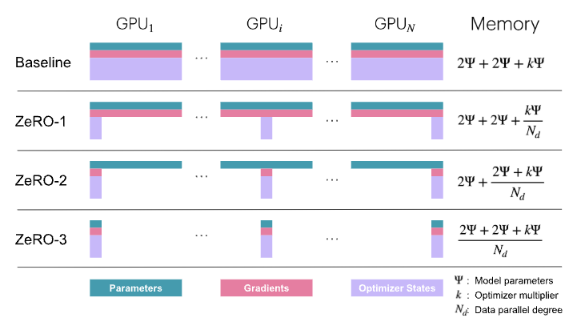

여기서 $\Psi$는 파라미터의 수를 나타내고, k는 옵티마이저 상태의 메모리 계수(조금 전 본 바와 같이 Adam의 경우 k=12)를 나타내며, $N_d$ 는 데이터 병렬(DP) Degree를 나타낸다.

(ZeRO-2 또는 ZeRO-3에서 FP32 그래디언트 누적을 사용하는 경우, 그래디언트 항에 추가로 $\frac{4\Psi}{N_d}$를 더해야 한다.)

이제 각 ZeRO 단계가 어떻게 작동하는지 살펴보며 이를 설명해보자. ZeRO-1부터 시작하자.

### ZeRO-1: 옵티마이저 상태 분할

기본적인 데이터 병렬 방식에서는, 모든 rank가 backward pass 이후 동일한 그래디언트를 모으고, 동시에 동일한 옵티마이저 스텝을 수행한다. 이는 많은 중복 작업처럼 보인다. 이를 피하면서 동시에 메모리 사용도 줄일 수 있을까?

ZeRO-1에서는 옵티마이저 상태를 $N_d$개의 동일한 부분으로 나눈다. 여기서 $N_d$는 데이터 병렬 정도다. 이는 DP rank들에 분산된 모델 복제본 각각이 전체 옵티마이저 상태의 $\frac{1}{N_d}$만을 유지한다는 뜻이고, 옵티마이저 스텝 동안 FP32 가중치의 $\frac{1}{N_d}$만 업데이트된다.

하지만 forward pass 시에는 모든 복제본이 전체 파라미터가 필요하다. 따라서 옵티마이저 스텝 이후에 모든 모델 복제본이 전체 업데이트된 가중치를 다시 갖도록 하기 위해 추가적인 **all-gather 연산**(우리가 지금까지 본 두 번째 collective communication primitive!)이 필요하다.

이것이 이전 그림에서 본 $2\Psi + 2\Psi + \frac{k\Psi}{N_d}$라는 메모리 공식의 이유다! 다음은 단일 훈련 스텝에 대한 연산 순서를 요약한 것이다:

1. 각 복제본에서 동일한 전체 BF16 파라미터 집합으로 forward pass를 수행하되, 복제본마다 서로 다른 마이크로 배치를 사용한다.
2. 각 복제본에서 동일한 전체 그래디언트 집합으로 backward pass를 수행하되, 복제본마다 서로 다른 마이크로 배치를 사용한다.
3. 그래디언트에 대해 **reduce-scatter**를 수행한다 (또 다른 collective primitive로, 곧 설명할 것이다).
4. 각 복제본은 자신의 로컬 옵티마이저 상태(전체 옵티마이저 상태의 $\frac{1}{N_d}$)에 대해 옵티마이저 스텝을 수행하여 FP32 파라미터의 $\frac{1}{N_d}$만 업데이트하고, 이것을 전체 BF16 파라미터의 $\frac{1}{N_d}$로 변환할 수 있다.
5. 각 복제본에 누락된 파라미터 조각을 다시 보내기 위해 BF16 파라미터에 대해 all-gather를 수행한다. 이 연산은 ZeRO에 새롭게 도입된 것이며, 기본적인 데이터 병렬에서는 사용되지 않는다.

당신은 아마도 이 "reduce-scatter" 연산이 무엇인지, 그리고 이 모든 과정이 실제로 어떻게 보이는지 궁금할 수 있다. 따라서 아래 그림을 통해 이를 좀 더 시각적으로 표현해보자. 우리는 forward/backward pass 주기의 모든 단계를 하나씩 살펴볼 것이다:

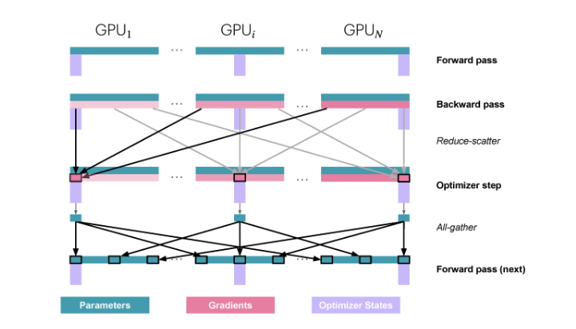

실질적인 통신 측면에서 보았을 때, ZeRO-1은 기본 데이터 병렬 방식(vanilla DP)과 비교하여, 그래디언트의 all-reduce 통신을 reduce-scatter 연산으로 변경하고, 옵티마이저 스텝 이후 모든 파라미터에 대해 all-gather 연산을 추가한다. 그 모습은 다음과 같다:

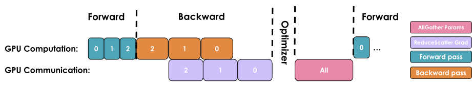

지금까지의 내용을 따라오셨다면, 우리가 기본 데이터 병렬(vanilla DP)에 대해 논의할 때 그래디언트 all-reduce 통신을 backward pass 계산과 겹쳐 실행할 수 있다는 점을 기억하실 것이다. ZeRO-1에서도 새롭게 추가된 BF16 파라미터의 all-gather 연산을 효율적으로 겹쳐 실행(overlap)할 수 있는지 살펴볼 수 있다. 이를 위한 주요 전략은 두 가지다:

1. **옵티마이저 스텝 중에:** 옵티마이저가 파라미터의 첫 슬라이스를 업데이트한 직후, all-gather를 시작할 수 있다. 이렇게 하면 나머지 파라미터를 업데이트하는 동안 통신이 병렬적으로 수행될 수 있다.
2. **forward pass 중에:** 각 레이어의 파라미터 all-gather를 forward pass와 겹쳐서 수행할 수 있다.

> 📝 참고
>
> 안타깝게도, 이러한 기법들은 간단하게 구현할 수 있는 것이 아니며, 복잡한 hook 또는 bucket 관리가 필요하다. 실전에서는 PyTorch의 기본 ZeRO-3 또는 FSDP 구현을 사용하는 것이 일반적이며, FSDPUnit을 전체 모델로 설정하면 된다 (이에 대해서는 뒤에서 더 자세히 다룰 것이다).

ZeRO-1에서는 옵티마이저 상태가 분할되어 있으므로, 각 복제본은 전체 상태의 $\frac{1}{N_d}$만 업데이트한다. 예리한 독자라면 모든 DP rank에서 모든 그래디언트를 가질 필요가 없다는 점을 눈치챘을 것이다. 옵티마이저 스텝에서는 이들 중 일부만 필요하기 때문이다. 이제 ZeRO-2를 살펴보자!

**ZeRO-2: 그래디언트 분할 추가**

각 복제본(replica)에서는 자신이 가지고 있는 옵티마이저 상태 조각에 대응하는 그래디언트 조각만 필요하므로, 옵티마이저 상태처럼 그래디언트도 분할(shard)하는 것이 자연스럽다. 이렇게 하면 backward pass 중에 그래디언트에 대해 all-reduce 연산을 수행하는 대신, reduce-scatter 연산만 수행하게 된다. 이 방식에서는 메모리 내에 필요한 $\frac{1}{N_d}$ 만큼의 그래디언트만 저장하면 되므로, ZeRO-1에 비해 더 많은 메모리를 절약할 수 있다.

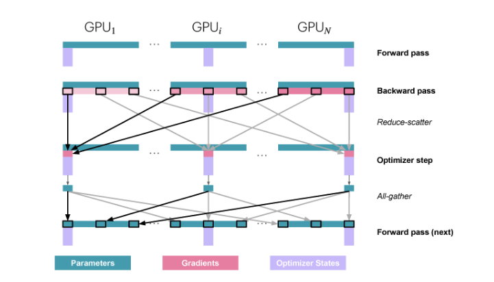

이제 그래디언트 분할로부터 다음과 같은 메모리 사용량이 유도된다는 것을 쉽게 이해할 수 있다:

$2\Psi+\frac{2\Psi+k\Psi}{N_d}$

그리고 $N_d$가 커질수록, 기준 대비 최대 8배까지 메모리를 덜 사용할 수 있게 된다. 통신 측면에서는 ZeRO-1과 동일한 방식이 적용되며, 유일한 차이는 통신이 수행됨과 동시에 메모리를 즉시 해제한다는 것이다. 둘 다 그래디언트에 대해 reduce-scatter, 파라미터에 대해 all-gather 연산을 필요로 한다. 따라서 ZeRO-2는 통신 구조 측면에서도 기본 데이터 병렬(vanilla DP)과 동일하다고 볼 수 있다.


이제 그래디언트도 분할했으니 다 끝났을까? 더 개선할 수 있을까? 여기서 등장하는 것이 ZeRO-3이다.

**ZeRO-3: 파라미터 분할 추가 (FSDP)**

ZeRO의 세 번째 단계에서는 옵티마이저 상태와 그래디언트를 분할하던 기존 접근을 확장하여, 모델의 파라미터도 DP 복제본에 따라 분할한다.

> 📝 참고
>
> PyTorch의 이 단계에 대한 기본 구현은 FSDP (Fully Sharded Data Parallelism)라고 불린다. 이 책에서는 FSDP를 ZeRO-3라고 지칭하지만, 둘은 동일한 개념으로 생각하면 된다.

그렇다면 파라미터가 분산되어 있을 때, forward 또는 backward pass는 실제로 어떻게 수행할까? 아주 간단하다. 필요할 때 요청하여 모으고, 사용이 끝나면 즉시 메모리에서 해제하는 방식이다. 예를 들어 forward pass는 다음과 같이 진행된다:

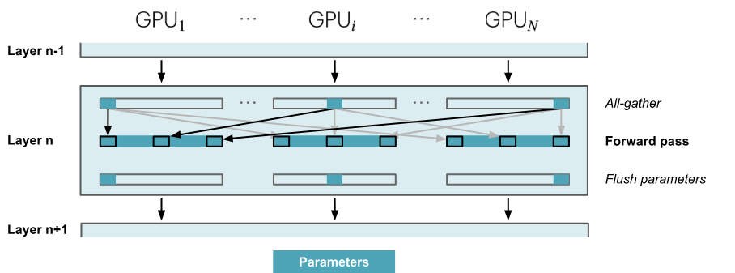

모델의 레이어를 순차적으로 지나며 forward pass를 수행할 때, 필요한 파라미터만 on-demand로 가져와 사용하고, 필요 없어진 순간 메모리에서 해제한다. backward pass도 마찬가지 원리로 작동하지만, 진행 방향만 반대다. 여기서는 그래디언트 조각이 생성된다:

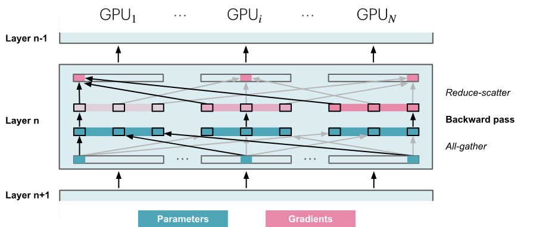

여기서 문제는, 학습 스텝 한 번마다 forward와 backward pass 전 과정에서 계속해서 all-gather 연산을 수행해야 한다는 것이다. 이는 ZeRO-2에 비해 다음과 같은 수의 추가 all-gather 연산을 필요로 하게 만든다:

$2⋅num\_layers−1$

각 all-gather는 **고정된 latency**를 가지므로, 다음 그림에서 보듯이 전체 학습 속도에 영향을 줄 수 있다:

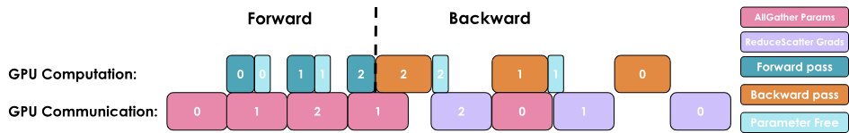

forward pass 동안, 필요한 시점에 파라미터에 대해 all-gather 연산을 수행하므로, Ψ만큼의 통신 비용이 발생한다. forward pass가 끝나면 파라미터를 즉시 버리기 때문에, backward pass 중에도 다시 한 번 all-gather 연산이 필요하며, 이는 또 다른 Ψ의 통신 비용을 발생시킨다. 마지막으로, ZeRO-2에서와 동일하게 그래디언트에 대해 reduce-scatter 연산이 필요하며, 이 역시 Ψ의 통신 비용이 든다. 따라서 ZeRO-3의 총 통신 비용은 ZeRO-2의 2Ψ에 비해 3Ψ가 된다.

이것이 많은 통신 오버헤드처럼 들릴 수 있으나, 실제로는 그렇게 크지 않다. **prefetching**이라 불리는 기법을 통해 다음 레이어의 파라미터 통신을 현재 레이어의 forward pass와 겹쳐 수행할 수 있기 때문이다. prefetching에서는 레이어 n의 forward pass를 수행하면서 레이어 n+1의 가중치를 all-gather하고, 마찬가지로 레이어 n의 backward pass를 수행하면서 레이어 n−1의 가중치를 all-gather한다. 물론 이러한 통신 겹치기는 DP를 지나치게 확장하지 않는 한에서만 효과적이며, 일반적인 경험칙으로 DP는 512를 넘기지 않아야 한다.

(여기서 "DP"는 데이터 병렬화 기법뿐 아니라 데이터 병렬화에 사용되는 GPU의 수도 의미한다 (DP = DP size = DP degree).)

메모리 측면에서는, 우리의 공식이 이제 최종 형태인 $\frac{2\Psi+2\Psi+k\Psi}{N_d}$에 도달했음을 확인할 수 있다. 이는 최소한 모델 관련 파라미터에 대해서는 DP 크기를 증가시킴으로써 이론상 메모리 사용량을 무한히 줄일 수 있음을 의미한다. 단, 이 최적화는 중간 activation에는 적용되지 않는다. activation에 대해서는 앞에서 살펴본 activation checkpointing 및 gradient accumulation 같은 기법을 함께 사용해야 한다.

DP와 ZeRO에 대한 여정을 요약해보자. 우리는 DP를 통해 단순히 모델 복제본을 추가하는 방식으로 훈련 throughput을 크게 증가시킬 수 있음을 확인했다. ZeRO를 통해서는, 단일 GPU에 들어가지 않는 모델조차도, 파라미터, 그래디언트, 옵티마이저 상태를 DP 복제본들 간에 분할함으로써 훈련이 가능해졌다. 이 과정에서 소규모의 통신 비용이 발생하지만, 이를 통해 메모리 사용을 획기적으로 줄일 수 있다.

다만 여기에도 몇 가지 한계가 존재한다. DP는 모델의 한 레이어가 단일 GPU에 적합할 때만 작동하며, ZeRO는 파라미터, 그래디언트, 옵티마이저 상태만 분할할 수 있고 activation 메모리는 분할할 수 없다. activation 메모리는 시퀀스 길이와 배치 사이즈에 따라 증가하며, 이를 단지 하드웨어 제약 때문에 줄이는 방식은 실전에서는 바람직하지 않다.

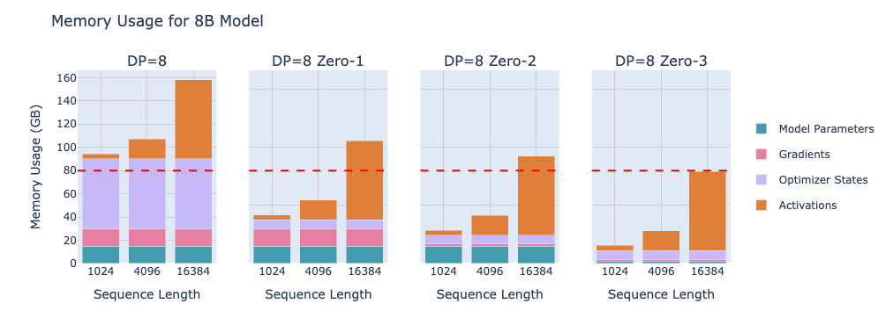

이 문제를 극복하기 위해, 이제는 새로운 병렬화 축인 **텐서 병렬화(Tensor Parallelism, TP)** 를 살펴볼 차례다. ZeRO-3가 대규모의 파라미터 통신에 의존하는 반면, TP는 파라미터, 그래디언트, 옵티마이저 상태, 그리고 activation까지도 디바이스 간에 분할(shard) 하되, GPU 간 모델 파라미터 통신 없이 이를 수행할 수 있도록 한다.

뭐라고? 모델 파라미터를 주고받지 않는데도 이런 게 가능하다고?! 이 마법 같은 접근 방식을 이제 함께 살펴보자. 🙂

## 텐서 병렬화 (Tensor Parallelism)

우리는 ZeRO를 통해 모델의 파라미터, 그래디언트, 옵티마이저 상태를 샤딩해왔지만, activation 메모리 사용량이 예산을 초과하면 한계에 도달한다. 여기서 등장하는 것이 텐서 병렬화(TP)다. 이 방법은 파라미터, 그래디언트, 옵티마이저 상태뿐 아니라 activation도 샤딩하며, 계산 전에 이들을 모두 모을 필요가 없다. 마치 꿈처럼 들린다! 우선 TP가 간단한 행렬 곱셈(matmul) 연산에서 어떻게 작동하는지를 살펴보자.

텐서 병렬화는 행렬 곱셈 A×B 의 수학적 성질을 활용한다. 이 병렬화를 가능하게 하는 두 가지 기본적인 수식을 살펴보자:

1. $A⋅B=A⋅[B1\quad B2⋯ ]=[AB1\quad AB2⋯ ]$
2. $A \cdot B = 
\begin{bmatrix}
A_1 \\
A_2 \\
\vdots
\end{bmatrix}
\begin{bmatrix}
B_1 & B_2 & \cdots
\end{bmatrix}
= \sum_{i=1}^{n} A_i B_i$

이 수식은 다음을 의미한다: 행렬 곱은 B의 각 열을 개별적으로 곱하거나, A의 각 행과 B의 대응하는 행을 곱해 합산함으로써 계산할 수 있다.

신경망에서는 이 행렬 곱셈이 보통 다음과 같은 형태로 나타난다:

$X \times W$

여기서:

- X는 입력 또는 activation 값이고,
- W는 Linear 레이어의 가중치(weight)를 나타낸다.

실제로, 이 연산의 간단한 예시는 다음과 같다:

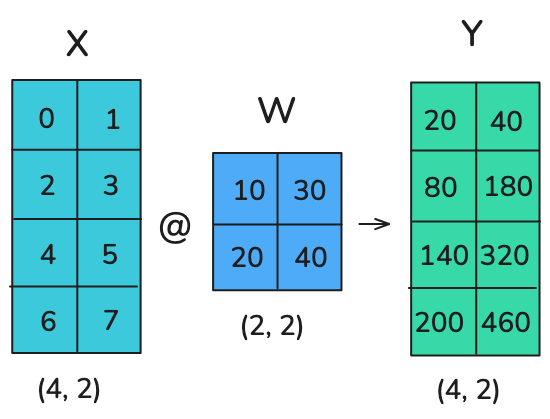

이 연산을 어떻게 병렬화할 수 있을지 살펴보자! 텐서 병렬화(Tensor Parallelism)에서는 텐서를 특정 차원에서 총 N 개의 shard로 나누고 이를 N개의 GPU에 분산시킨다. 행렬은 열(column) 또는 행(row)을 기준으로 나눌 수 있으며, 이로 인해 행 병렬(row parallelism) 또는 열 병렬(column parallelism)이 가능하다. 아래에서 살펴보겠지만, 행 분할과 열 분할은 서로 다른 통신 연산(communication primitive)을 요구한다.

첫 번째 방식은 **열 기준 분할(column-wise**, 또는 column-linear)이다. 이 방식에서는 전체 입력 행렬을 각 작업자(worker)에 복사(broadcast)한 뒤, 가중치 행렬을 열 기준으로 분할한다. 이후 각 입력은 분할된 가중치 행렬과 곱해지고, 마지막으로 결과는 all-gather 연산을 통해 결합된다.

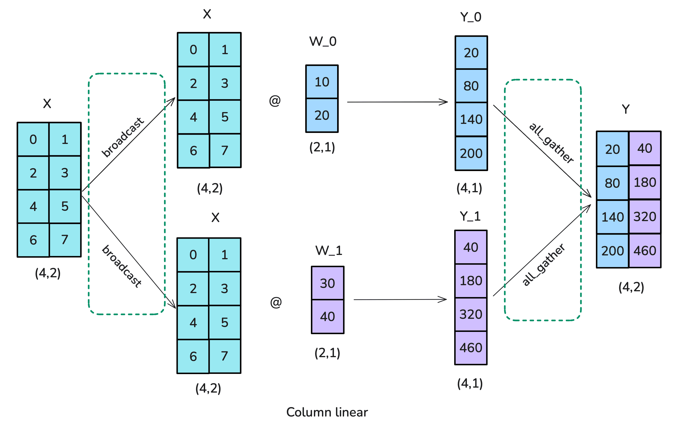

다음은 column-wise 텐서 병렬화를 구현한 코드이다:

- Picotron 의 Column 병렬 TP 구현

  ```python
  class ColumnParallelLinear(torch.nn.Module):
      """Column Parallel Linear layer
      Y = XW + b, where weight matrix W is parallelized along its second dimension. W = [W_1, ..., W_p]
      This module returns the results of Y_i = XW_i + b_i in the forward method, Y_i is parallelized in the second dimension.
      Arguments:
          in_features: first dimension of weight matrix W.
          out_features: second dimension of weight matrix W.
          bias: If true, add bias
          init_method: method to initialize weights
          gather_output: If true, gather the output from all the partitions. This is used for the last linear layer
      """

      def __init__(
          self,
          in_features: int,
          out_features: int,
          bias: bool = False,
          gather_output: bool = False,
          async_all_reduce: bool = False,
      ) -> None:
          super(ColumnParallelLinear, self).__init__()

          self.tp_world_size = pgm.process_group_manager.tp_world_size
          self.tp_rank = pgm.process_group_manager.tp_rank

          self.in_features = in_features
          self.out_features = out_features
          assert out_features % self.tp_world_size == 0, "Hidden dimension must be divisible by the tensor parallel world size"
          self.output_size_per_partition = out_features // self.tp_world_size
          self.gather_output = gather_output
          self.async_all_reduce = async_all_reduce
          # Allocate space for the weight and bias
          # Note: torch.nn.functional.linear performs XW^T + b so we exchange the order of dimensions
          self.weight = nn.Parameter(torch.Tensor(self.output_size_per_partition, self.in_features)) # W_i
          if bias:
              self.bias = nn.Parameter(torch.Tensor(self.output_size_per_partition))
              with torch.no_grad():
                  self.bias.zero_()
          else:
              self.register_parameter("bias", None)

          self.reset_parameters()

      def reset_parameters(self):
          # Initialize weight tensor with the default initialization method used for nn.Linear in PyTorch
          master_weight = torch.empty(
              self.out_features,
              self.in_features,
              dtype=self.weight.dtype,
              device=self.weight.device,
              requires_grad=False
          )

          # Calculate bound based on master weight's input dimension
          k = 1 / master_weight.size(1)
          bound = math.sqrt(k)
          torch.nn.init.uniform_(master_weight, -bound, bound)

          # Split the model into size of self.output_size_per_partition
          weight_list = torch.split(master_weight, self.output_size_per_partition, dim=0)
          self.weight.data = weight_list[self.tp_rank].contiguous()

      def forward(self, x: torch.Tensor) -> torch.Tensor:
          if self.async_all_reduce:
              output = linear_with_async_all_reduce(x, self.weight, self.bias)
          else:
              output = linear_with_all_reduce(x, self.weight, self.bias)
          if self.gather_output:
              output = GatherFromModelParallelRegion.apply(output)
          return output

  ```

두 번째 방식은 **행 기준 분할(row-wise** 또는 row-linear)이다. 주의 깊게 본 독자는 알 수 있겠지만, row-linear란 가중치 행렬을 행 단위로 나누는 것을 의미한다. 하지만 이 방식은 입력값도 나누어야 하므로, column-linear 방식에서 사용했던 broadcast가 아니라 **scatter** 연산(우리가 지금까지 본 네 번째 분산 통신 연산)을 사용해야 한다. 각 작업자에서의 출력은 이미 올바른 형태를 가지므로, 최종 결과를 얻기 위해서는 all-reduce 연산을 사용해 합산해주어야 한다.

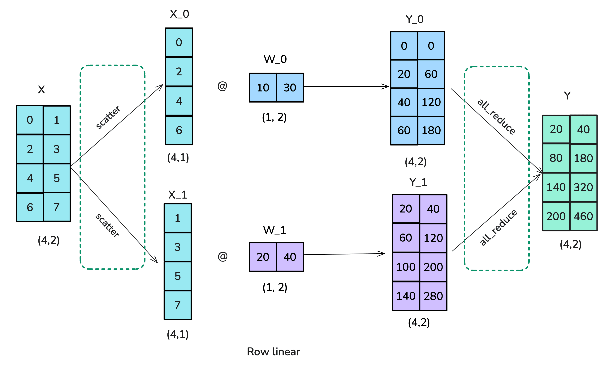

다음은 row-wise 텐서 병렬화를 구현한 코드이다:

- Picotron의 Row 병렬 TP 구현

  ```python
  class RowParallelLinear(nn.Module):
      """Linear layer with row parallelism.
      Y = XW + b. W is parallelized along its first dimension and X along its second dimension as:
                 -   -
                | W_1 |
                | .   |
            W = | .   |        X = [X_1, ..., X_p]
                | .   |
                | W_p |
                 -   -
      We assume that X is already parallelized. This is the case after ColumnParallelLinear.
      This module returns the results of Y = sum(X_i * W_i + b_i) in the forward method.
      Arguments:
          in_features: first dimension of matrix W.
          out_features: second dimension of matrix W.
          bias: If true, add bias
          init_method: method to initialize weights.
      """
      def __init__(self, in_features: int, out_features: int, bias: bool):
          super(RowParallelLinear, self).__init__()

          self.tp_world_size = pgm.process_group_manager.tp_world_size
          self.tp_rank = pgm.process_group_manager.tp_rank

          self.in_features = in_features
          self.out_features = out_features
          assert in_features % self.tp_world_size == 0, "Hidden dimension must be divisible by the tensor parallel world size"
          self.input_size_per_partition = in_features // self.tp_world_size

          self.weight = nn.Parameter(torch.Tensor(self.out_features, self.input_size_per_partition))
          if bias:
              self.bias = nn.Parameter(torch.Tensor(self.out_features))
              # Always initialize bias to zero.
              with torch.no_grad():
                  self.bias.zero_()
          else:
              self.register_parameter("bias", None)

          self.reset_parameters()

      def reset_parameters(self):
          # Initialize weight tensor with same dtype and device as self.weight
          master_weight = torch.empty(
              self.out_features,
              self.in_features,
              dtype=self.weight.dtype,
              device=self.weight.device,
              requires_grad=False
          )

          # Calculate bound based on master weight's input dimension
          k = 1 / master_weight.size(1)
          bound = math.sqrt(k)
          torch.nn.init.uniform_(master_weight, -bound, bound)

          # Split the model into size of self.input_size_per_partition
          weight_list = torch.split(master_weight, self.input_size_per_partition, dim=1)
          self.weight.data = weight_list[self.tp_rank].contiguous()

      def forward(self, x):
          # X_i * W_i^T + b
          output_parallel = F.linear(x, self.weight)
          # All-reduce across all the partitions.
          output = ReduceFromModelParallelRegion.apply(output_parallel)
          return output if self.bias is None else output + self.bias

  ```

이제 텐서 병렬화(TP)의 기본 구성 요소들을 갖추었으니, 이를 트랜스포머 레이어 안에서 효과적으로 결합하는 방법을 살펴보자!

### 트랜스포머 블록에서의 텐서 병렬화

Transformer 모델은 크게 두 가지 구성 요소로 이루어져 있다: 피드포워드 다층 퍼셉트론(MLP) 블록과 다중 헤드 어텐션(Multi-Head Attention, MHA) 블록이다. 텐서 병렬화는 이 두 구성 요소 모두에 적용할 수 있다.

피드포워드 부분은 column-linear 분할 후 row-linear 분할을 적용함으로써 병렬화할 수 있다. 이는 입력을 복사하는 broadcast 연산과 forward 단계에서의 all-reduce 연산을 의미한다. 실제 훈련에서는 입력이 이미 TP rank 간에 동기화되어 있다고 가정할 수 있으므로 broadcast는 필요 없다. 이 방식은 row-linear → column-linear 순서보다 더 효율적인데, 그 경우 중간에 추가적인 all-reduce 연산이 필요하기 때문이다.

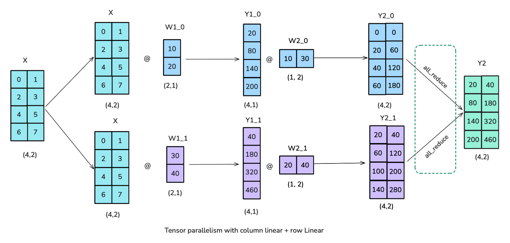

이제 트랜스포머의 피드포워드 부분에 대한 효율적인 스키마를 정리했으니, 다중 헤드 어텐션 블록을 살펴보자.

이 경우에도 유사한 접근이 가능하다. Query(Q), Key(K), Value(V) 행렬은 column-parallel 방식으로 분할하고, 출력 projection은 row-linear로 간주할 수 있다. 멀티 헤드 어텐션에서는 column-parallel 방식이 자연스럽게 해석된다. 각 GPU가 개별 어텐션 헤드 또는 일부 어텐션 헤드의 연산을 담당하게 되기 때문이다. 이 방식은 Query는 개별이지만 Key와 Value를 공유하는 Multi-Query Attention(MQA) 또는 Grouped Query Attention(GQA)에도 동일하게 적용할 수 있다.


우리가 Attention 블록과 MLP 블록 모두에 텐서 병렬화를 효과적으로 적용할 수 있었던 이유는, 이들이 자연스럽게 독립적인 차원을 가지고 있기 때문이다. Attention 블록은 `num_attention_heads` 차원을 따라 병렬화할 수 있는데, 각 어텐션 헤드는 독립적으로 동작하기 때문이다. 마찬가지로, MLP 블록은 `hidden_dim` 차원을 따라 병렬화할 수 있으며, 피드포워드 네트워크 내의 연산은 이 차원에서 독립적으로 수행된다.

하지만 주의해야 할 점도 있다. 텐서 병렬화의 차수(TP degree)는 어텐션 헤드 수를 초과해서는 안 된다. 이는 QKV 프로젝션을 `num_attention_heads` 차원에 따라 분할하기 때문이다. Grouped Query Attention (GQA)을 사용하는 경우에는 `num_attention_heads` 개의 쿼리 헤드가 있고, 그보다 적은 수의 `num_kv_heads` 개의 키/밸류 헤드가 존재한다 (`num_attention_heads >= num_kv_heads`). 이 경우에도 TP를 `num_attention_heads`까지 설정할 수 있지만, K/V 헤드가 GPU들 간에 정확히 동기화되도록 구현에 유의해야 한다. 예를 들어, Llama-3 8B 모델은 쿼리 헤드가 32개이고 K/V 헤드가 8개이므로, TP 차수를 이론적으로 32까지 늘릴 수 있지만, 이 경우에는 텐서 병렬화 워커 간의 K/V 헤드 동기화를 위한 정교한 구현이 필요하다.

또한 텐서 병렬화는 훈련의 만능 해결책이 아니다. 우리는 모델의 연산 경로 안에 여러 분산 통신 프리미티브를 직접 포함시켰으며, 이들 통신은 ZeRO에서처럼 계산과 완전히 겹치거나 숨기기 어렵다. 따라서 최종 성능은 계산과 메모리에서의 이점, 그리고 추가된 통신 오버헤드 간의 절충 결과로 결정된다. 다음에서 이를 시각적으로 설명하겠다.


텐서 병렬 MLP의 연산 타임라인을 살펴보면(이는 MHA에도 동일하게 적용된다), 여기에 수반되는 트레이드오프를 더 명확히 이해할 수 있다. 각 디코더 레이어의 순전파 과정에서, 연산과 겹칠 수 없는 동기화 지점으로서 `all-reduce` 연산이 등장한다. 이 통신 오버헤드는 텐서 병렬 rank들 간의 부분 결과를 결합하여 최종 `LayerNorm`을 적용하기 전에 반드시 필요하다.

(예를 들어, Megatron-LM과 Nanotron에서는 `Fully-Connected`(FC1) 연산 도중 일부 결과를 다른 GPU에 보내면서 나머지 부분의 행렬 곱 연산을 계속 수행하는 방식으로, `all-gather` 통신과 FC1 계산을 부분적으로 겹치도록 구현하고 있다. 이 부분은 활발히 연구되고 있는 주제로, 예를 들어 최근의 _Domino_ [6] 같은 연구에서는 이러한 겹침을 최대화하기 위한 새로운 기술들을 탐구하고 있다.)

텐서 병렬화는 행렬 곱 연산에서의 중간 액티베이션 값을 GPU 간에 분산시키기 때문에, 액티베이션 메모리를 줄이는 데에는 효과가 있다. 그러나 `LayerNorm` 같은 연산을 위해 전체 액티베이션을 다시 모아야 하기 때문에, 얻을 수 있는 메모리 이점이 제한적이다. 또한 TP는 네트워크 인프라에 큰 영향을 받는 높은 통신 요구사항을 도입하게 된다. 특히, 이 `all-reduce` 연산을 계산과 완전히 겹치지 못하기 때문에 순전파의 _critical path_ (순전파에 소요되는 최소 시간을 결정하는 연산 경로)에 직접적인 영향을 미치게 된다.

이제, TP 차수를 확장할 때 발생하는 트레이드오프를 더 자세히 살펴보자:

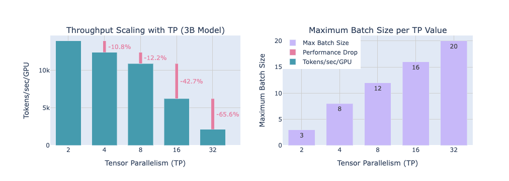

TP를 증가시키면 GPU당 throughput(per-GPU throughput)은 줄어들지만(좌측), 동시에 더 큰 배치 사이즈를 처리할 수 있게 되므로(우측), 분산 학습에서 연산 효율성과 메모리 가용성 사이의 명확한 트레이드오프가 발생하게 된다.

실제로, 위 왼쪽 그래프에서 볼 수 있듯이 텐서 병렬화의 통신 오버헤드는 GPU 수가 8개를 초과하는 시점부터 특히 두드러지게 나타난다. 하나의 노드 내에서의 텐서 병렬은 고속 NVLink 인터커넥트를 활용할 수 있지만, 노드를 넘어서는 경우에는 훨씬 느린 네트워크 연결을 사용해야 한다. 예를 들어 TP=8에서 TP=16으로 확장할 때 성능 하락이 크며, TP=16에서 TP=32로 갈 때는 성능이 급격히 감소한다. 병렬화 수준이 높아질수록 통신 오버헤드가 연산 시간보다 더 큰 비중을 차지하게 된다.

그럼에도 불구하고, 텐서 병렬화는 모델 파라미터, 그래디언트, 옵티마이저 상태, 그리고 일부 액티베이션 값을 GPU 간에 분산함으로써 메모리 사용 측면에서 중요한 이점을 제공한다. 이제, 이러한 효과가 700억 개 파라미터 모델에 대해 어떤 영향을 주는지 살펴보자:

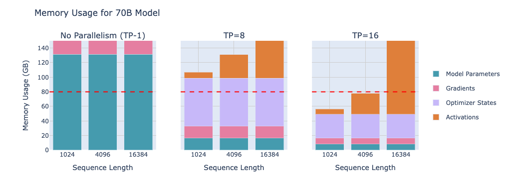

텐서 병렬화 수준을 높이면, 각 GPU에서 모델 파라미터, 그래디언트, 옵티마이저 상태에 필요한 메모리가 줄어들어, 더 큰 모델을 하나의 8-GPU 노드에 적재할 수 있게 된다.

그렇다면 이 기법에서 더 많은 이점을 얻을 방법은 없을까? 레이어 정규화(LayerNorm)와 드롭아웃(Dropout)은 여전히 전체 액티베이션 값을 각 GPU에서 모아야 하기 때문에, 메모리 절약 효과를 일부 상쇄시킨다. 하지만 이러한 연산들 또한 병렬화할 수 있는 방법을 찾아낸다면, 더 나은 결과를 얻을 수 있다.

> 📝 참고
>
> 텐서 병렬 훈련에서 레이어 정규화에 대해 흥미로운 점이 하나 있다. all-gather 이후 각 TP 랭크가 동일한 액티베이션 값을 보기 때문에, 백워드 패스 후에 레이어 정규화의 파라미터(가중치)에 대해 그래디언트를 동기화하기 위한 all-reduce 연산이 필요하지 않다. 이 파라미터들은 자연스럽게 TP 랭크 간 동기화된 상태를 유지한다. 반면, 드롭아웃 연산의 경우에는 결정론적인 동작을 보장하기 위해 TP 랭크 간에 난수 시드를 동기화해주어야 한다.

다음으로, 텐서 병렬화의 자연스러운 확장 방식인 **시퀀스 병렬화(sequence parallelism)** 를 살펴볼 것이다. 이 방식은 위에서 언급한 문제를 해결하기 위해 고안되었다.

### 시퀀스 병렬화 (Sequence Parallelism)

시퀀스 병렬화(Sequence Parallelism, SP)는 텐서 병렬화가 처리하지 않는 드롭아웃(dropout)과 레이어 정규화(LayerNorm) 같은 연산에 대해, 은닉 차원이 아닌 입력 시퀀스 차원을 따라 액티베이션 값과 계산을 분할하는 방식이다.

> 📝 참고
>
> ‘시퀀스 병렬화’라는 용어는 다소 중복되어 사용된다. 여기서 다루는 시퀀스 병렬화는 텐서 병렬화와 함께 사용되는 형태로, 드롭아웃과 레이어 정규화 연산에 적용된다. 그러나 시퀀스 길이가 길어짐에 따라 어텐션 연산이 병목이 되는 경우에는 링 어텐션(Ring Attention)과 같은 기법이 요구되며, 이러한 기법들 또한 시퀀스 병렬화로 불리기도 한다. 혼동을 피하기 위해 이 책에서는 이를 컨텍스트 병렬화(context parallelism) 로 따로 지칭할 것이다. 따라서 이 책에서 "시퀀스 병렬화"라는 표현이 등장할 경우, 항상 텐서 병렬화와 함께 사용되는 방식을 의미한다고 생각하면 된다. (반대로 컨텍스트 병렬화는 독립적으로도 사용 가능하다.)

시퀀스 병렬화가 필요한 이유는, 앞서 언급한 연산들이 정확히 동작하기 위해 전체 은닉 차원(hidden dimension)에 대한 접근이 필요하기 때문이다. 예를 들어, 레이어 정규화는 다음과 같은 연산을 수행한다:

$\text{LayerNorm}(x) = \gamma \cdot \frac{x - \mu}{\sqrt{\sigma^2 + \epsilon}} + \beta$

여기서

- $\mu = \text{mean}(x)$
- $\sigma^2 = \text{var}(x)$ 는 은닉 차원 h 전체에 대해 계산된다.

결과적으로, 이러한 연산은 계산량은 적더라도 은닉 전체 차원을 필요로 하기 때문에 상당한 액티베이션 메모리를 요구한다. 시퀀스 병렬화는 이러한 메모리 부담을 시퀀스 차원으로 나누어 여러 GPU에 분산시킴으로써 해결할 수 있다.

다음 다이어그램은 텐서 병렬 구간과 시퀀스 병렬 구간 사이를 전환하는 과정을 나타내며, 각 구간 전환 시 다른 집합 연산(collective operations) 이 사용된다(f와 g로 표시). 실제 훈련에서는 왼쪽에서 오른쪽으로 이러한 전환이 일어나게 된다:

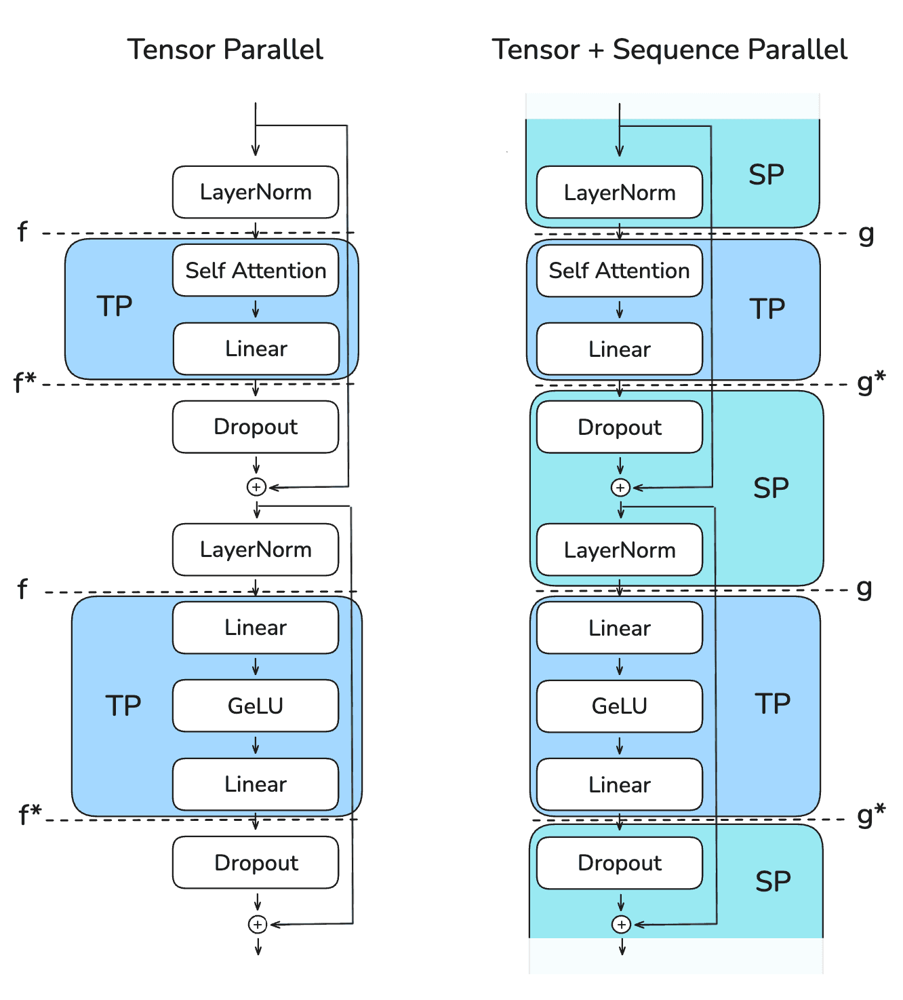

핵심 과제는 메모리 사용량을 최소화하면서 정확성을 유지하는 동시에, 이러한 전환을 효율적으로 관리하는 것이다

텐서 병렬성(Tensor Parallelism)에서는, 순전파 시:

- **f**는 no-op(연산 없음)이다. 왜냐하면 액티베이션 값은 이미 각 rank에 복제되어 있기 때문이다.
- **f\***는 모든 rank 간의 액티베이션 값을 동기화하고 정확성을 보장하기 위한 all-reduce 연산이다.

그리고 역전파 시:

- **f\***는 no-op이다. 왜냐하면 그래디언트가 이미 각 rank에 복제되어 있기 때문이다.
- **f**는 그래디언트를 동기화하기 위한 all-reduce 연산이다.

이러한 **f**와 **f\*** 연산은 **conjugate pair(켤레 쌍)** 이라고 불린다. 왜냐하면 이들은 서로 보완적으로 작동하기 때문이다: 순전파에서는 하나가 no-op이고 다른 하나가 all-reduce이며, 역전파에서는 반대의 관계를 가진다.

시퀀스 병렬성(Sequence Parallelism, SP)에서는 다른 연산들, 즉 g와 g\*가 사용된다. 특히, SP 영역에서는 all-reduce를 사용하지 않는다. 그 이유는 전체 액티베이션를 수집해야 하므로 최대 메모리 사용량(peak memory usage) 을 증가시켜 SP의 목적을 무력화시키기 때문이다.

그렇다면 여기서 실제로 어떤 일이 일어나는가? 유명한 LLM이 말하듯, 한 걸음씩 살펴보자:

① 초기 LayerNorm 층 (SP 영역)

- 입력 텐서 X1* 및 X2*
  (b, s/2, h) 형태이며, 시퀀스 차원을 따라 이미 분할되어 있음.
- 각 GPU는 자신의 시퀀스 청크에 대해 독립적으로 LayerNorm을 수행하여 Y1* 및 Y2*를 생성함.

② 첫 번째 전환 (SP → TP)

- g 연산 (all-gather)은 Y1과 Y2를 결합하여 전체 시퀀스 길이로 복원함.
- column-linear 층이 전체 hidden 차원 h 를 필요로 하므로, Y (b,s,h) 를 복원

③ 첫 번째 Linear 층 (TP 영역)

- A1과 A2는 column-linear 층이므로, Y를 hidden 차원을 따라 분할함.
- GELU는 각 GPU에서 독립적으로 적용됨.
- Z1*, Z2*는 (b,s,h/2) 형태.

④ 두 번째 Linear 층 (TP 영역)

- B1과 B2는 row-linear 층이므로, hidden 차원을 복원함.
- 출력 W1, W2는 (b,s,h)이며, 합산되어야 함

⑤ 최종 전환 (TP → SP)

- g\* 연산 (reduce-scatter) 를 통해 이전 row-linear 층의 정확성을 유지하면서 시퀀스 차원에 따라 결과를 scatter
- 출력 W1*, W2*는 (b,s/2,h) 형상이 됨

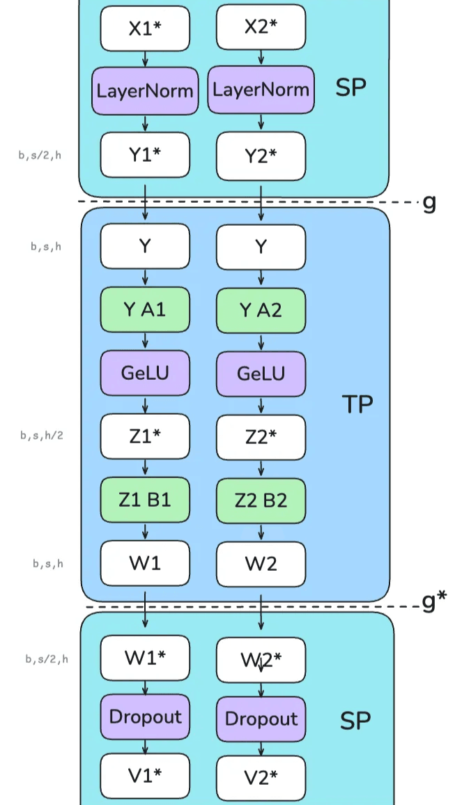

시퀀스 병렬성(sequence parallelism)의 핵심 장점 중 하나는 저장해야 할 최대 액티베이션 메모리 크기(activation size) 를 줄여준다는 점이다. 텐서 병렬성(tensor parallelism)만 사용할 경우, 여러 지점에서 (b, s, h) 형태의 액티베이션을 저장해야 했다. 그러나 시퀀스 병렬성을 함께 사용하면, 항상 시퀀스 차원이나 은닉 차원 중 하나를 분할하므로 최대 액티베이션 크기를 $\frac{b \cdot s \cdot h}{tp}$ 로 줄일 수 있다.

TP와 TP+SP 환경에서 각각 어떤 부분이 어떤 방식으로 분할되는지를 계속 추적하는 것은 쉽지 않다. 우리도 이것을 일일이 대응시키는 데 어려움을 느꼈기 때문에, forward pass 도중 액티베이션 값(=hidden states)의 시퀀스 차원 s과 은닉 차원 h의 형태 변화를 정리한 작은 표를 만들었다:

| 구간                          | TP만 사용한 경우                                               | TP + SP 사용한 경우                                                                       |
| ----------------------------- | -------------------------------------------------------------- | ----------------------------------------------------------------------------------------- |
| **TP 진입부 (column-linear)** | h: 분할됨 (weight_out이 분할됨) s: 전체                        | h: 분할됨 (weight_out이 분할됨) s: **all-gather**로 전체 복원                             |
| **TP 영역 내부**              | h: 분할됨 s: 전체                                              | h: 분할됨 s: 전체                                                                         |
| **TP 종료부 (row-linear)**    | h: 전체 (weight_out 전체 + 정확성 위해 **all-reduce**) s: 전체 | h: 전체 (weight_out 전체 + 정확성 위해 **reduce-scatter**) s: **reduce-scatter**로 분할됨 |
| **SP 영역**                   | h: 전체 s: 전체                                                | h: 전체 s: 분할됨                                                                         |

임베딩 층에 대해서는 다음과 같이 요약된다:

| 구간                                        | 기본 TP (Vanilla TP)                                           | TP + SP 사용한 경우                                                                       |
| ------------------------------------------- | -------------------------------------------------------------- | ----------------------------------------------------------------------------------------- |
| **임베딩 층 (row-linear, vocab 기준 분할)** | h: 전체 (weight_out 전체 + 정확성 위해 **all-reduce**) s: 전체 | h: 전체 (weight_out 전체 + 정확성 위해 **reduce-scatter**) s: **reduce-scatter**로 분할됨 |

이처럼 시퀀스 병렬성을 활용하면, 액티베이션 메모리에 대한 요구량을 더욱 줄일 수 있기 때문에, 텐서 병렬성만 사용할 때보다 더 큰 배치 사이즈와 더 긴 시퀀스 길이를 사용할 수 있게 된다. 다음으로는, 앞서 다룬 70B 모델 예제에서 이 점이 어떤 의미를 가지는지를 살펴보자:

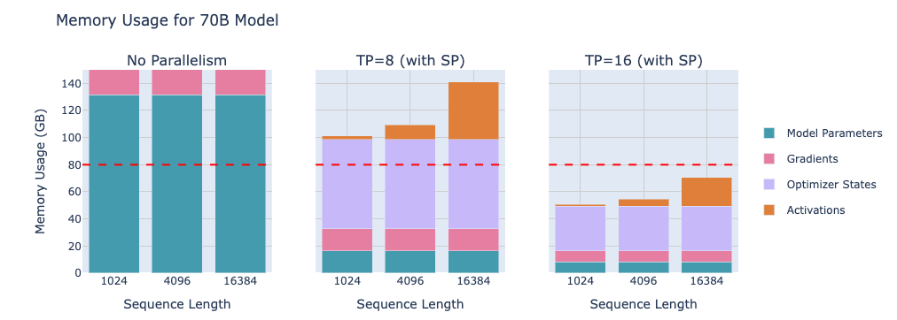

우리는 다시 한 번 GPU당 최대 메모리 사용량을 크게 줄일 수 있었고, 이를 통해 TP+SP=16인 설정에서 시퀀스 길이 16k 토큰까지 수용할 수 있게 되었다. 이는 기본 TP 설정에서보다 개선된 결과다. (앞서 본 것처럼 TP=16은 다소 큰 값이지만, 다음 섹션에서 이를 어떻게 개선할 수 있는지를 살펴보게 될 것이다.)

이 시점에서 하나의 의문이 생길 수 있다. TP+SP를 사용하면 기본 TP보다 통신 오버헤드가 더 크지 않을까? 그에 대한 답은 '그렇기도 하고, 아니기도 하다'이다. 기본 TP의 forward pass에서는 transformer 블록마다 all-reduce 연산이 두 번 수행된다. 반면 SP에서는 all-gather 두 번, reduce-scatter 두 번, 총 네 번의 통신 연산이 수행된다. 따라서 통신 연산의 횟수만 보면 SP가 두 배이다. 하지만 all-reduce 연산은 all-gather와 reduce-scatter로 분해할 수 있으므로 (이에 대해서는 부록의 "Ring AllReduce" 섹션 참고), 통신 비용의 관점에서는 둘이 사실상 동일하다. 같은 논리가 backward pass에도 적용되며, 이때는 각 연산의 켤레(conjugate) 연산이 사용된다 (no-op ↔ all-reduce, all-gather ↔ reduce-scatter).

주의 깊게 살펴본 독자라면 각 레이어마다 총 네 번의 통신 연산이 발생하고 있다는 점을 눈치챘을 것이다 (어텐션에 두 번, MLP에 두 번). 다음은 TP+SP를 사용할 때 MLP 블록에서의 프로파일링 결과를 보여준다:


기본 TP와 마찬가지로, TP+SP 역시 계산과 통신을 쉽게 겹쳐서 수행할 수 없기 때문에 전체 throughput(throughput)은 통신 대역폭에 크게 의존하게 된다. 이 때문에 TP+SP 또한 일반적으로 하나의 노드 내에서만 수행되며, TP degree는 노드당 GPU 수 이하(예: TP≤8)로 유지된다.

이제 텐서 병렬성을 확장할수록 통신 오버헤드가 얼마나 심각해지는지를 벤치마크해 보자. 파라미터 수 3B인 모델에 대해, 시퀀스 길이 4,096으로 설정한 상태에서 TP+SP를 사용할 때의 throughput과 메모리 사용량을 측정해보자:

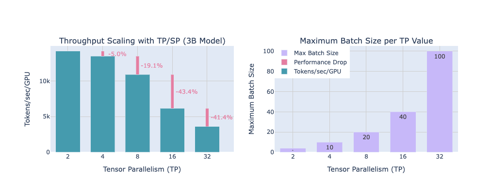

다시 한 번, 계산 효율성과 메모리 용량 사이의 트레이드오프가 존재한다. 병렬화 정도(TP degree)를 높이면 액티베이션 메모리를 줄여 훨씬 더 큰 배치 사이즈를 처리할 수 있게 되지만, 동시에 GPU 하나당 throughput은 줄어든다. 특히 노드 간 통신이 발생하기 시작하는 TP=8을 넘는 순간부터 throughput 저하가 두드러진다.

관찰을 요약해보자:

- 두 방법 모두에서, TP=8에서 TP=16으로 넘어갈 때 성능 저하가 가장 크게 발생한다. 이는 이 시점에서 통신이 단일 노드 내부(NVLink)를 넘어서 노드 간 통신(EFA)으로 전환되기 때문이다.
- TP에 SP를 함께 사용할 경우, 액티베이션 메모리 사용량이 줄어들어 단순한 TP만 사용할 때보다 훨씬 더 큰 배치를 수용할 수 있게 된다.

TP는 attention과 feedforward 연산을 hidden dimension을 따라 분할(shard)함으로써 액티베이션을 여러 GPU에 나눌 수 있게 해주며, SP는 나머지 연산들을 sequence dimension을 따라 분할함으로써 이를 자연스럽게 보완한다는 것을 살펴보았다.

> 📝 참고
>
> SP 영역에 있는 LayerNorm 레이어는 시퀀스의 서로 다른 부분에 대해 작동하므로, 각 TP rank마다 생성되는 그래디언트가 다르다. 가중치의 동기화를 유지하기 위해, 역전파 과정에서 이들 그래디언트를 all-reduce 해야 한다. 이는 데이터 병렬화(DP)가 가중치를 동기화하는 방식과 유사하다. 다만 LayerNorm은 파라미터 수가 상대적으로 적기 때문에, 이에 따른 통신 오버헤드는 작다.

그럼에도 TP+SP에는 두 가지 한계가 존재한다. 시퀀스 길이를 늘리면 TP 영역의 액티베이션 메모리가 여전히 폭증하게 되며, 모델이 너무 커서 TP=8로는 수용할 수 없을 경우, 노드 간 통신으로 인해 심각한 속도 저하가 발생하게 된다.

첫 번째 문제는 **context parallelism**으로, 두 번째 문제는 **pipeline parallelism**으로 해결할 수 있다. 이제 context parallelism을 먼저 살펴보자.

## 컨텍스트 병렬화 (Context Parallelism)

텐서 병렬화(TP)와 시퀀스 병렬화(SP)를 함께 사용하면, 모델 가중치와 액티베이션이 모두 여러 GPU에 분산되기 때문에 GPU당 메모리 요구량을 크게 줄일 수 있다. 그러나 시퀀스 길이를 점점 늘려가며 훈련할 경우(예: 시퀀스당 128k 토큰 이상으로 확장할 때), 여전히 TP 영역에서는 전체 시퀀스를 처리해야 하기 때문에 단일 노드의 메모리를 초과할 수 있다.

또한, 액티베이션을 완전히 재계산하는 방식을 사용하더라도(이 경우 약 30%의 높은 계산 오버헤드가 발생한다), 각 레이어 경계에서 일부 액티베이션을 메모리에 보관해야 하며, 이 메모리 사용량은 시퀀스 길이에 따라 선형적으로 증가한다.

이 문제를 어떻게 해결할 수 있을까? 컨텍스트 병렬화(Context Parallelism, CP)가 어떻게 도움이 되는지 살펴보자:

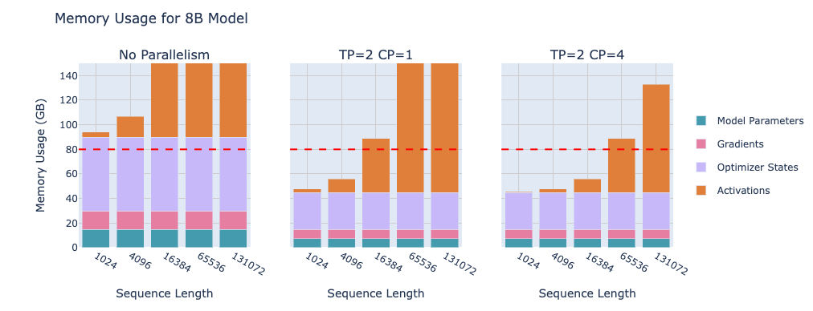

컨텍스트 병렬화(context parallelism)의 핵심 아이디어는 시퀀스 병렬화(sequence parallelism)와 유사하다. 즉, 시퀀스 길이를 따라 분할하는 것이다. 하지만 이 방식은 기존에 텐서 병렬화를 적용했던 모듈에 대해서도 동일하게 적용된다는 점에서 다르다. 따라서 우리는 이러한 모듈을 두 개의 차원에 따라 분할하게 되며, 이로 인해 시퀀스 길이의 영향을 더욱 줄일 수 있다. 지금까지 배운 내용을 바탕으로 보면, 이 접근 방식은 꽤 직관적으로 느껴질 것이다. 다만, 여기에는 하나의 ‘트릭’이 숨어 있으니 집중해서 보아야 한다!

컨텍스트 병렬화에서는 시퀀스 병렬화와 마찬가지로 입력을 시퀀스 차원으로 분할한다. 하지만 이제는 이전에 TP+SP 방식에서는 시퀀스 병렬화 영역에만 적용하던 이 분할을, 모델 전체에 적용한다.

시퀀스를 분할한다고 해서 대부분의 모듈에는 영향을 주지 않는다. 예를 들어, MLP나 LayerNorm은 각 토큰을 독립적으로 처리하기 때문이다. 또한 이 방식은 텐서 병렬화처럼 무거운 통신을 필요로 하지 않는다. 가중치 행렬이 아니라 입력만 분할되기 때문이다. 데이터 병렬화와 마찬가지로, 그래디언트를 계산한 후에는 CP 그룹 내의 모든 GPU 간에 그래디언트를 동기화하기 위해 all-reduce 연산이 수행된다.

하지만 한 가지 중요한 예외가 있다. 바로 attention 블록이다. (주의하라는 의미에서 attention이라는 단어를 쓴 셈이다. 하하!) attention 모듈에서는 각 토큰이 다른 모든 시퀀스 토큰들의 key/value 쌍에 접근할 수 있어야 한다. (혹은 causal attention의 경우에는 이전 토큰들까지라도.)

그러나 컨텍스트 병렬화는 시퀀스를 시퀀스 차원으로 GPU들에 나누어 분할하기 때문에, attention 모듈에서는 필요한 key/value 데이터를 주고받기 위해 GPU 간의 전체 통신이 필요하다.

이걸 단순하게 구현하면 통신 비용이 매우 커질 수 있다. 그러면 더 저렴하고 빠르게 처리할 방법은 없을까? 다행히도 있다. key/value 쌍의 통신을 효율적으로 처리하기 위한 핵심 기법이 존재하는데, 그것이 바로 **링 어텐션(Ring Attention)**이다.

> 📝 참고
>
> 컨텍스트 병렬화는 개념적으로는 이후에 다룰 FlashAttention과 유사한 점이 있다. 두 방식 모두 메모리 사용량을 줄이기 위해 온라인 소프트맥스 계산에 의존한다. 하지만 FlashAttention은 단일 GPU 내에서 어텐션 연산 자체를 최적화하는 데 집중하는 반면, 컨텍스트 병렬화는 시퀀스를 여러 GPU에 분산시켜 메모리를 절약한다는 점에서 차이가 있다.

### 링 어텐션 (Ring Attention)

Ring Attention에서는 어텐션 메커니즘을 다음과 같이 구현한다. 각 GPU는 먼저 자신의 key/value 쌍을 다른 GPU로 전송하는 비동기 통신 연산을 시작한다. 이와 동시에, 현재 메모리에 있는 데이터를 바탕으로 어텐션 스코어 계산을 수행한다. 이상적인 경우, 첫 번째 연산이 끝나기 전에 다음 GPU로부터 새로운 key/value 쌍이 도착하여, GPU는 즉시 다음 계산을 이어서 수행할 수 있다.

이 과정을 설명하기 위해, GPU가 네 개이고 입력 토큰도 네 개라고 가정하자. 입력 시퀀스는 시퀀스 차원을 따라 네 개로 고르게 나뉘므로, 각 GPU는 하나의 토큰과 해당되는 Q/K/V 값을 갖는다. 예를 들어 Q1, K1, V1은 첫 번째 토큰의 쿼리, 키, 밸류를 의미하며, 이는 첫 번째 GPU에 위치한다. 어텐션 계산은 총 네 번의 시간 단계(time step)를 거쳐 완료된다. 각 단계마다, 각 GPU는 다음 세 가지 연산을 순차적으로 수행한다:

1. 현재 키와 밸류를 다음 GPU로 전송한다 (마지막 단계는 제외). 이때 전송은 non-blocking 방식으로 수행되어, 연산이 끝나기를 기다리지 않고 다음 연산을 시작할 수 있다.
2. 현재 가지고 있는 키와 밸류를 이용해 로컬에서 어텐션 스코어를 계산한다. 이는 일반적으로 $\text{Softmax}\left( \frac{QK^T}{\sqrt{d}} \right) \cdot V$ 와 같은 연산을 수행하는 것을 의미한다.
3. 이전 GPU로부터 키와 밸류를 수신하고, 이를 현재 키와 밸류로 설정한 뒤 다시 1단계로 돌아간다.

이 세 가지 단계를 총 네 번 반복하면 어텐션 계산이 완성된다.

아래 애니메이션은 이 과정을 네 개의 GPU를 기준으로 시각화한 것이다:


아마도 위 애니메이션을 본 뒤라면, 왜 이 방식을 Ring Attention이라 부르게 되었는지 쉽게 납득할 수 있을 것이다!

하지만 여기에 하나 큰 문제가 있다. Ring Attention을 단순하게 구현하면, causal attention matrix의 형태 때문에 GPU 간 계산량 불균형이 심하게 발생한다는 점이다. 이 문제를 더 자세히 이해하기 위해, causal attention mask가 적용된 어텐션 스코어 행렬을 고려하여 softmax 계산이 어떻게 이루어지는지 살펴보자:


소프트맥스는 행(row) 단위로 계산되므로, 어떤 GPU든지 한 행에 해당하는 토큰들을 모두 수신하면 곧바로 계산을 수행할 수 있다. GPU 1의 경우, 처음부터 토큰 1~4를 가지고 시작하므로 다른 GPU로부터의 정보 수신 없이 바로 계산을 수행할 수 있다. 그러나 GPU 2는 두 번째 라운드까지 기다려야 토큰 1~4를 수신하고, 그제야 토큰 1~8에 대한 계산을 수행할 수 있다. 또한 GPU 1은 다른 모든 GPU보다 훨씬 적은 양의 연산만을 수행하는 것처럼 보인다.

이제 연산을 보다 균형 있게 분산시킬 수 있는 방법이 있는지 살펴보자.

### 지그재그 링 어텐션 – 균형 잡힌 연산 분배 방식

입력 시퀀스를 더 나은 방식으로 분산시킬 필요가 있다. 이 목표는 토큰을 GPU에 단순히 순차적으로 할당하는 대신, 각 GPU에 초반 토큰과 후반 토큰을 적절히 섞어 배치함으로써 달성할 수 있다. 이 접근법은 지그재그 어텐션(Zig-Zag Attention)이라고 불린다. 이러한 새로운 배치 방식에서는 어텐션 마스크 상에서 연산이 고르게 분포되는 것이 보이며, 색칠된 사각형의 개수를 세어보면 연산량이 이제 모든 GPU에 걸쳐 균형 있게 분산되었음을 확인할 수 있다.

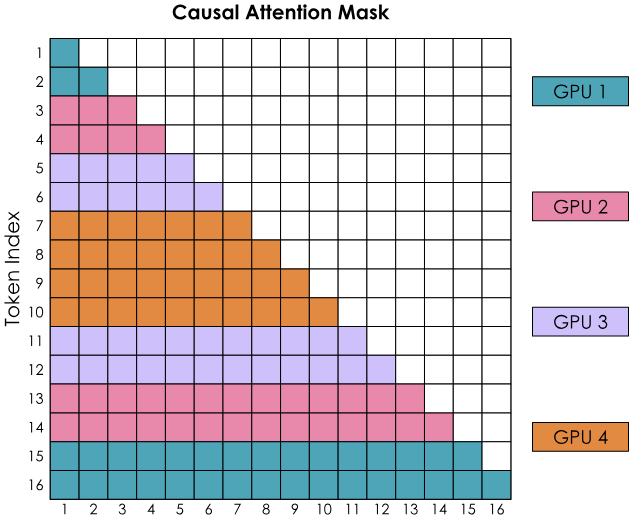

이제 모든 행을 완성하기 위해 각 GPU는 다른 모든 GPU로부터 정보를 받아야 하게 된다.

연산과 통신을 겹치게(overlap) 할 수 있는 일반적인 방법은 두 가지가 있다. 하나는 ZeRO-3 방식처럼 모든 키/값 쌍을 각 GPU에 한 번에 모으는 all-gather 방식이고, 다른 하나는 필요할 때마다 각 GPU로부터 받아오는 방식이다.


이 두 가지 구현 방식의 핵심 차이점은 통신 패턴과 메모리 사용 방식에 있다:

1. **All-gather 방식**:
   - 모든 GPU가 동시에 다른 모든 GPU로부터 전체 키/값 쌍을 모은다.
   - 각 GPU가 전체 K/V 쌍을 한 번에 보관해야 하므로 더 많은 임시 메모리가 필요하다.
   - 통신은 한 번에 이루어지지만 메모리 오버헤드가 크다.
2. **All-to-all(링) 방식**:
   - GPU 간 키/값 쌍을 한 덩어리씩 순차적으로 교환한다.
   - 각 GPU는 한 번에 하나의 덩어리만 임시로 저장하면 되므로 메모리 효율성이 높다.
   - 통신은 여러 단계에 걸쳐 이루어지며 계산과 겹쳐질 수 있지만, 통신 단계가 많아지면서 기본 지연(latency)이 발생한다.

All-to-all 방식은 메모리 효율성 면에서 더 나은 성능을 제공하지만 통신 패턴이 다소 복잡하며, 반면 all-gather 방식은 구현이 간단하지만 어텐션 연산 중 더 많은 임시 메모리를 요구한다.

이제 우리는 TP를 통해 하나의 노드 내에서 큰 모델의 파라미터를 나눌 수 있고, CP를 통해 긴 시퀀스로 인해 발생하는 액티베이션 메모리 폭증 문제를 해결할 수 있음을 보았다.

하지만 여전히 TP는 노드 간 확장성이 떨어진다는 점을 알고 있다. 그렇다면 모델 파라미터가 한 노드에 다 들어가지 않는 경우에는 어떻게 해야 할까? 바로 파이프라인 병렬화(Pipeline Parallelism), 병렬화의 네 번째 축이 등장할 차례다!

## 파이프라인 병렬화 (Pipeline Parallelism)

"텐서 병렬화(Tensor Parallelism)" 섹션에서 살펴본 바와 같이, 텐서 병렬화의 규모를 단일 노드에 있는 GPU 수(보통 4개 또는 8개)를 넘어서 확장하려고 하면, 낮은 대역폭의 네트워크 통신을 사용하게 되어 성능에 큰 영향을 줄 수 있다.

실제로 이러한 노드 간 통신의 영향을 파악하기 위해 클러스터에서 여러 노드에 걸쳐 all-reduce 연산을 벤치마크해 보면 그 차이를 명확히 확인할 수 있다. (각 노드는 8개의 GPU를 포함하고 있음)

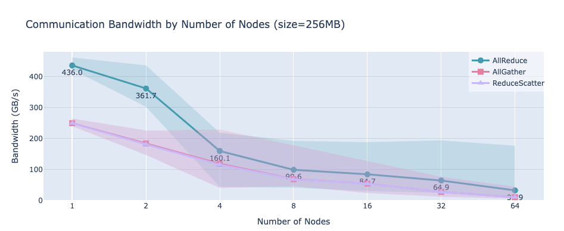

(노드 수에 따른 노드 간 통신 대역폭 측정 결과(all-reduce, all-gather, reduce-scatter 연산에 대한 중앙값 선 및 5–95 백분위 범위 음영 표시))

시퀀스 병렬화(sequence parallelism)와 컨텍스트 병렬화(context parallelism)는 긴 시퀀스를 처리할 때 유용하지만, 메모리 병목의 근본 원인이 시퀀스 길이가 아니라 모델 자체의 크기인 경우에는 큰 도움이 되지 않는다. 70B 이상의 파라미터를 가진 대형 모델에서는, 가중치만으로도 단일 노드에 있는 4~8개의 GPU 한계를 초과할 수 있다.이 문제를 해결하기 위해, 우리는 또 다른 병렬화 차원을 도입한다. 바로 **파이프라인 병렬화(Pipeline Parallelism, PP)** 이다.

파이프라인 병렬화는 단순하면서도 강력한 기법이다. 모델의 레이어들을 여러 GPU에 나누어 배치하는 방식이다. 예를 들어 GPU가 8개 있는 경우, 레이어 1~4는 GPU 1에, 레이어 5~8은 GPU 2에, 이런 식으로 각 GPU가 전체 모델의 일부 레이어만 저장하고 연산하게 된다. 이렇게 하면 GPU당 필요한 메모리 양이 크게 줄어든다. 다음은 8B 파라미터 모델에서 파이프라인 병렬화 적용이 메모리 사용량에 어떤 영향을 미치는지를 보여주는 예시이다:

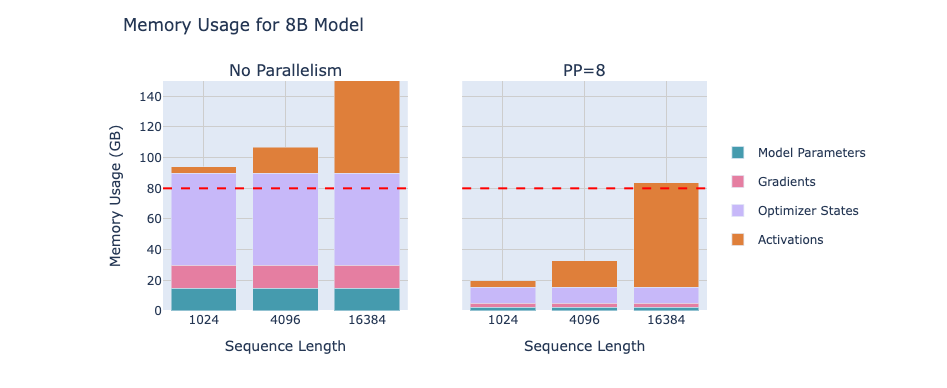

그림을 보면 흥미로운 점을 발견할 수 있다. 모델 파라미터는 GPU들 사이에 잘 분할되어 있지만, 액티베이션 메모리는 각 GPU에서 동일하게 유지된다. 즉, 이 방식으로는 액티베이션 메모리 절감 효과가 없다는 뜻이다.

> 📝 참고
>
> 이는 각 GPU가 첫 번째 역전파(backward pass)를 시작하기 전에 파이프라인 병렬화(PP)의 순방향 연산(forward pass)을 여러 번 수행해야 하기 때문이다. 각 GPU는 전체 레이어의 1/PP 만을 처리하지만, 역전파가 시작되기 전까지 PP개의 마이크로 배치(micro-batch) 를 처리해야 한다. 이 과정에서 각 GPU는 다음과 같은 양의 액티베이션을 저장하게 된다:
>
> $\text{PP} \times \left(\frac{\text{activs}}{\text{PP}}\right) \approx \text{activs}$
>
> 즉, 전체 액티베이션 메모리 요구량은 파이프라인 병렬화를 적용하지 않았을 때와 거의 동일하게 유지된다.

이 방식은 완전히 새로운 형태의 통신 패턴을 도입한다. ZeRO-3와 같은 데이터 병렬화에서처럼 파라미터를 동기화하는 것이 아니라, 이번에는 액티베이션 텐서들을 각 GPU 사이에서 순차적으로 전달하는 파이프라인 방식의 통신을 사용한다. 개념적으로는 단순해 보일 수 있지만, 이 기법을 효율적으로 구현하는 것은 매우 까다로운 작업이다. 지금부터 그 세부 사항을 살펴보자.

### 여러 노드에 걸쳐 레이어 분할 – All forward, all backward

먼저, 단순히 모델의 레이어들을 여러 디바이스에 나눠 분산시킨다고 가정하자. 예를 들어 첫 번째 GPU가 첫 몇 개의 레이어를 담당하고, 두 번째 GPU가 그 다음 레이어들을 담당하는 식이다. 이 경우 순전파는 하나의 데이터 배치를 모델의 깊이에 따라 순차적으로 전달하면서 각 디바이스를 차례로 사용하는 방식이 된다.

이 방식의 첫 번째 분명한 장점은 필요한 인터커넥트 대역폭이 상당히 낮다는 것이다. 모델의 깊이에 따라 소수의 지점에서 중간 크기의 액티베이션 값만 전송하면 되기 때문이다. 이는 예를 들어 TP 방식과 비교했을 때 큰 차이를 만든다. TP에서는 각 레이어 내부에서 여러 차례 통신이 발생하기 때문이다.

그러나 이제 슬슬 문제가 보이기 시작할지도 모르겠다. "순차적으로" 그리고 "차례로"라니? 병렬 계산이 핵심인 세상에서 이는 별로 효율적으로 들리지 않는다. 특히 앞에서 연산과 통신을 겹쳐서 처리하는 중요성에 대해 이야기한 후라면 더욱 그렇다.

맞다. 파이프라인 병렬화(PP)의 핵심 과제는 PP가 갖는 순차적인 특성을 어떻게 효과적으로 회피할 수 있을지이다. GPU들이 항상 작업을 수행하도록 만들고, 어떤 GPU 하나만 계산하는 동안 나머지 GPU들은 대기 상태가 되지 않게 해야 한다.

다음은 모델의 순전파와 역전파를 단순히 직렬적으로 수행했을 때 GPU 사용률이 어떻게 되는지를 나타낸 것이다 (숫자는 모델 레이어를 나타냄):


(파이프라인 병렬화 예시: 16개의 레이어를 4개의 GPU에 분산한 경우. 숫자는 각 레이어의 ID를 나타낸다.)

남아 있는 유휴 시간은 회색으로 표시되며, 일반적으로 “버블(bubble)”이라고 불린다. 지금까지 throughput을 극대화하기 위해 그렇게 애썼는데, 이런 모습을 보면 마음이 아플지도 모른다.

파이프라인 구성의 효율성을 정량화하는 방법 중 하나는 버블 때문에 손실되는 시간을 측정하는 것이다.

각 마이크로 배치와 파이프라인의 각 단계(stage)에서 순전파에 걸리는 시간을 $t_f$, 역전파에 걸리는 시간을 $t_b$ 라고 하자. (단순화를 위해 $t_b ≈ 2 \times t_f$ 라고 가정할 수 있으며, 이는 위의 그래프에 나타난 상황과 유사하다.)

만약 완벽하게 병렬화할 수 있다면, 이상적인 전체 시간은 다음과 같이 표현된다:

$t_{id} = t_f + t_b$

하지만 이 예시에서는 파이프라인 버블로 인해 추가적인 시간이 발생하는데, 그 값은 다음과 같다:

$t_{pb} = (p - 1) \cdot (t_f + t_b)$

여기서 p 는 파이프라인 병렬화의 단계 수(즉, GPU 수)이다. 이 시간은 각 GPU가 다른 GPU의 계산이 끝나기를 기다리는 데 소비되는 시간이다.

이상적인 시간에 대한 추가 버블 시간의 비율은 다음과 같이 계산할 수 있다:

$r_{bubble} = \frac{(p - 1) \cdot (t_f + t_b)}{t_f + t_b} = p - 1$

즉, 병렬화 단계 수 p 가 커질수록 버블 시간도 증가하고 GPU 활용도는 떨어지게 된다. 위 그래프에서도 볼 수 있듯이, 단순한 파이프라인 구현에서는 버블이 매우 클 수 있다.

다행히도, 버블의 크기를 줄이기 위한 다양한 파이프라인 병렬화 기법들이 고안되어 있다.

첫 번째 도구로 사용할 수 있는 접근법은, 배치를 더 작고 병렬 처리가 가능한 단위인 마이크로 배치로 나누는 것이다. 이전에 데이터 병렬화(DP) 방식에서도 사용했던 기법이다.

이제 두 번째 GPU가 마이크로 배치 1을 처리하고 있을 때, 첫 번째 GPU는 마이크로 배치 2의 처리를 이미 시작할 수 있다.

다음은 마이크로 배치 8개를 사용하는 스케줄 예시이다:


위의 스케줄은 **전체 순전파 후 전체 역전파(All Forward, All Backward; AFAB)** 스케줄이라고 불린다. 먼저 모든 마이크로 배치에 대해 순전파를 수행한 다음, 모든 마이크로 배치에 대해 역전파를 수행하기 때문이다.

이 방식의 장점은 순전파와 역전파가 여전히 일반적으로 순차적으로 이루어진다는 점에서, 모델 학습 코드를 기존 구조에 가깝게 유지할 수 있다는 것이다. 따라서 파이프라인 병렬화(PP) 방식 중 가장 단순하게 구현할 수 있는 방법 중 하나이다.

Picotron에서 AFAB 파이프라인의 전체 구현을 확인할 수 있다.

- Picotron의 AFAB PP 구현

  ```python
  def train_step_pipeline_afab(model, data_loader, tensor_shapes, device, dtype):
      logging_loss: torch.float32 = 0.0
      input_tensors, output_tensors = [], []
      requires_grad_sync = pgm.process_group_manager.cp_dp_world_size > 1

      for _ in range(data_loader.grad_acc_steps): # All forward passes
          input_tensor = pipeline_communicate(operation='recv_forward', shapes=tensor_shapes, device=device, dtype=dtype)
          batch = next(data_loader)
          batch["hidden_states"] = input_tensor.to(device) if input_tensor is not None else input_tensor
          output_tensor = model.forward(input_ids=batch["input_ids"].to(device), position_ids=batch["position_ids"].to(device), hidden_states=batch["hidden_states"])
          pipeline_communicate(operation='send_forward', tensor=output_tensor, device=device, dtype=dtype)

          # calculate loss on the last stage
          if pgm.process_group_manager.pp_is_last_stage:
              output_tensor = F.cross_entropy(output_tensor.transpose(1, 2), batch["target_ids"].to(device), reduction='mean')
              logging_loss += output_tensor.item() / data_loader.grad_acc_steps

          input_tensors.append(input_tensor)
          output_tensors.append(output_tensor)

      for ith_microbatch in range(data_loader.grad_acc_steps): # All backward passes
          if requires_grad_sync:
              is_last_iteration = (ith_microbatch == data_loader.grad_acc_steps - 1)
              model.require_backward_grad_sync = is_last_iteration
          output_tensor_grad = pipeline_communicate(operation='recv_backward', shapes=tensor_shapes, device=device, dtype=dtype)
          input_tensor, output_tensor = input_tensors.pop(0), output_tensors.pop(0)
          input_tensor_grad = model.backward(input_tensor, output_tensor, output_tensor_grad)
          pipeline_communicate(operation='send_backward', tensor=input_tensor_grad, device=device, dtype=dtype)

      return logging_loss

  ```

이번 예제에서 버블 크기를 추정해보자. 첫 번째 예제와의 차이점은, 이제는 총 마이크로 배치 수가 mmm개이므로 이상적인 처리 시간은 $t_{\text{id}} = m \cdot (t_f + t_b)$ 이 된다는 점이다.

따라서, 파이프라인 버블로 인해 발생하는 비효율의 비율은

$r_{\text{bubble}} = \frac{(p - 1) \cdot (t_f + t_b)}{m \cdot (t_f + t_b)} = \frac{p - 1}{m}$이 된다.

즉, 파이프라인 단계를 여러 개로 나누는 경우 발생하는 비효율성을 줄이기 위해, 마이크로 배치 수 m을 늘림으로써 버블의 크기를 m의 비율만큼 감소시킬 수 있다.

하지만 버블만큼이나 골칫거리인 것이 바로 모든 액티베이션(activation)을 메모리에 저장해야 한다는 점이다. 역전파 단계를 시작할 때까지 각 마이크로 배치에 대한 모든 액티베이션을 계속 메모리에 보관해야 하므로, 이런 PP 구현에서는 메모리 사용량이 급격히 증가하게 된다.

이 문제를 피할 수 있는 더 나은 방법은 없을까?

메모리 폭증의 원인이 역전파에 필요한 액티베이션을 저장하는 데 있다면, 순전파를 수행하면서 동시에 가능한 한 빨리 역전파도 시작하는 방식을 고려해볼 수 있다. 그렇게 하면, 역전파에 필요한 액티베이션을 최대한 빨리 버릴 수 있게 된다.

### One forward, one backward 와 Llama 3.1 스키마

이 스케줄은 **1F1B (One Forward, One Backward)** 스케줄이라 불린다. 이는 중간 상태(steady state)에서 순전파 한 번과 역전파 한 번을 번갈아 수행하는 방식이다. 기본 아이디어는 가능한 한 빨리 역전파를 시작하는 것이다. 스케줄은 다음과 같다:


만약 주의 깊게 세어보면, 버블의 크기는 여전히 동일하다는 것을 알 수 있으므로, 우리의 학습 효율은 크게 개선되지 않는다. 그러나 우리는 이제 더 이상 전체 마이크로배치 수 m 만큼의 activation을 저장할 필요가 없고, 대신 파이프라인 병렬화의 단계 수 p 만큼만 저장하면 된다. 이는 AFAB 스케줄에서 발생했던 activation 메모리 폭발 문제를 줄여준다. 그 결과, 우리는 더 많은 마이크로배치를 추가할 수 있고, 이는 실제로 버블을 줄이는 효과를 가져온다.

이 설정에서 주요한 복잡성은 위 그림에서도 볼 수 있듯이, 순전파와 역전파가 더 이상 깔끔하게 순차적으로 수행되지 않고, 장치 간에 병렬적으로 수행되며 교차된다는 점이다. 이는 일반적으로 단순하고 중앙 집중적인 학습 루프에서 수행되던 방식과 달리, 각 장치에서 순전파에서 역전파로의 전환을 독립적으로 스케줄링해야 함을 의미한다.

이것이 파이프라인 병렬화를 구현하려면 일반적으로 학습 코드뿐만 아니라 모델링 코드에도 상당한 수정을 필요로 하는 이유 중 하나이다.

Picotron에서 1F1B의 전체 구현을 확인할 수 있다:

- Picotron 1F1B PP 구현

  ```python
  def train_step_pipeline_1f1b(model, data_loader, tensor_shapes, device, dtype):
      num_warmup_microbatches = min(pgm.process_group_manager.pp_world_size - pgm.process_group_manager.pp_rank - 1, data_loader.grad_acc_steps)
      num_microbatches_remaining = data_loader.grad_acc_steps - num_warmup_microbatches
      logging_loss, input_tensors, output_tensors  = 0.0, [], []
      requires_grad_sync = pgm.process_group_manager.cp_dp_world_size > 1

      def _forward_step(input_tensor):
          batch = next(data_loader)
          batch["hidden_states"] = input_tensor.to(device) if input_tensor is not None else input_tensor
          output_tensor = model.forward(input_ids=batch["input_ids"].to(device), position_ids=batch["position_ids"].to(device), hidden_states=batch["hidden_states"])

          # calculate loss on the last stage
          if pgm.process_group_manager.pp_is_last_stage:
              output_tensor = F.cross_entropy(output_tensor.transpose(1, 2), batch["target_ids"].to(device), reduction='mean')
              nonlocal logging_loss
              logging_loss += output_tensor.item() / data_loader.grad_acc_steps
          return output_tensor

      for _ in range(num_warmup_microbatches): # Warmup forward passes
          input_tensor = pipeline_communicate(operation='recv_forward', shapes=tensor_shapes, device=device, dtype=dtype)
          output_tensor = _forward_step(input_tensor)
          pipeline_communicate(operation='send_forward', tensor=output_tensor, device=device, dtype=dtype)
          input_tensors.append(input_tensor)
          output_tensors.append(output_tensor)

      if num_microbatches_remaining > 0:
          input_tensor = pipeline_communicate(operation='recv_forward', shapes=tensor_shapes, device=device, dtype=dtype)

      if requires_grad_sync:
          model.require_backward_grad_sync = False

      for ith_microbatch in range(num_microbatches_remaining):  # 1F1B steady state
          is_last_iteration = (ith_microbatch == num_microbatches_remaining - 1)
          output_tensor = _forward_step(input_tensor)
          output_tensor_grad = bidirectional_pipeline_communicate(operation='send_fwd_recv_bwd', send_tensor=output_tensor, recv_shapes=tensor_shapes, device=device, dtype=dtype)
          input_tensors.append(input_tensor)
          output_tensors.append(output_tensor)
          input_tensor, output_tensor = input_tensors.pop(0), output_tensors.pop(0)

          # Trigger gradient sync on the last microbatch but only when last rank (the one that has num_warmup_microbatches = 0) has finished computing its backward pass.
          if num_warmup_microbatches == 0 and is_last_iteration:
              model.require_backward_grad_sync = True

          input_tensor_grad = model.backward(input_tensor, output_tensor, output_tensor_grad)

          if is_last_iteration:
              input_tensor = None
              pipeline_communicate(operation='send_backward', tensor=input_tensor_grad, device=device, dtype=dtype)
          else:
              input_tensor = bidirectional_pipeline_communicate(operation='send_bwd_recv_fwd', send_tensor=input_tensor_grad, recv_shapes=tensor_shapes, device=device, dtype=dtype)

      for ith_warmup_microbatches in range(num_warmup_microbatches): # Cooldown backward passes
          if requires_grad_sync:
              is_last_iteration = (ith_warmup_microbatches == num_warmup_microbatches - 1)
              model.require_backward_grad_sync = (ith_warmup_microbatches == num_warmup_microbatches - 1)
          input_tensor, output_tensor = input_tensors.pop(0), output_tensors.pop(0)
          output_tensor_grad = pipeline_communicate(operation='recv_backward', shapes=tensor_shapes, device=device, dtype=dtype)
          input_tensor_grad = model.backward(input_tensor, output_tensor, output_tensor_grad)
          pipeline_communicate(operation='send_backward', tensor=input_tensor_grad, device=device, dtype=dtype)

      return logging_loss

  ```

이제 1F1B 파이프라인 병렬화 스케줄이 실제로 어떻게 확장되는지, 우리 클러스터에서의 벤치마크를 통해 살펴보자.


왼쪽 그래프에서, 마이크로 배치 수가 파이프라인 병렬화(PP) 차수보다 하나 적은 경우(m=p−1), 파이프라인 버블이 얼마나 성능에 치명적인 영향을 미치는지를 볼 수 있다 — 성능이 낮고, PP를 확장할수록 오히려 하락한다. 오른쪽 그래프에서는 PP 차수가 낮은 경우 성능을 개선하기 위해 마이크로 배치 수를 훨씬 많이 사용하는 경우(m=32≫p−1), 성능이 향상되는 것을 볼 수 있으나, 매우 큰 PP 차수에서는 여전히 한계가 있다. 실질적으로는,m≫p−1 을 유지하기 위해 마이크로 배치 수를 무한히 늘리는 것은 불가능한데, 결국에는 목표 글로벌 배치 사이즈에 의해 제약을 받기 때문이다. PP 차수가 커짐에 따라 설정 가능한 최대 마이크로 배치 수 역시 제한되므로, 결국 버블 크기는

$r_{\text{bubble}} = \frac{p - 1}{m}$ 의 비율에 따라 증가하게 된다.

흥미롭게도, 마이크로 배치 수가 적은 경우에도 성능은 하나의 노드에서 두 개의 노드로 확장할 때(p=8→p=16), 단 14%만 하락한다 — 이는 텐서 병렬화에서 일반적으로 나타나는 약 43% 성능 저하보다 훨씬 좋은 확장성이다. 이처럼 대역폭이 낮은 노드 간 네트워크를 사용할 때에도 비교적 적은 성능 손실로 확장이 가능한 특성 덕분에, 파이프라인 병렬화는 여러 노드를 아우르는 분산 학습에서 특히 매력적인 선택이 된다.

1F1B 스케줄은 액티베이션 메모리 사용량을 크게 줄여주지만, 마지막 그래프에서 보이듯이 파이프라인 버블은 여전히 주요한 효율성 병목이다. 버블 크기가 파이프라인 스테이지 수에 비례하는 한, GPU 계산 자원이 낭비되고 있다. 그렇다면 이 낭비되는 연산 시간을 최소화할 수 있는 더 똑똑한 스케줄을 설계할 수는 없을까?

### 스테이지 교차(interleaving stages)

1F1B 스케줄은 메모리 사용 측면에서는 개선을 제공했지만, 유휴 버블의 크기에는 큰 영향을 주지 못했다. 이 한계를 더 밀어붙일 방법은 없을까?

몇 가지 추가적인 통신 연산을 도입할 의향이 있다면, 이게 가능하다는 사실이 밝혀졌다. 이제 **교차 스테이지(interleaved stages)**에 대해 이야기해보자!

지금까지는 모델을 깊이 차원(model depth)에서 단순하게 나눠왔다. 예를 들어, 1번 GPU에는 1~4번 레이어를, 2번 GPU에는 5~8번 레이어를 배치하는 식이었다. 그러나 레이어를 나누는 방식에는 다른 방법도 존재한다. 예를 들어, 홀수 레이어(1, 3, 5, 7)는 첫 번째 GPU에, 짝수 레이어(2, 4, 6, 8)는 두 번째 GPU에 배치하는 식이다.

이 방식은 일반적으로 “루프형 파이프라인(looping pipeline)”의 일종으로 볼 수 있으며, 마이크로 배치가 모델의 순방향 패스를 통과할 때 GPU 사이를 원형으로 순환하는 구조를 갖는다. 이제 이 방식이 실제로 어떻게 작동하는지 살펴보자.


( 4개의 GPU에 레이어가 분산된 모델에 대한 인터리브드 파이프라인 병렬화(interleaved pipeline parallelism) 예시. 숫자는 여전히 마이크로 배치 ID를 나타내며, 각 GPU에 레이어가 어떻게 분산되어 있는지를 명확히 보여주기 위해 첫 번째와 마지막 레이어는 색상으로 구분하였다. )

여기서는 모델이 동일한 계산을 위해 여러 번 각 GPU를 거치게 되므로 추가적인 통신이 필요하다. 하지만 각 순방향 및 역방향 패스는 GPU당 모델 청크 수인 𝑣 만큼 나뉘게 되므로, 순방향과 역방향 패스를 더 잘 교차(interleave)할 수 있게 된다:

$t_{pb} = \frac{(p - 1) \cdot (t_f + t_b)}{v}$

$r_{bubble} = \frac{1}{v} \cdot \frac{(p - 1) \cdot (t_f + t_b)}{m \cdot (t_f + t_b)} = \frac{p - 1}{v \cdot m}$

즉, 우리는 마이크로 배치 수와 인터리브된 스테이지 수를 늘려 버블을 줄일 수 있게 되었지만, 그에 따라 통신량이 𝑣 배 증가한다는 점도 함께 감안해야 한다. 아래 그래프에서는𝑝 = 8 인 파이프라인 병렬화 설정에서 다양한 구성 결과를 확인할 수 있다. 𝑚 = 1, 𝑣 = 1 은 순진한 파이프라인 병렬화 방식에 해당하며, 𝑣 = 1 인 경우는 AFAB 또는 1F1B 구성에 해당하고, 𝑣 ≠ 1 인 경우는 인터리브드 구성에 해당한다.

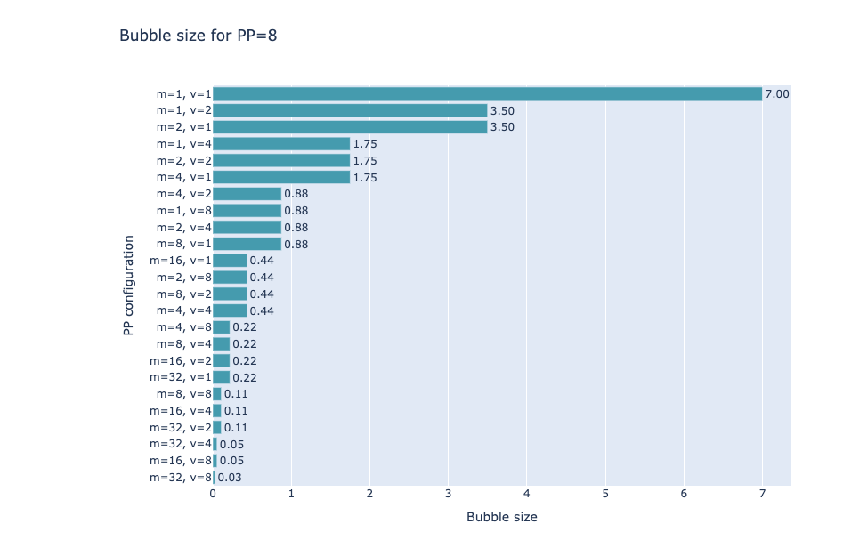

이 방식에서는 스케줄링 또한 더 복잡해진다. 각 GPU와 특정 시점마다, 우리는 앞선 마이크로 배치가 뒤쪽 레이어를 통과하는 것을 우선시할 것인지—즉 순방향 및 역방향 루프를 최대한 빠르게 닫는 것(모델을 가능한 빨리 통과시키는 데 집중하는 "깊이 우선(depth-first)" 접근)—또는 뒤쪽 마이크로 배치가 앞쪽 레이어를 통과하는 것을 우선시할 것인지(파이프라인을 가능한 한 가득 채우는 데 집중하는 "너비 우선(breadth-first)" 접근)를 선택해야 한다. 이 선택은 _Breadth-First Pipeline Parallelism_ 논문에서 자세히 설명된다.

이제 여러분은 Llama 3.1에서 사용된 파이프라인 병렬화 방식, 즉 interleaved stage가 적용된 1F1B 스케줄링 구조와 깊이 우선과 너비 우선 사이에서 조절 가능한 priority 설정을 이해할 수 있는 모든 요소를 갖추었다.

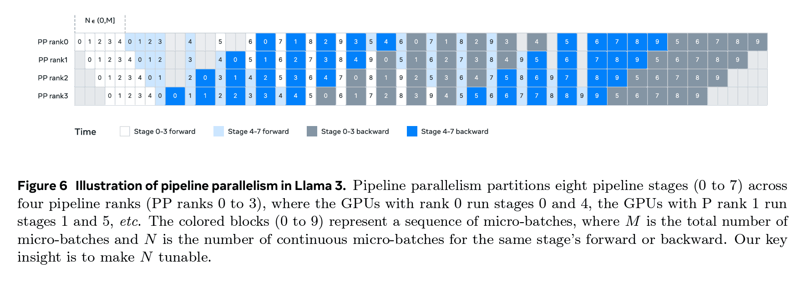

그러나 우리는 아직 가능한 모든 파이프라인 스케줄을 다 살펴본 것이 아니다. 최근에는 **버블을 사실상 0으로 줄이는** 새로운 기법들이 제안되었으며, 이러한 기법은 예를 들어DeepSeek-V3/R1 구현에서 사용되었다. 궁금해졌는가? 파이프라인 병렬화의 세계를 떠나기 전에, 이 마법 같은 스케줄링 기법들을 마지막으로 간단히 살펴보자!

### 제로 버블과 DualPipe

최근에는 버블을 사실상 0으로 줄일 수 있는 더욱 정교한 방법들이 제안되었는데, 예를 들어 DeepSeek-V3/R1 구현에서 사용된 파이프라인 방식인 DualPipe가 있다. 여기서의 핵심은 연산을 훨씬 더 세분화하여 가장 효율적인 방식으로 교차 수행(interleave)할 수 있도록 하는 것이다.

DeepSeek-V3 기술 보고서에서 저자들은 자신들의 구성 방식이 "사실상 제로에 가까운 all-to-all 통신 오버헤드"를 달성했다고 명시한다. 이 방식이 어떻게 가능한지 간단히 살펴보기 위해, DualPipe의 선행 작업이라 할 수 있는 Sea AI Lab의 zero bubble 연구를 요약해보자. 여기서의 기본적인 관찰은, 행렬 곱셈의 역전파(backward pass)는 실제로 두 개의 별도 연산으로 구성된다는 것이다: 입력에 대한 역전파(B)와 가중치에 대한 역전파(W).

여기서 B, 즉 입력에 대한 역전파의 출력은 하위 레이어의 역전파를 수행하는 데 반드시 필요하다. 반면 W, 즉 가중치에 대한 역전파는 그렇지 않으며, 일반적으로 옵티마이저 단계를 실행하기 전에만 완료되면 된다. 이 내용은 다음 다이어그램에서 확인할 수 있다 (Zero Bubble 논문 발췌):

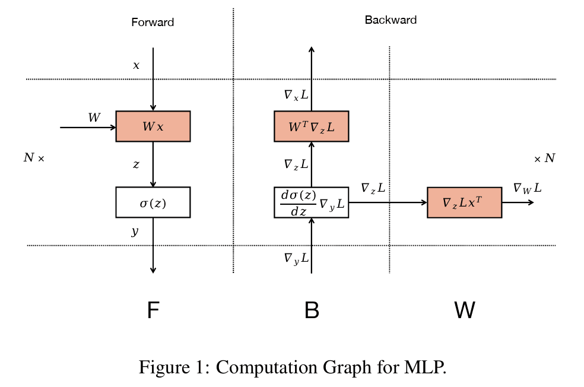

이는 동일한 스테이지의 B 이후라면, W를 유연하게 어느 위치에든 스케줄링할 수 있음을 의미한다. 이를 통해 W 연산을 파이프라인 버블을 채우는 데 전략적으로 배치할 수 있다. 오른쪽 상단의 ZB-H2 스케줄은 이러한 미세한 분해를 활용해 버블이 0인 (이론적인) 스케줄의 한 예시이다.

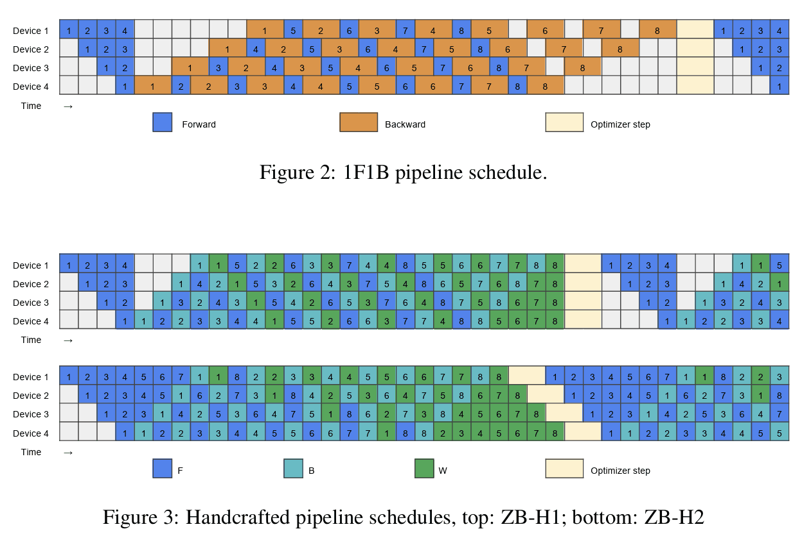

상단 그림(Zero Bubble 논문의 그림 2)은 고전적인 1F1B 스케줄로, 순전파와 역전파를 교차로 실행하지만 여전히 역전파 연산을 거칠게 하나로 묶은 방식이다. 하단 그림(Zero Bubble 논문의 그림 3)은 역전파 연산을 더 미세하게 나눈 B와 W 연산으로 분할한 두 개의 수작업 스케줄을 보여준다. 아래쪽 스케줄은 이러한 미세한 분해를 활용한 (이론적인) 제로 버블 스케줄의 예시이다.

DeepSeek의 DualPipe는 V3 기술 보고서에서 소개된 방식으로, 이 미세 분해 기법을 확장하여 파이프라인 병렬(PP) 차원의 양 끝에서 전파되는 두 개의 연산 스트림을 다루는 경우까지 포괄한다. 이 두 스트림은 GPU에서 유휴 시간을 더욱 줄이기 위해 교차되어 스케줄링된다. 이 스케줄은 다음의 스케줄링 그래프에 나타나 있으며, 이전 스케줄들보다 훨씬 더 복잡함을 볼 수 있다.


일반적으로, 이렇게 복잡한 스케줄을 완전히 최적화하려면 다양한 미세 연산들의 소요 시간을 정밀하게 측정한 후, 최종 버블 시간을 최소화하도록 정수 선형 계획(Integer Linear Programming, ILP) 문제를 풀어야 한다. (관련된 휴리스틱과 알고리즘에 대해서는 Zero Bubble 논문을 참고하라.) 이러한 이유로, Zero Bubble 및 DualPipe 스케줄은 너무 복잡하여 여기에 코드 스니펫을 싣기는 어렵지만, 이제 여러분은 그 개념에 대해 충분히 이해했을 것이다.

이로써 파이프라인 스케줄과 버블의 세계에 대한 여정을 마친다. 즐거운 시간이었기를 바란다!

이제 우리가 효율적으로 대규모 모델을 학습하기 위해 사용할 수 있는 마지막 병렬화 기법인 **전문가 병렬화(Expert Parallelism)** 로 넘어가 보자.

## 전문가 병렬화 (Expert Parallelism)

이제 우리가 다룰 마지막 병렬화 기법에 도달했다. 이 내용을 본격적으로 살펴보기 전에, 만약 당신이 Mixture of Experts(MoE) 모델에 익숙하지 않다면, 예전에 우리가 작성한 [짧은 블로그 글](https://example.com/)을 먼저 읽고 오는 것을 권한다. 이 글은 MoE 아키텍처 전반을 이해하는 데 도움이 될 것이다.

Mixture of Experts 패러다임은 최근 GPT-4, Mixtral, DeepSeek-V3/R1 같은 모델을 통해 주목받고 있으며, 그 존재감도 커지고 있다. 이 접근법의 핵심 아이디어는 다음과 같다: 각 레이어에 단일 피드포워드 모듈만 사용하는 대신, 여러 개의 병렬 모듈(전문가, experts)을 갖추고, 각 토큰을 이들 중 일부로 라우팅하여 서로 다르게 처리하게 만든다는 것이다.

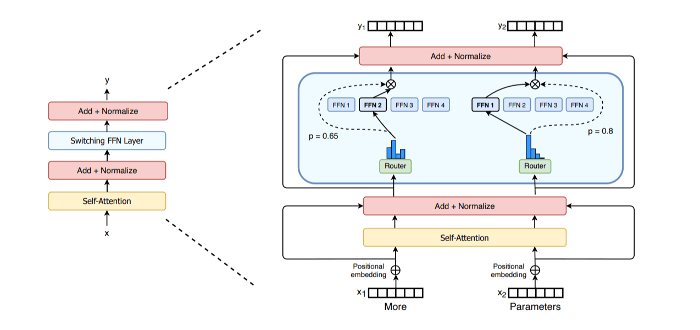

MoE 레이어의 설계 덕분에 전문가 차원(experts dimension) 에서 병렬화를 구현하는 것이 쉽다. 이를 전문가 병렬화(Expert Parallelism, EP) 라고 부른다. 피드포워드 레이어는 서로 완전히 독립적이기 때문에, 각 전문가의 피드포워드 레이어를 다른 워커에 할당하면 된다. 이는 행렬 곱셈을 직접 쪼개야 하는 TP 방식에 비해 훨씬 간단한 접근이다. 토큰의 hidden state를 적절한 전문가로 라우팅만 해주면 되기 때문이다.

실제로는 EP는 다른 형태의 병렬화 기법들, 특히 데이터 병렬화(DP) 와 함께 사용되는 경우가 대부분이다. 그 이유는 다음과 같다:

- EP는 MoE 레이어에만 적용되며, 모델의 나머지 부분에는 영향을 주지 않는다.
- EP는 토큰을 샤딩하지 않으며, 이는 입력 시퀀스를 시퀀스 길이 차원으로 나누는 컨텍스트 병렬화(CP) 와는 다르다.
- EP만 사용할 경우, MoE가 아닌 블록에 대해서는 모든 GPU가 동일한 계산을 중복해서 수행하게 된다.

그래서 EP를 DP와 결합하면, 전문가 레이어는 EP로 분산하고, 나머지 일반 레이어는 DP로 효율적으로 분산시킬 수 있다. 아래의 단순화된 다이어그램은 이러한 구조를 보여준다:


하지만 너무 앞서가지 말자. 다양한 병렬화 전략들 간의 상호작용에 대해서는 다음 섹션에서 다룰 예정이니, 지금 이 마지막 다이어그램을 이해하지 못했더라도 걱정하지 말아라.

실제로 EP를 효율적으로 작동시키기 위해서는 몇 가지 요령이 있고, 이는 모델 설계와 밀접하게 관련되어 있다. 예를 들어, DeepSeek-V3는 라우터에 제약을 두어 각 토큰이 최대

*M*개의 노드(그들의 경우에는 4개)로만 전송되도록 하여, 토큰을 하나의 노드에 유지시키고 통신 오버헤드를 줄이도록 한다. 전문가 병렬화는 꽤 오래전부터 존재해왔지만, MoE 아키텍처의 인기가 높아지면서 지금에서야 새롭게 주목받고 있다.

우리는 곧 Picotron/Nanotron에 EP의 보다 완전한 예제를 추가할 계획이니, 계속 지켜봐 주시길 바란다.

## 5D 병렬화 요약

축하한다, 독자 여러분! 이제 모델 학습을 확장하기 위해 사용할 수 있는 다섯 가지 병렬화 전략을 모두 확인하였다:

- 데이터 병렬화 (Data parallelism, DP) – 배치 차원(batch dimension)을 따라 수행한다.
- 텐서 병렬화 (Tensor parallelism, TP) – 은닉 차원(hidden dimension)을 따라 수행한다.
- 시퀀스 및 컨텍스트 병렬화 (Sequence and context parallelism, SP/CP) – 시퀀스 차원(sequence dimension)을 따라 수행한다.
- 파이프라인 병렬화 (Pipeline parallelism, PP) – 모델 레이어(model layers)를 따라 수행한다.
- 전문가 병렬화 (Expert parallelism, EP) – 모델의 전문가(experts)를 따라 수행한다.

또한, 메모리 절감을 위해 데이터 병렬화와 함께 사용할 수 있는 세 가지 ZeRO 전략도 확인하였다:

- ZeRO-1 – 옵티마이저 상태(optimizer states)를 DP 복제본들 사이에 분할한다.
- ZeRO-2 – 옵티마이저 상태와 그래디언트(gradients)를 DP 복제본들 사이에 분할한다.
- ZeRO-3 – 옵티마이저 상태, 그래디언트, 그리고 파라미터(parameters)를 DP 복제본들 사이에 분할한다.

이쯤 되면, 아마도 가장 궁금한 부분은 이 모든 병렬화 전략과 ZeRO 전략들이 서로 어떻게 비교되고 상호작용하는가일 것이다. 즉, 어떤 것들을 함께 효율적으로 사용할 수 있고, 어떤 것들은 서로 분리해서 사용해야 하는지를 알고 싶을 것이다.

이제 그 유사성과 상호작용을 살펴보도록 하겠다. 파이프라인 병렬화와 ZeRO-3는 서로 매우 비슷하지만 중요한 차이점도 존재하므로, 이 둘을 나란히 비교하는 것부터 시작하겠다.

**파이프라인 병렬화와 ZeRO-3는** 모두 모델의 파라미터를 여러 GPU에 분할하고 모델 깊이(model depth) 축을 따라 통신 및 계산을 수행하는 방법이다 (예: ZeRO-3에서는 다음 레이어를 계산 중에 프리페치한다). 이는 두 경우 모두 각 디바이스에서 전체 레이어 연산이 수행된다는 것을 의미하며, 이는 예를 들어 TP나 EP처럼 레이어 내 단위(sub-layer unit) 수준에서 계산이 이루어지는 경우와는 다르다.

하지만, PP와 ZeRO-3 접근 방식 사이에는 몇 가지 주요한 차이점이 존재한다:

(여기서 “레이어(layer)”라고 표현한 것은 단순화를 위한 것이며, 실제 모델의 분할 단위(sharding unit)는 구현 방식에 따라 여러 개의 레이어, 하나의 레이어, 혹은 레이어의 일부일 수도 있다.)

|                                 | ZeRO-3                                       | 파이프라인 병렬화 (Pipeline Parallelism) |
| ------------------------------- | -------------------------------------------- | ---------------------------------------- |
| 각 연산 유닛이 저장하는 것은... | 레이어의 일부만                              | 전체 레이어                              |
| 통신으로 전달하는 것은...       | 가중치(weights)                              | 액티베이션(activations)                  |
| 오케스트레이션                  | 모델에 종속되지 않음 (Model-agnostic)        | 모델에 종속되지 않음 (Model-agnostic)    |
| 구현 난이도                     | 모델 분할 및 통신 처리 복잡성 있음           | 효율적인 PP 스케줄링 처리 복잡성 있음    |
| 스케일링 고려 사항              | 통신을 숨기기 위해 큰 `mbs`와 `seq_len` 선호 | 버블을 숨기기 위해 큰 `grad_acc` 선호    |

보시다시피, ZeRO-3와 파이프라인 병렬화(PP)는 동일한 문제(모델 파라미터를 여러 GPU에 분산시키는 문제)를 해결하지만, 접근 방식에서는 차이를 보인다. ZeRO-3는 가중치 전송에 통신을 집중하고, PP는 액티베이션 전송에 통신을 집중한다는 점에서 차별화된다.

이 두 방법은 이론적으로 조합할 수 있지만, 실제로는 자주 조합되지 않는다. 그 이유는 통신 비용을 분산시키기 위해 전체 배치 사이즈(global batch size)를 상당히 키워야 하기 때문이며, 이는 전체 배치 사이즈, 모델 크기, 네트워크 대역폭, 학습 효율성 사이의 절충(trade-off)을 초래한다. 만약 이 둘을 조합하기로 한다면, ZeRO-3는 파이프라인 병렬화의 마이크로 배치 시리즈 동안 가중치를 메모리에 유지하도록 설정해야 불필요한 통신 오버헤드를 최소화할 수 있다.

반면, 옵티마이저 상태와 그래디언트에 집중하는 ZeRO-1 및 ZeRO-2는 파이프라인 병렬화와 쉽게 결합할 수 있으며, 서로를 보완한다. 이 조합은 특별한 새로운 문제를 일으키지 않는다. 예를 들어, DeepSeek-V3의 학습에서는 ZeRO-1과 파이프라인 병렬화를 함께 사용하였다.

**텐서 병렬화(시퀀스 병렬화 포함)**는 파이프라인 병렬화와 ZeRO-3 모두와 자연스럽게 결합할 수 있다. 이는 행렬 곱셈의 분배 법칙(distributive property)을 활용할 수 있기 때문이며, 가중치와 액티베이션을 분할한 뒤 독립적으로 계산하고 나서 결과를 결합하는 방식이 가능하다.


우리가 병렬화 전략으로 텐서 병렬화(TP)만을 사용하고 싶지 않은 주된 이유는, 실제로 TP에는 두 가지 한계가 있기 때문이다 (이전 섹션에서 이미 다룬 바 있음). 첫째, TP의 통신 연산은 계산의 크리티컬 패스에 포함되어 있기 때문에, 일정 수준을 넘어서면 통신 오버헤드가 지배하게 되어 확장성이 떨어진다. 둘째, ZeRO 및 파이프라인 병렬화(PP)와는 달리 TP는 모델에 독립적이지 않으며, 액티베이션을 분할하는 방식에 있어서 세심한 관리가 필요하다 — TP 구간에서는 hidden dimension을 따라, SP 구간에서는 sequence dimension을 따라 분할해야 하기 때문이다. 이로 인해 TP는 올바른 분할 패턴을 보장하기 위해 모델 구조에 대한 구체적인 지식이 요구되며, 구현도 더욱 번거로워진다.

이러한 이유로 병렬화 전략을 결합할 때 TP는 일반적으로 고속 intra-node 통신용으로 유지되며, ZeRO-3 또는 PP는 inter-node와 같은 저속 통신을 포함하는 병렬화 그룹에 사용된다. 이는 ZeRO-3가 계산과 통신을 쉽게 겹쳐 수행할 수 있고, PP는 상대적으로 낮은 대역폭으로도 작동 가능한 통신 패턴을 가지기 때문이다. 이러한 기술들을 결합할 때 가장 중요한 고려 사항은 각 병렬화 차원에 따라 GPU들을 효과적으로 그룹화하여 throughput을 극대화하고 통신 오버헤드를 최소화하는 것이다. 특히 TP에 있어서는, TP 그룹에 속한 GPU들은 노드 내에 있어야 한다는 제약을 유념해야 한다.

**컨텍스트 병렬화(CP)와 전문가 병렬화(EP)** 또한 액티베이션을 분할할 수 있도록 도와주며, TP와 상호 보완적인 관계에 있다고 볼 수 있다. CP는 긴 시퀀스를 처리할 때 도움이 되고, EP는 분산 Mixture of Experts 학습을 가능하게 하며, 이 둘은 별다른 문제 없이 결합이 가능하다.

특히 CP는 매우 긴 시퀀스를 학습할 때 발생하는 문제를 해결하기 위해 sequence dimension을 따라 액티베이션을 여러 GPU에 걸쳐 분할하는 방식이다. 대부분의 모듈들 — 예를 들어 MLP와 LayerNorm — 은 이러한 분할된 시퀀스를 독립적으로 처리할 수 있지만, attention 블록의 경우 각 토큰이 전체 시퀀스의 키/값 벡터에 접근해야 하므로 통신이 필요하다. CP 섹션에서 보았듯이, 이는 계산과 통신을 겹쳐 수행할 수 있는 Ring Attention 패턴을 통해 효율적으로 처리된다. CP는 특히 128k 토큰 이상의 극단적으로 긴 시퀀스를 처리할 때 유용하며, 이 경우에는 액티베이션을 완전히 재계산하는 방식조차 단일 GPU의 메모리로는 감당하기 어려운 상황이 발생할 수 있다.


**전문가 병렬화(Expert Parallelism, EP)**는 MoE(Mixture of Experts) 모델을 훈련할 때의 도전 과제를 해결하기 위해 고안된 방식으로, 각 GPU에 특화된 “전문가(expert)”들을 분산 배치하고, 계산 중에는 토큰을 관련된 전문가에게 동적으로 라우팅하는 방식을 따른다. EP에서 핵심적인 통신 연산은 토큰을 할당된 전문가에게 라우팅하고, 처리 결과를 다시 수집하는 “all-to-all” 연산이다. 이러한 방식은 일정 수준의 통신 오버헤드를 수반하지만, 각 토큰이 전체 파라미터 중 극히 일부에만 의해 처리되므로 모델 용량을 매우 효율적으로 확장할 수 있게 해준다. 분산 훈련 또는 추론 측면에서 보면, 전문가들을 GPU에 걸쳐 분할하는 방식은 전문가의 수가 매우 많은 대규모 모델로 확장할 때 특히 중요해진다.


> 📝 참고
>
> 입력 처리 방식에서 EP(전문가 병렬화)와 DP(데이터 병렬화)가 유사하다는 점 때문에, 일부 구현에서는 EP를 데이터 병렬화의 하위 범주로 간주하기도 한다.
>
> 두 방식의 핵심적인 차이점은, EP는 모든 GPU가 동일한 모델 복사본으로 입력을 처리하는 대신, 토큰을 특화된 전문가에게 라우팅하는 방식을 사용한다는 점이다.

### 범위와 중점

이제 각 병렬화 기법이 모델의 어느 부분에 가장 영향을 미치는지 간단히 요약해 보겠다:

- 텐서 병렬화(Tensor Parallelism) 와 시퀀스 병렬화(Sequence Parallelism) 는 가중치와 액티베이션 값을 모두 샤딩함으로써 모델 전체의 연산에 영향을 준다.
- 컨텍스트 병렬화(Context Parallelism) 는 주로 어텐션 계층에 영향을 주는데, 이는 시퀀스 간 통신이 필요한 부분이며, 그 외의 계층은 샤딩된 시퀀스를 독립적으로 처리할 수 있기 때문이다.
- 전문가 병렬화(Expert Parallelism) 는 주로 MoE 계층에 영향을 주며, 이는 기존의 MLP 블록을 대체하는 구조이다. 어텐션 계층과 기타 구성 요소는 변경되지 않는다.
- 파이프라인 병렬화(Pipeline Parallelism) 와 ZeRO 는 특정 하위 모듈에 집중되지 않으며, 예외적으로 파이프라인 병렬화에서는 계층 간의 균형을 맞추기 위해 모듈과 계층이 고려되어야 하며, 이로 인해 첫 번째 및 마지막 계층은 추가적인 임베딩 계층 때문에 종종 다르게 처리된다.

| 텐서 + 시퀀스 병렬화                                 | 컨텍스트 병렬화                        | 전문가 병렬화                                   |
| ---------------------------------------------------- | -------------------------------------- | ----------------------------------------------- |
| 숨김/시퀀스 차원에 따라 가중치와 액티베이션을 샤딩함 | 시퀀스 차원에 따라 액티베이션을 샤딩함 | 전문가 가중치와 액티베이션을 샤딩함             |
| 행/열 선형 연산(행렬곱)을 위한 통신이 발생함         | 어텐션 키/값을 위한 통신이 발생함      | 전문가에게 토큰을 라우팅하기 위한 통신이 발생함 |
| 모델에 특화된 구현이 필요함                          | 어텐션을 제외하면 모델 비의존적임      | MoE 레이어를 제외하면 모델 비의존적임           |
| 노드 내 고대역폭 통신 환경에 적합함                  | 긴 시퀀스 길이에 적합함                | MoE 레이어가 필요함                             |

### 모두 요약하며

그동안 살펴본 모든 병렬화 기법을 하나의 다이어그램에 통합해 보면 어떨까? 네, 저희도 그 도전을 받아들이기로 했다!

이 요약 다이어그램에는 MoE 변형을 포함한 단일 트랜스포머 레이어를 기준으로, 액티베이션과 모듈이 어떻게 구성되는지를 시각화하였다. 또한, 앞서 논의했던 병렬화 방향들과 통신 연산들이 모두 함께 표현되어 있다.


우리는 이와 더불어, 각 전략의 메모리 절감 효과에 대한 **전체적인 개요**도 함께 제공한다. 시퀀스 길이가 달라질 때, 그리고 선택적 재계산과 전체 재계산의 상황에 따라 어떻게 액티베이션과 상호작용하며 메모리를 절약하는지를 시각적으로 보여준다.:

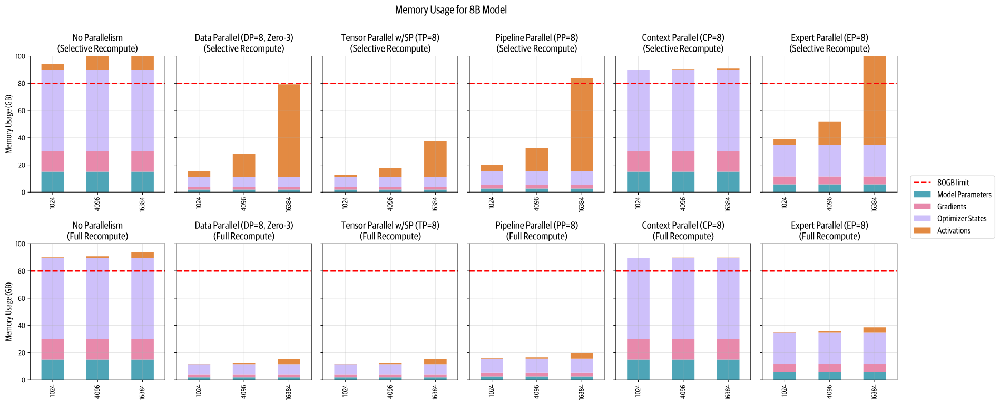

이 섹션을 마무리하면서, 지금까지 살펴본 모든 기술들의 핵심 아이디어와 주요 병목 지점을 한눈에 볼 수 있는 고수준 요약표를 보겠다:

| 방법   | 메모리 절감이 적용되는 대상                | 병렬화/샤딩 차원        | 단점                                       |
| ------ | ------------------------------------------ | ----------------------- | ------------------------------------------ |
| DP     | 액티베이션 (로컬 배치 사이즈 감소)         | 배치                    | 최대 배치 사이즈에 의해 제한됨             |
| PP     | 모델 파라미터                              | 모델 레이어             | 유휴 버블 및 복잡한 스케줄링               |
| TP+SP  | 모델 파라미터 및 액티베이션                | 은닉 차원 / 시퀀스 길이 | 고대역폭 통신 필요                         |
| CP     | 액티베이션                                 | 시퀀스 길이             | 어텐션 모듈에서 통신 오버헤드 발생         |
| EP     | 전문가 파라미터                            | 전문가 차원             | MoE 레이어 필요, 라우팅 통신 오버헤드 추가 |
| ZeRO-1 | 옵티마이저 상태                            | DP 복제본 간 샤딩       | 파라미터 통신 오버헤드                     |
| ZeRO-2 | 옵티마이저 상태 및 그래디언트              | DP 복제본 간 샤딩       | 파라미터 통신 오버헤드                     |
| ZeRO-3 | 옵티마이저 상태, 그래디언트, 모델 파라미터 | DP 복제본 간 샤딩       | 파라미터 통신 오버헤드                     |

분명히, 이러한 기술들 중 어느 것도 마법처럼 모든 상황에 적용 가능한 확장성의 만능 해결책은 아니다. 실제로 우리는 이들 기술을 다양한 방식으로 조합하여 사용하는 경우가 많다. 그렇다면, 이러한 병렬화 전략들 중 어떤 조합을 선택해야 할지에 대해 실질적인 기준이나 일반적인 규칙을 세울 수 있을까? 다음 섹션에서는 바로 이 문제를 다루도록 하겠다.

## 최적의 학습 구성 찾기

우리는 이제, 실제로 더 큰 모델을 분산시켜 학습하는 데 사용되는 모든 병렬화 기술들과, 그것들이 어떤 방식으로 왜 조합될 수 있는지를 모두 살펴보았다. 하지만 여전히 남아 있는 일반적인 질문이 하나 있다. 바로, 어떤 병렬화 방식을 선택하고, 또 어떤 조합으로 결정해야 하는가 하는 것이다.

이 주제는 앞선 섹션에서 간략히 언급한 바 있지만, 이제는 각 병렬화 기법을 어떤 순서와 기준으로 적용할지에 대해 좀 더 구체적으로 살펴보도록 하겠다. 물론, 실제로는 컴퓨팅 클러스터의 물리적 특성(네트워크 대역폭, 노드당 GPU 수, GPU당 메모리 용량 등)에 따라 최적 구성을 찾기 위해 여러 실험이 반드시 병행되어야 함을 기억해야 한다.

### 1단계: 학습 스텝을 메모리에 적재하기

가장 먼저 고려할 것은, 하나의 학습 스텝을 수행하는 데 필요한 전체 모델 인스턴스를 GPU 메모리에 어떻게 적재할 수 있을지를 파악하는 것이다. 보통 두 가지 시나리오로 나눌 수 있다.

1. **GPU가 풍부한 경우 🤑 – 사용할 수 있는 GPU가 많은 경우:**

- 모델의 파라미터 수가 10B 개 미만인 경우, 단일 병렬화 기법(예: 텐서 병렬화 혹은 ZeRO-3 기반 데이터 병렬화)만으로도 전체 재계산(full recomputation)을 수행하며 8개의 GPU로 충분히 학습할 수 있다.
- 모델 파라미터가 10B~100B 사이일 경우에는 8개 이상의 GPU가 필요하며, 다음과 같은 조합이 가능하다:
  - 텐서 병렬화(TP=8)와 파이프라인 병렬화를 결합
  - 텐서 병렬화(TP=8)와 데이터 병렬화(ZeRO-3)를 결합
  - ZeRO-3만 사용하는 경우 (즉, 순수한 데이터 병렬화)
- 512개 이상의 GPU 규모에서는 통신 비용 때문에 순수한 데이터 병렬화/ZeRO-3 방식이 비효율적이기 시작하며, 이 경우 데이터 병렬화를 텐서 병렬화 또는 파이프라인 병렬화와 결합하는 것이 더 바람직하다.
- 1024개 이상의 GPU 규모에서는, 텐서 병렬화(TP=8), 데이터 병렬화(ZeRO-2), 파이프라인 병렬화를 결합한 구성이 권장된다.

현재는 단일 모델 인스턴스를 적재하는 데 집중하고 있다 – 비록 이 목표를 달성하기 위해 ZeRO 기반의 데이터 병렬화를 사용할 수는 있지만, 여기서 관심 있는 것은 ZeRO-3와 함께 사용될 때의 모델 파라미터 메모리 절약 효과이다.

특별 고려사항:

- 매우 긴 시퀀스를 사용하는 경우, 노드 간에 컨텍스트 병렬화를 추가하는 것이 좋다.
- Mixture of Experts 아키텍처의 경우, 노드 간에 전문가 병렬화(expert parallelism)를 사용하는 것이 유리하다.

1. **GPU가 부족한 경우 😭 – 사용할 수 있는 GPU 자원이 적은 경우:**

- 메모리를 절약하기 위해 전체 액티베이션 재계산(full activation recomputation)을 활성화할 수 있다 (대신 계산량이 늘어나며 학습 속도는 느려진다).
- 제한된 메모리로 더 큰 배치를 처리하기 위해 그래디언트 누적(gradient accumulation)을 증가시킬 수 있다.

이제 첫 번째 모델 인스턴스를 학습시킬 수 있게 되었으니, 올바른 배치 사이즈를 사용하는지도 확인해야 한다.

### 2단계: 목표 글로벌 배치 사이즈 달성하기

1단계에서 결정된 마이크로 배치 사이즈와 데이터 병렬화 수준에 따라, 현재의 배치 사이즈가 너무 작거나 클 수 있다. 이제는 목표로 하는 배치 사이즈에 도달할 차례이다.

현재의 글로벌 배치 사이즈를 늘리기 위해서는:

- 데이터 병렬화(data parallelism) 또는 그래디언트 누적(gradient accumulation) 단계를 확장할 수 있다.
- 긴 시퀀스를 사용하는 경우, 컨텍스트 병렬화(context parallelism)를 활용할 수 있다.

현재의 글로벌 배치 사이즈를 줄이기 위해서는:

- 데이터 병렬화를 줄이고 다른 병렬화 기법으로 전환할 수 있다.
- 긴 시퀀스를 사용하는 경우, 컨텍스트 병렬화를 줄일 수 있다.

이제 모델 크기와 배치 사이즈 측면에서 우리가 원하는 일반적인 구성으로 모델이 실행되고 있다. 그렇다면, 이 구성이 가장 빠르게 학습되고 있는 구성일까? 마지막 단계에서는 throughput을 최적화하는 작업을 하게 된다.

### 3단계: 학습 throughput 최적화

우리는 학습이 가능한 한 빠르게 진행되어 모든 소중한 GPU가 항상 잘 활용되도록 하고자 한다. 메모리와 통신이 병목이 되지 않는 한, 다음과 같은 방법을 시도할 수 있다:

- 텐서 병렬화(tensor parallelism)를 확장한다 (노드 내 빠른 대역폭을 활용). 노드 크기에 가까운 병렬화 수준까지 확장함으로써, 다른 형태의 병렬화를 줄일 수 있다.
- 목표 배치 사이즈를 유지하면서 ZeRO-3을 사용해 데이터 병렬화(data parallelism)를 늘린다.
- 데이터 병렬화 통신이 병목이 되기 시작하면, 파이프라인 병렬화(pipeline parallelism)로 전환한다.
- 다양한 병렬화 방식을 하나씩 확장해보며 실험한다.
- 마이크로 배치 사이즈(mbs)를 조정해, 최대 글로벌 배치 사이즈, 모델 크기, 연산량, 통신 간의 최적 균형을 노린다.

### 수천 개 구성 벤치마킹하기

지금까지 단계별 과정을 모두 살펴보았으니, 이제 이 탐색 과정을 실제로 구현해보자.

Nanotron 저장소에는 앞서 논의한 모든 실험을 실행하고, 사용자의 모델과 클러스터를 벤치마킹하는 데 활용할 수 있는 다양한 스크립트가 준비되어 있다.

실제로 우리는 여기에서 다룬 모든 모델 크기뿐만 아니라, 8xH100을 사용하는 1~64개 노드의 다양한 클러스터 구성을 포함한 수천 개의 분산 구성에 대해 직접 벤치마크를 수행하였다.

과학 클러스터 대부분을 점유한 것에 대해 이 자리를 빌려 동료들에게 사과드리며, 그 과정에서 들려온 다소 위협적인 속삭임도 너그러이 받아들이기로 한다.

이제 한 발 물러서서, 수집한 모든 벤치마크 결과를 정리하고 분석함으로써, 이론을 넘어 실제 데이터 상에서 다양한 구성이 어떤 성능 차이를 보이는지 살펴보고자 한다.

이하의 모든 벤치마크는 시퀀스 길이 4,096, 글로벌 배치 사이즈 100만 토큰 기준으로 수행하였으며, 각 모델 크기 및 클러스터 규모에 대해 가장 성능이 우수했던 구성을 수집하여 아래 히트맵에 시각화하였다:

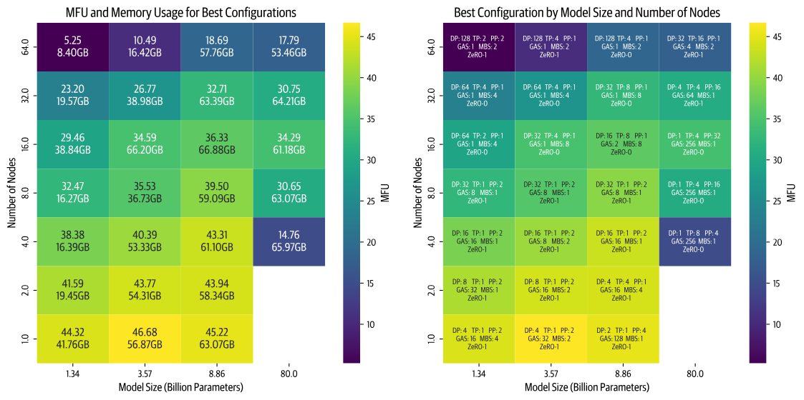

모델 크기와 컴퓨트 노드 수(노드당 GPU 8개)에 따른 최적 학습 구성을 히트맵으로 시각화한 결과이다. 각 조합에 대한 구성 세부 사항에는 데이터 병렬화(DP), 텐서 병렬화(TP), 파이프라인 병렬화(PP), 그래디언트 누적 단계(GAS), 마이크로 배치 사이즈(MBS), ZeRO 최적화 단계 등이 포함된다. 색상 강도는 모델 FLOPs 활용도(MFU)를 나타내며, 밝은 색일수록 더 높은 효율성을 의미한다.

이 고수준 시각화를 통해 다음과 같은 몇 가지 중요한 통찰을 얻을 수 있다:

- 첫째, 노드 수를 증가시키면(즉, 병렬성을 높이면) 효율성이 감소하는 경향이 나타난다. 이 효과는 특히 모델 크기가 작을수록 더 뚜렷하게 나타나는데, 이는 작은 모델일수록 계산 대비 파라미터 비율이 낮기 때문이다. 일반적으로는 배치 사이즈를 키워 이 문제를 보완하지만, 여기에서는 글로벌 배치 사이즈를 100만 토큰으로 고정하였기 때문에 이 보완책이 적용되지 않는다.
- 둘째, 더 큰 모델은 또 다른 도전을 제시한다. 모델 크기가 커질수록 메모리 요구량이 급격히 증가하며, 노드 수가 적은 경우에는 두 가지 시나리오가 발생할 수 있다. 첫째, 모델이 아예 메모리에 적재되지 않거나, 둘째, 가까스로 적재되더라도 GPU 메모리 한계에 근접하게 동작하여 효율이 저하된다(예: 80B 파라미터 모델을 4개 노드에서 학습하는 경우).
- 마지막으로, 벤치마크 결과는 성능이 구현 품질에 크게 의존한다는 점을 보여준다. 초기에 두 병렬화 전략을 구현했을 때에는 텐서 병렬화가 파이프라인 병렬화보다 더 나은 성능을 보였다. 그러나 파이프라인 병렬화 코드를 최적화한 이후에는 PP가 더 빠른 선택이 되었다. 현재는 TP 구현에서 통신과 계산의 오버랩을 개선하고 있는 중이기 때문에, 머지않아 TP가 다시 성능 우위를 회복할 것으로 기대된다.

### 벤치마킹에서 얻은 교훈

이 책의 목표는 단순히 이론과 구현을 다루는 데 그치지 않고, 실제 데이터 포인트를 제공하는 데 있다. 이를 위해 세운 계획은 명확하였다. 가능한 모든 분산 구성에 대해, 다양한 모델과 클러스터 크기를 대상으로 실험을 수행하고자 하였다. 실행이 불가능한 구성을 제외하더라도, 수천 개에 달하는 실험을 수행해야만 하였다.

문서상으로는 단순해 보였으며, 우리 클러스터에서는 대규모 작업 배열을 손쉽게 실행할 수 있었기에 무리가 없어 보였다. 그러나 첫 번째 실험 배치를 실행하자마자 문제가 발생하기 시작하였다:

- PyTorch 프로세스가 제대로 종료되지 않고 남아 있는 경우가 발생하였다.
- Slurm 작업 관리자가 일부 작업을 강제로 종료하면서 노드 오류가 발생하였다.
- 몇 분이면 끝나야 할 간단한 벤치마크가 수 시간 이상 걸리는 일이 발생하였다.
- 일부 작업은 무기한으로 멈춰 응답하지 않는 상태가 되기도 하였다.

이러한 문제들을 해결하고 유한한 시간 내에 모든 실험을 완료하기 위해서는 추가적인 엔지니어링 노력이 필요하였다. 우리는 다음과 같은 작업에 많은 시간을 투입하였다:

- 클러스터 재시작 시간을 최소화하고 유휴 시간을 최적화하는 작업
- NCCL 디버그 로그를 정밀하게 분석하여 통신 병목을 식별하는 작업
- 메모리 사용 패턴과 CUDA 메모리 할당자 동작을 이해하는 작업
- 다중 노드 환경에서 파이프라인 병렬화의 성능을 개선하는 작업

이러한 도전 과정을 통해 분산 학습 인프라의 복잡성에 대해 많은 교훈을 얻을 수 있었다. 이론적으로는 간단해 보이는 작업도 실제 환경에서는 수많은 구성 요소들을 세심하게 고려해야만 원활하게 수행할 수 있다.

이론적인 결과를 실제 환경에서 재현하는 일은 결코 쉽지 않다. 특히, 실제 프로덕션 환경에서 사용되는 학습 코드는 대부분 공개되지 않기 때문에 재현 가능성을 확보하는 데 어려움이 따른다. Nanotron 및 Picotron과 같은 오픈 소스 프로젝트는 이러한 장벽을 낮추기 위한 시도이다. 우리는 이 프로젝트들을 통해 분산 학습 기술을 보다 쉽게 접할 수 있도록 하고, 연구자 및 실무자들이 하드웨어 자원을 최대한 활용할 수 있도록 단순하면서도 효율적인 코드베이스를 함께 발전시켜 나가고자 한다.

---

이로써 5차원 병렬화(5D parallelism)의 분산 방식에 대한 매우 심층적인 탐구를 마무리한다.

이제 한 걸음 물러서 돌아보면, 지금까지의 논의는 하나의 핵심 가정에 자주 의존해 왔음을 알 수 있다. 바로, 계산과 통신이 GPU 상에서 아무런 계산 성능 저하 없이 효율적으로 겹쳐서 실행될 수 있다는 가정이다. 그러나 현실은 그렇게 단순하지 않다. NCCL send/recv와 같은 일반적인 통신 연산자를 사용할 경우, 계산과 통신 자원 사이에서 숨겨진 경합(hidden contention)이 발생하게 된다. 이는 통신 커널 또한 계산에 사용되는 동일한 GPU의 스트리밍 멀티프로세서(streaming multiprocessors)를 활용하기 때문이며, 그 결과 통신과 계산을 겹쳐 수행하면 오히려 throughput이 감소하게 된다.

따라서 분산 학습을 진정으로 최적화하려면 GPU 아키텍처 자체에 대해 더 깊이 있게 이해하고 파고들 필요가 있다.

또한, 계산과 통신을 겹쳐 수행할 때 발생하는 동기화 패턴이 현재 사용하는 병렬화 전략과 항상 최적으로 맞아떨어지는 것은 아니다. 이에 대한 구체적인 사례는 PyTorch 팀의 블로그 포스트에서 확인할 수 있다.

이제 불을 끄고, CUDA 모드로 전환할 시간이다!

## GPU 내부로의 탐구 – 연산 융합, 쓰레딩, 정밀도 혼합

지금까지는 모델 연산의 상위 수준 조직 구조에 집중해 왔다. 다양한 가속기 위에서 연산을 이동시키고, 메모리 제약과 연산 장치의 상위 스케줄링을 고려해 왔다.

그러나 이는 각 GPU에서 모델 연산이 실제로 어떻게 스케줄되고 수행되는지, 즉 더 낮은 수준에서 가능한 최적화들을 완전히 무시한 접근이었다.

이번 섹션에서는 GPU 아키텍처의 세부 구조로 들어가 보고자 한다. NVIDIA GPU 아키텍처를 중심으로 설명하지만, 여기서 다루는 일반적인 개념들은 대부분의 유사한 가속기 장치에도 적용할 수 있다.

우선 GPU가 어떻게 조직되어 있는지 간단히 설명한 뒤, 다음과 같은 내용을 차례로 다루도록 한다:

- FlashAttention 혁신의 작동 방식
- GPU에서 작업 부하를 효율적으로 스케줄하는 방법
- 다양한 정밀도(precision)를 GPU에서 효과적으로 활용하는 방법

### GPU에 대한 기초 이해

일반적으로 GPU는 매우 계층적인 구조를 가지고 있다. 연산 측면에서 보면, GPU는 **Streaming Multiprocessor (SM)** 라는 연산 유닛의 집합으로 구성된다. 각 SM은 다시 여러 개의 Streaming Processor, 즉 코어들을 포함하고 제어한다.

예를 들어, NVIDIA H100 GPU는 다음과 같은 구조를 가지고 있다:

- 132개의 SM
- 각 SM에는 128개의 코어가 있음
- 따라서 총 16,896개의 코어가 존재함

이 각각의 코어는 동시에 여러 쓰레드(thread) 를 처리할 수 있다.

> 💡 더 자세한 내용은 NVIDIA 문서의 Tensor Core 섹션에서 확인할 수 있다.

이러한 구조는 GPU가 대규모 병렬 연산을 매우 빠르게 수행할 수 있도록 해 주는 기반이다.

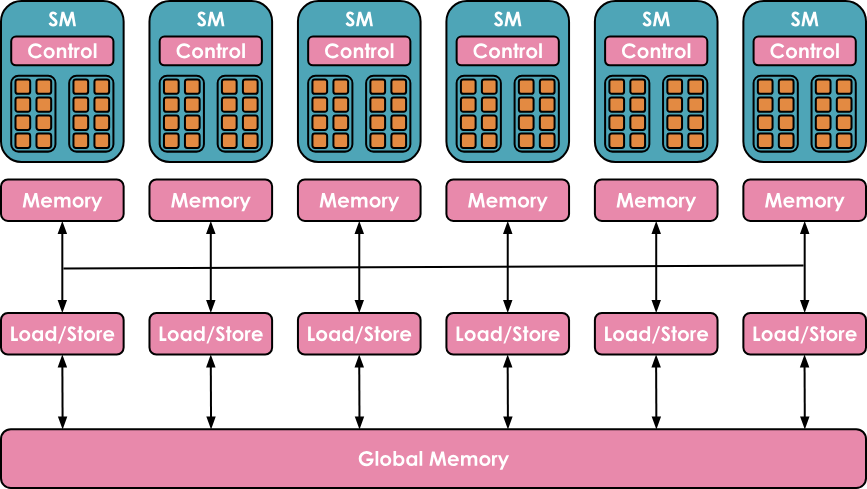

메모리 측면 또한 매우 계층적으로 구성되어 있으며, 여러 단계의 캐시와 메모리가 존재한다. 레지스터는 가장 작은 단위이며, 실행 중인 쓰레드에 의해 독립적으로 사용된다. 공유 메모리와 L1 캐시는 단일 SM에서 실행되는 쓰레드들 간에 공유된다. 그보다 상위에는 모든 SM이 공유하는 L2 캐시가 있고, 마지막으로 글로벌 메모리가 있다. 이는 GPU에서 가장 큰 메모리(H100의 경우 명시된 80GB 등)이지만, 접근 및 조회 속도는 가장 느리다.

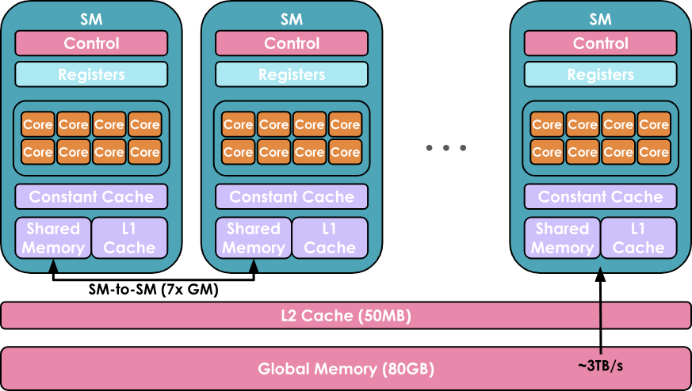

GPU를 사용할 때의 목표는 이와 같은 연산/메모리 자원의 계층적 구조를 활용하여 가능한 한 많은 작업을 병렬로 실행하는 것이다.

GPU의 코어에서 실행되는 코드 조각을 **커널(kernel)**이라고 한다. 예를 들어, CUDA나 Triton 같은 고수준 언어로 작성할 수 있으며, 이후 NVIDIA GPU에서 사용되는 저수준 어셈블리인 PTX(Parallel Thread Execution)로 컴파일된다.

커널을 실행하려면 커널 외에도 호스트에서 실행되는 **호스트 코드**가 필요하며, 이 코드는 데이터 할당을 준비하고, 데이터 및 코드를 로딩하는 역할을 한다.

- 두 벡터를 더하는 CUDA kernel 을 위한 호스트 코드

  ```c
  // Host code
  void vecAdd(float* h_A, float *h_B, float *h_c, int n) {
      // Allocate vectors in device memory
      int size = n * sizeof(float);
      float *d_A, *d_B, *d_C;
      cudaMalloc(&d_A, size);
      cudaMalloc(&d_B, size);
      cudaMalloc(&d_C, size);

      // Copy vectors from host memory to device memory
      cudaMemcpy(d_A, h_A, size, cudaMemcpyHostToDevice);
      cudaMemcpy(d_B, h_B, size, cudaMemcpyHostToDevice);

      // Invoke kernel
      int threadsPerBlock = 256;
      int blocksPerGrid =
              (N + threadsPerBlock - 1) / threadsPerBlock;
      VecAdd<<<blocksPerGrid, threadsPerBlock>>>(d_A, d_B, d_C, N);

      // Copy result from device memory to host memory
      // h_C contains the result in host memory
      cudaMemcpy(h_C, d_C, size, cudaMemcpyDeviceToHost);

      // Free device memory
      cudaFree(d_A);
      cudaFree(d_B);
      cudaFree(d_C);
  }
  ```

- 벡터 덧셈 커널의 정의를 포함한 디바이스 코드

  ```c
  // Device code
  __global__ void VecAdd(float* A, float* B, float* C, int N)
  {
      int i = blockDim.x * blockIdx.x + threadIdx.x;
      if (i < N)
          C[i] = A[i] + B[i];
  }

  ```

커널은 일반적으로 다음과 같이 스케줄된다.

- 스레드는 32개의 스레드로 이루어진 워프(warp) 단위로 묶인다. 워프 내의 모든 스레드는 서로 다른 데이터 부분에 대해 동시에 명령어를 실행하도록 동기화된다.
- 워프들은 보다 유연한 크기의 블록으로 묶이며(예: 하나의 블록에 512개 혹은 1,024개의 스레드가 포함될 수 있음), 각 블록은 단일 SM에 할당된다. 하나의 SM은 여러 블록을 병렬로 실행할 수 있다. 그러나 사용 가능한 자원에 따라 일부 블록은 즉시 실행되지 않고, 자원이 확보될 때까지 대기 상태에 놓일 수 있다.

여기서 기억해야 할 핵심은, 다양한 메모리 크기, 워프 내 스레드 수, 동시에 실행 가능한 블록 수 등 여러 가지 크기와 할당 제약이 존재하며, 이들을 고려해야 GPU 아키텍처를 가장 효율적으로 활용할 수 있다는 점이다.

대부분의 경우 이처럼 정밀한 수준까지 직접 다룰 필요는 없으며, 커뮤니티에서 이미 작성된 커널과 코드를 재사용하면 충분하다. 하지만 커널을 직접 작성해보고 싶은 사람들을 위해 몇 가지 입문 팁도 제공하겠다.

### 커널을 통한 성능 향상

최적화된 커널이 없는 새로운 연산을 추가하거나 기존의 PyTorch 함수를 더 빠르게 만들고 싶다면, 커널을 처음부터 작성하는 것이 가장 직접적인 방법처럼 보일 수 있다. 그러나 고성능 CUDA 커널을 처음부터 작성하는 일은 상당한 경험을 요구하며, 학습 곡선도 매우 가파르다. 일반적으로는 PyTorch 코드의 연산을 포착하여 하위 수준의 고성능 커널로 자동 변환해주는 `torch.compile`을 활용하는 것이 더 좋은 출발점이다.

예를 들어, ELU(Exponential Linear Unit) 활성화 함수를 위한 커널을 작성하고 싶다고 가정해보자:

$\text{ELU}(x) =
\begin{cases}
e^x - 1 & \text{if } x < 0 \\
x & \text{if } x \geq 0
\end{cases}$

당신은 간단한 PyTorch 구현부터 시작할 수 있으며, 그 위에 `@torch.compile` 데코레이터만 추가하면 된다:

```python
@torch.compile
def elu(x, alpha=1.0):
    return torch.where(x < 0, alpha * (torch.exp(x) - 1), x)
```

다음 그래프에서 볼 수 있듯이, 컴파일된 버전과 컴파일되지 않은 버전 사이에는 놀라운 성능 차이가 나타난다. 특히 우리가 단지 데코레이터 하나만 추가했다는 점을 고려하면 더욱 그렇다 (`N`은 열의 개수를 나타낸다).

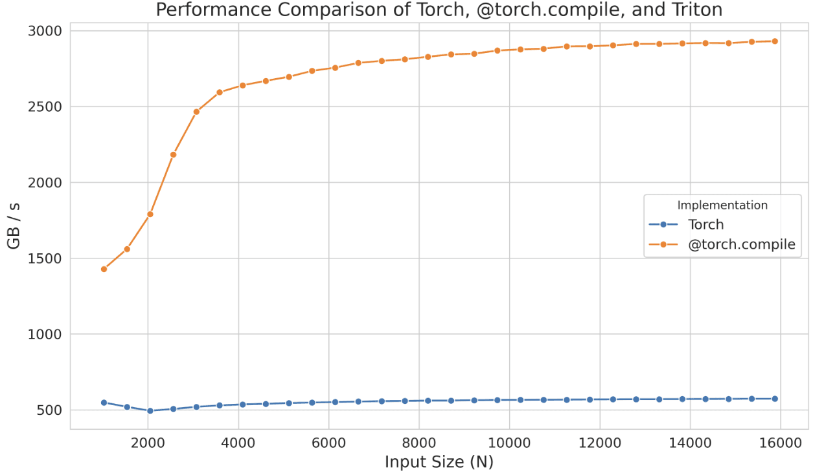

하지만 이 정도의 성능 향상으로는 부족하다면, Triton 커널을 직접 구현하는 것도 고려해볼 수 있다. 시작점으로는 `@torch.compile`이 생성한 Triton 커널을 확인해보는 것이 좋다. 이를 위해서는 환경 변수 `TORCH_LOGS`를 `"output_code"`로 설정하면 된다:

```bash
export TORCH_LOGS="output_code"
```

이 상태에서 `@torch.compile` 데코레이터가 적용된 Python 스크립트를 실행하면, 해당 연산에 대해 자동으로 생성된 Triton 커널 코드가 출력된다. 이 경우 생성되는 커널은 다음과 같다:

```python
@triton.jit
def triton_(in_ptr0, out_ptr0, xnumel, XBLOCK : tl.constexpr):
    xnumel = 100000000
    xoffset = tl.program_id(0) * XBLOCK
    xindex = xoffset + tl.arange(0, XBLOCK)[:]
    xmask = xindex < xnumel
    x0 = xindex
    tmp0 = tl.load(in_ptr0 + (x0), xmask)
    tmp1 = 0.0
    tmp2 = tmp0 < tmp1
    tmp3 = tl_math.exp(tmp0)
    tmp4 = 1.0
    tmp5 = tmp3 - tmp4
    tmp6 = tl.where(tmp2, tmp5, tmp0)
    tl.store(out_ptr0 + (x0), tmp6, xmask)
```

가독성을 높이기 위해, 변수 이름을 더 명확하게 바꾸고, 주석을 추가하고, 약간의 수정을 가할 수 있다 (또는 LLM에게 이를 요청할 수도 있다). 아래는 그 예시이다:

```python
@triton.jit
def elu_kernel(input_ptr, output_ptr, num_elements, BLOCK_SIZE: tl.constexpr):
    # Calculate the starting index for this block
    block_start = tl.program_id(0) * BLOCK_SIZE
    # Create an array of indices for this block
    block_indices = block_start + tl.arange(0, BLOCK_SIZE)[:]
    # Create a mask to ensure only valid indices are processed
    valid_mask = block_indices < num_elements
    # Load input values from the input pointer based on valid indices
    input_values = tl.load(input_ptr + block_indices, valid_mask)
    # Define the ELU parameters
    zero_value = 0.0  # Threshold for ELU activation
    negative_mask = input_values < zero_value
    exp_values = tl.math.exp(input_values)
    # Define the ELU output shift
    one_value = 1.0
    shifted_exp_values = exp_values - one_value

    output_values = tl.where(negative_mask, shifted_exp_values, input_values)

    # Store the computed output values back to the output pointer
    tl.store(output_ptr + block_indices, output_values, valid_mask)
```

여기서 `tl.program_id(0)`은 고유한 블록 ID를 제공하며, 이를 사용하여 해당 블록이 처리할 데이터의 구간을 결정한다. 이 블록 ID를 바탕으로 `block_start`는 각 블록의 데이터 시작 인덱스를 계산하고, `block_indices`는 그 블록이 처리할 인덱스 범위를 지정한다. `valid_mask`는 해당 인덱스가 `num_elements` 내에 있는지를 확인하여 안전하게 데이터를 불러오기 위해 사용되며, 이 때 `tl.load`를 통해 데이터를 읽어온다. 이후 ELU 함수가 적용되어 값이 음수인지 여부에 따라 값을 변형하고, 결과는 `tl.store`를 통해 다시 메모리에 저장된다.

생성된 커널을 `triton.testing.Benchmark`로 벤치마크한 결과는 다음과 같다:

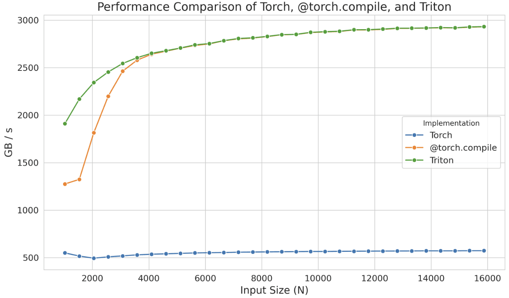

이 독립적인 커널은 작은 사이즈에서도 `@torch.compile`보다 더 나은 성능을 보이기도 한다. 그러나 이는 아마도 `torch.compile`의 컴파일 시간 때문인 일시적인 현상일 가능성이 높다. 어쨌든 처음부터 커널을 직접 작성하기보다는, 이처럼 자동 생성된 커널에서 출발하여 성능 최적화에 집중하는 방식이 훨씬 많은 시간을 절약할 수 있다는 점을 기억해야 한다.

하지만 Triton을 사용하더라도, 장치의 최대 성능을 완전히 달성하지 못하는 경우가 있다. 이는 공유 메모리나 스트리밍 멀티프로세서(SM) 내의 세부적인 스케줄링과 같은 저수준 디테일을 Triton 언어가 완전히 다룰 수 없기 때문이다. Triton은 블록 단위 및 SM 간의 블록 스케줄링까지만 제어가 가능하기에, 더 깊은 수준의 제어가 필요할 경우 CUDA로 커널을 직접 구현해야 한다. CUDA에서는 이러한 저수준 요소들에 직접 접근할 수 있다.

CUDA에서는 커널 효율을 높이기 위한 다양한 기술이 존재한다. 이 장에서는 그 중 일부만을 소개한다. 예를 들어, 메모리 접근 패턴을 최적화하여 지연 시간을 줄이거나, 자주 접근하는 데이터를 공유 메모리에 저장하거나, 스레드의 작업량을 조절하여 유휴 시간을 최소화하는 등의 방법이 있다.

본격적으로 CUDA 예제를 살펴보기 전에, 지금까지 GPU에서 명령어를 실행하는 커널 코드를 작성할 수 있도록 도와주는 도구들을 정리해 보면 다음과 같다:

- PyTorch: 사용하기 쉽지만 느림
- `@torch.compile`: 사용하기 쉽고 빠르지만 유연성이 낮음
- Triton: 조금 더 어렵고 빠르며 더 유연함
- CUDA: 가장 어렵지만, 가장 빠르고, 잘 구현하면 가장 유연함

우리는 이제 CUDA의 가장 일반적인 활용 중 하나인 메모리 접근 최적화를 살펴보면서 본격적인 CUDA 탐구를 시작할 것이다. 앞서 살펴본 것처럼 GPU의 글로벌 메모리는 가장 용량이 크지만, 캐시에 비해 지연 시간이 길고 대역폭도 낮기 때문에 많은 응용에서 병목 현상을 유발한다. 이 글로벌 메모리로부터 데이터를 효율적으로 접근하는 것은 성능 향상에 매우 중요하다.

**메모리 연속 접근(Memory Coalescing)**

GPU의 글로벌 메모리 대역폭을 효과적으로 활용하기 위해서는 메모리 아키텍처에 대한 이해가 필수적이다. CUDA 장치에서 글로벌 메모리는 DRAM을 기반으로 구현되어 있다.

**메모리 연속 접근(Coalescing)**은 DRAM의 버스트 전송 특성을 활용한다. DRAM에서 특정 주소가 접근될 때, 요청된 위치 하나만 읽는 것이 아니라 해당 위치를 포함한 연속적인 위치들의 데이터를 동시에 여러 센서를 통해 병렬로 읽는다. 이렇게 읽힌 데이터는 하나의 버스트 단위로 프로세서에 고속으로 전송된다.

CUDA에서는 이와 같은 DRAM의 버스트 특성을 최대한 활용하기 위해, 하나의 워프(warp)에 속한 스레드들(총 32개)이 연속된 메모리 주소를 접근하도록 유도한다. 예를 들어, 스레드 0이 주소 `M`을, 스레드 1이 `M+1`, 스레드 2가 `M+2`를 접근한다면, GPU 하드웨어는 이 요청들을 병합(coalesce)하여 하나의 큰 메모리 접근 요청으로 처리하게 된다. 이렇게 하면 DRAM이 한 번의 버스트로 전체 요청을 처리할 수 있으므로, 개별적인 요청을 각각 처리할 때보다 훨씬 효율적인 메모리 접근이 가능해진다.

행렬 곱셈(Matrix Multiplication)을 예로 들어 보겠다. 가장 단순하고 직관적인 구현 방식은, 각 스레드가 출력 행렬의 한 요소를 계산하도록 하는 것이다:

```c
__global__ void matmul_naive(int M, int N, int K, const float *A, const float *B, float *C) {
    const uint x = blockIdx.x * blockDim.x + threadIdx.x;
    const uint y = blockIdx.y * blockDim.y + threadIdx.y;

    if (x < M && y < N) {
        float tmp = 0.0;
        for (int i = 0; i < K; ++i) {
            tmp += A[x * K + i] * B[i * N + y];
        }
        C[x * N + y] = tmp;
    }
}
```

여기 Simon Boehm의 훌륭한 블로그 포스트에서 가져온 커널의 뛰어난 시각화 자료가 있다:

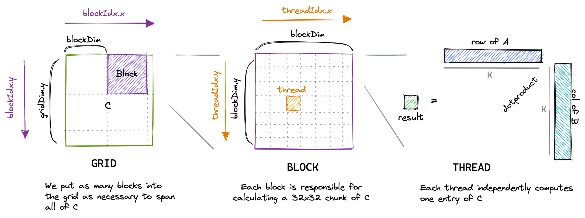

하지만 `ncu`(NVIDIA Compute Utility)와 같은 도구로 이 커널을 프로파일링해 보면, 다음과 같은 문제가 드러난다:

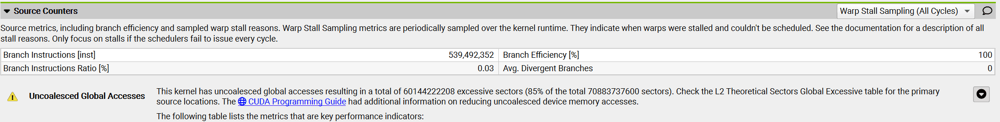

문제의 원인은 다음과 같다.

이 커널에서는, thread ID가 (0, 0)과 (1, 0)인 동일한 블록 내의 두 스레드는 같은 워프에 속하게 되며, 행렬 B의 같은 열에서 값을 로드하고 행렬 A의 서로 다른 행에서 값을 로드한다. 행렬 요소들이 row-major 순서(즉, 행의 요소들이 연속적인 메모리 주소에 저장됨)로 저장되기 때문에, 스레드 (0, 0)는 첫 번째 반복(i = 0)에서 A0,0A*{0,0}A0,0을 로드하고, 스레드 (1, 0)는 A1,0A*{1,0}A1,0을 로드한다. 이 요소들은 메모리상에서 서로 인접하게 저장되지 않기 때문에, 이 정렬 불일치는 각 반복마다 존재하게 되어 메모리 접근이 coalesced되는 것을 방해하게 된다.

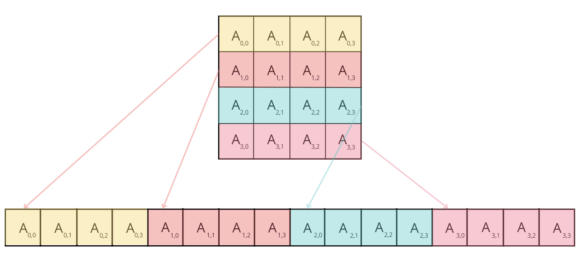

우리 커널의 성능을 향상시키기 위해, 좌표 x와 y를 계산하는 방식을 다음과 같이 변경할 수 있다:

```c
const int x = blockIdx.x * BLOCKSIZE + (threadIdx.x / BLOCKSIZE);
const int y = blockIdx.y * BLOCKSIZE + (threadIdx.x % BLOCKSIZE);

if (x < M && y < N) {
float tmp = 0.0;
for (int i = 0; i < K; ++i) {
    tmp += A[x * K + i] * B[i * N + y];
}
C[x * N + y] = tmp;
}
```

2차원 블록을 사용하는 대신, 우리는 1차원 블록으로 전환하고 x와 y 값을 결정하는 방식을 새롭게 정의한다. 이 새로운 방식에서는 같은 워프에 속한 쓰레드들(즉, 서로 가까운 `threadIdx.x` 값을 가지는 쓰레드들)이 동일한 x 값을 공유하면서 서로 다른 y 값을 가진다. 이는 곧 그들이 행 우선(row-major)으로 저장된 행렬 A의 같은 행을 로드하고, 행렬 B의 서로 다른 열을 로드하게 됨을 의미한다. 그 결과, 메모리 접근이 행 우선 행렬의 형태에 맞춰 coalescing될 수 있다.

새 커널을 프로파일링해보면, 메모리 접근이 비-coalesced되어 있다는 경고가 사라졌으며, **GPU의 메모리 throughput이 약 10배가량 증가했음을 확인할 수 있다.**

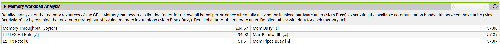

우리는 또한 **커널의 실행 시간이 10배 줄어들었음**을 확인할 수 있다. 놀라운 결과다!

이제 문헌에서 자주 언급되는 또 다른 기법인 **타일링(tiling)**에 대해 알아보겠다.

**타일링(Tiling)**

타일링은 공유 메모리를 활용하여 메모리 접근 패턴을 최적화하는 기법이다. 앞서 언급했듯이, GPU의 공유 메모리는 블록 내 모든 스레드가 접근할 수 있는 작고 빠른 메모리 영역으로, 데이터를 여러 스레드가 재사용할 수 있게 하여 느린 글로벌 메모리에서 반복적으로 데이터를 로드하는 횟수를 줄여준다.

예를 들어 행렬 곱셈에서, 각 스레드는 두 행렬 A와 B에서 필요한 요소들을 가져와야 한다. 만약 각 스레드가 자신이 필요한 행과 열을 글로벌 메모리에서 각각 독립적으로 불러온다면, 블록 내 여러 스레드들이 중복된 데이터를 로드하게 되어 많은 낭비가 발생한다. 대신, 타일링을 이용하면 A와 B의 일부분(“타일”)을 공유 메모리에 한 번만 로드한 뒤, 블록 내 모든 스레드가 이 공유 데이터를 재사용할 수 있다.

타일링 방식에서는 반복문마다 블록 내 모든 스레드가 협력하여 행렬 A와 행렬 B 각각의 타일을 공유 메모리에 로드한다. 구체적으로는, 행렬 A에서 `(BLOCK_SIZE_M × BLOCK_SIZE_K)` 크기의 타일과, 행렬 B에서 `(BLOCK_SIZE_K × BLOCK_SIZE_N)` 크기의 타일을 가져온다. 이 타일들이 공유 메모리에 로드되면, 스레드들은 이 데이터를 이용해 타일 단위의 행렬 곱셈을 수행한다. 이때 계산 결과는 중간 결과를 저장하는 누산(accumulation) 행렬에 저장되며, 각 반복 이후 현재 타일 곱셈 결과가 누산 행렬에 더해집니다. 이 과정을 모든 타일 쌍에 대해 반복하면 전체 행렬 곱셈이 완료된다.

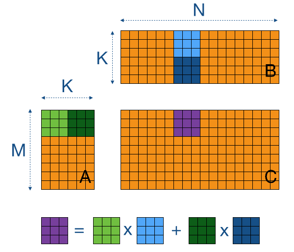

구현에서 이해해야 할 중요한 부분들을 살펴보겠다:

```c
// Set pointers to the starting elements
A += blockRow * TILE_SIZE * K; // Start at row = blockRow, column = 0
B += blockCol * TILE_SIZE; // Start at row = 0, column = blockCol
C += blockRow * TILE_SIZE * N + blockCol * TILE_SIZE; // Start at row = blockRow, column = blockCol
float sum = 0.0;
// The outer loop moves through tiles of A (across columns) and B (down rows)
for (int tileIdx = 0; tileIdx < K; tileIdx += TILE_SIZE) {
sharedA[localRow * TILE_SIZE + localCol] = A[localRow * K + localCol];
sharedB[localRow * TILE_SIZE + localCol] = B[localRow * N + localCol];

// Ensure all threads in the block have completed data loading
__syncthreads();

// Shift pointers to the next tile
A += TILE_SIZE;
B += TILE_SIZE * N;

// Compute the partial dot product for this tile
for (int i = 0; i < TILE_SIZE; ++i) {
    sum += sharedA[localRow * TILE_SIZE + i] * sharedB[i * TILE_SIZE + localCol];
}
// Synchronize again to prevent any thread from loading new data
// into shared memory before others have completed their calculations
__syncthreads();
}
C[localRow * N + localCol] = sum;
```

각 스레드는 먼저 행렬 A와 행렬 B에서 각각 하나의 요소를 공유 메모리로 로드하는 것으로 시작한다. 이때 메모리 접근을 결합(coalesced)시키는 것은 비교적 간단하다. `threadIdx.x`를 지역 열 인덱스(`localCol`)로 지정하면, 같은 워프에 속한 스레드들이 두 행렬의 인접한 요소에 접근하게 되기 때문이다. 블록 내의 모든 스레드가 자신의 요소를 공유 메모리에 로드한 후(`__syncthreads()` 호출을 통해 보장됨), 각 스레드는 두 타일의 내적을 계산한다. 스레드들은 행렬 A의 타일을 수평으로, 행렬 B의 타일을 수직으로 순차적으로 처리하며 반복을 수행한다. 모든 타일을 처리한 후, 계산된 합은 행렬 C의 해당 위치에 저장된다.

이 커널을 `ncu`를 사용하여 벤치마킹한 결과, 메모리 throughput은 410 Gb/s로 증가했고 커널 실행 시간은 약 43% 감소하였으며, 약 6.6 TFLOPS의 성능을 달성했다.

**스레드 코어스닝**

타일링 기법은 커널의 성능을 상당히 향상시켰다. 그러나 각 상태에서 얼마나 많은 사이클이 소비되었는지를 나타내는 워프 상태(warp states) 를 분석해 보면, 다음과 같은 점을 관찰할 수 있다:

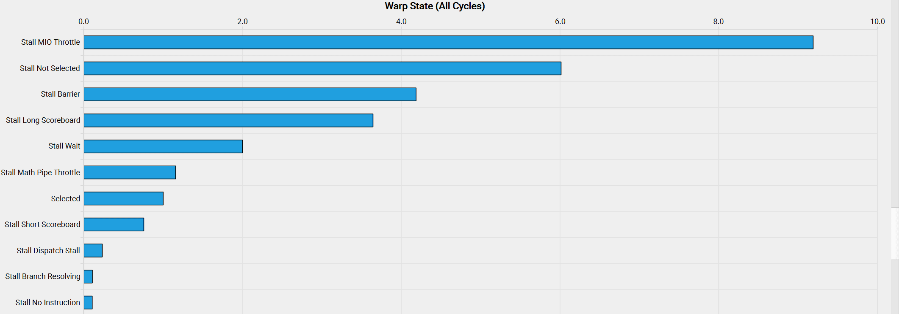

이러한 난해한 상태 이름들의 의미는 NVIDIA의 _Kernel Profiling Guide_ 내 "Warp Stall Reasons" 섹션에서 확인할 수 있다. 거기에서 우리는 `smsp__pcsamp_warps_issue_stalled_mio_throttle`가 다음을 의미한다는 것을 확인할 수 있다: "워프가 MIO (메모리 입력/출력) 명령 큐가 가득 차지 않기를 기다리며 정지됨. 이 정지 사유는 특수 수학 명령어, 동적 분기, 공유 메모리 명령 등을 포함하는 MIO 파이프라인의 극단적 사용 시 높아질 수 있음. 공유 메모리 접근이 원인일 경우, 더 적지만 더 넓은 로드를 사용하는 것이 파이프라인 부하를 줄일 수 있음."

즉, 워프가 공유 메모리 접근이 반환되기를 기다리며 정지되고 있는 것으로 보인다! 이 문제를 해결하기 위해 **스레드 코어스닝(thread coarsening)** 이라는 기법을 적용할 수 있다. 이는 여러 개의 스레드를 하나의 코어스닝된 스레드로 병합하는 방법이며, 공유 메모리 접근을 크게 줄여준다. 각각의 코어스닝된 스레드가 여러 개의 출력 요소를 처리할 수 있기 때문이다.

다음으로, 커스텀 커널을 작성하거나 개선할 때 마지막으로 중요하게 고려해야 할 사항 하나를 간단히 살펴보겠다: **분기(divergence) 를 최소화**하는 것이다.

**제어 흐름 분기(Control Divergence) 최소화**

스트리밍 멀티프로세서(SM)는 SIMD(Single Instruction, Multiple Data) 모델을 기반으로 워프 내 모든 스레드를 실행하도록 설계되어 있다. 이는 특정 시점에 하나의 명령어가 워프 내 모든 스레드에 대해 동시에 fetch되고 실행된다는 뜻이다. 워프가 실행될 때, 그 안의 스레드들은 각기 다른 데이터 조각에 대해 작업하지만 동일한 명령어를 따른다(그래서 “단일 명령어, 다중 데이터”라는 이름이 붙은 것입니다). SIMD의 주요 장점은 효율성이다. 명령어를 가져오고 분배하는 제어 하드웨어가 여러 실행 유닛에 의해 공유되기 때문에, 제어 기능에 소요되는 하드웨어 오버헤드를 최소화하면서 더 많은 하드웨어 자원을 산술 연산 성능 향상에 집중할 수 있게 한다.

제어 흐름 분기(control divergence) 는 동일한 워프 내 스레드들이 서로 다른 실행 경로를 선택할 때 발생한다. 예를 들어, 조건문(if문 등)으로 인해 일부 스레드는 하나의 코드 블록을 실행하고, 나머지 스레드는 다른 블록을 실행하게 되면, 워프는 이러한 실행들을 직렬화해야 한다. 그 결과, 일부 스레드는 다른 스레드들이 완료될 때까지 유휴(idle) 상태로 대기하게 된다. 이 같은 제어 흐름 분기를 최소화하려면, 워프 내 스레드들이 최대한 동일한 실행 경로를 따르도록 커널을 설계해야 한다. 이를 위해 다음과 같은 전략을 사용할 수 있다: 분기를 줄이도록 코드를 재구성하거나, 모든 스레드가 유사한 실행 경로를 따르게 하는 데이터 구조를 사용하거나, 프레디케이션(predication) 같은 기법을 활용하는 것이다.

지금까지 커스텀 커널을 작성하고 GPU 연산의 성능 및 메모리 사용량을 개선할 때 고려해야 할 주요 사항들을 살펴보았다. 하지만 실제 예제로 넘어가기 전에, **커널 결합(kernel fusion)** 이라는 또 하나의 중요한 개념을 다룰 필요가 있다.

### 커널 결합(Fused Kernels)

지금까지 여러 번 언급했듯이, **GPU와 CPU의 연산은 비동기적으로(asynchronous)** 이루어질 수 있다. 특히, CPU에서 실행되는 호스트 코드는 GPU에서 실행될 작업을 **논블로킹 방식**으로 스케줄링할 수 있다.

이러한 방식은 우리가 지금까지 여러 차례 살펴본 것처럼 **통신과 연산을 겹쳐 실행(overlap)** 하는 데 유용할 수 있다. 그러나 이 개념은 더 일반화하여, **가능한 한 CPU와 GPU 커널 명령 간의 왕복 호출을 피하려는 노력**으로 확장될 수 있다.

이 아이디어는 Horace He가 아래의 다이어그램들에서 매우 인상적으로 설명하고 있다:

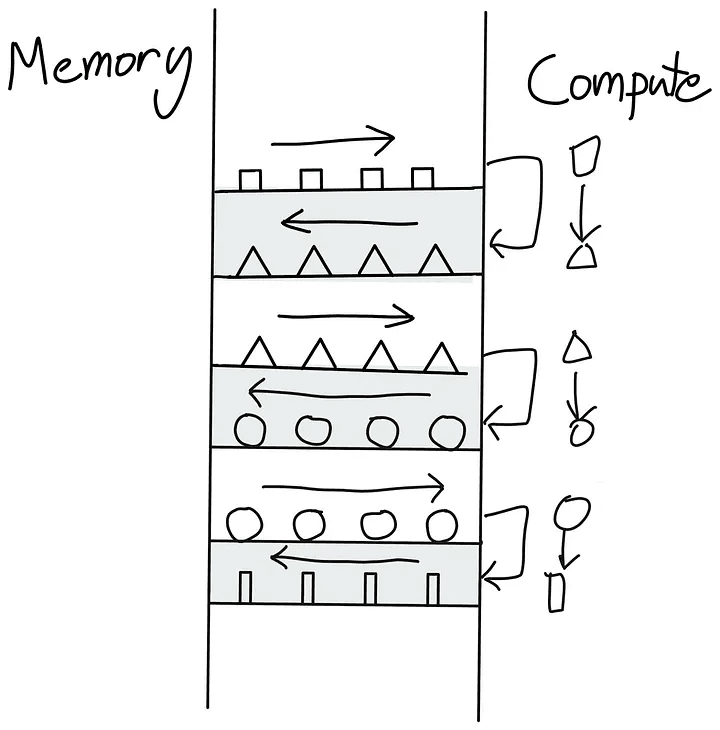

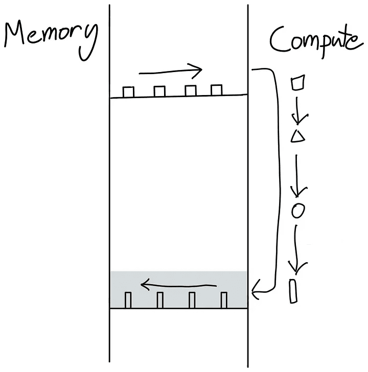

(전역 메모리와 연산 유닛 사이를 오가야 하는 커널들의 연속 실행 과정 / 삼각형 데이터를 전역 메모리에 다시 보내고 다시 읽어오는 대신, 모든 연산을 한 번에 수행한다.)

전역 메모리와 연산 장치 사이에서 발생하는 불필요한 왕복을 피하려면 어떻게 해야 할까? 가장 좋은 방법은 GPU가 가능한 한 자율적으로 작동하도록 만드는 것이다. 이는 가능한 많은 연산들을 하나의 커널 안에 묶어 GPU가 한 번에 처리할 수 있도록 하는 것으로, 이를 “fusion kernel(융합 커널)”이라고 부른다. 오른쪽 그림은 이를 잘 보여준다.

융합 커널은 특히 각 입력 토큰에 대해 독립적으로 수행되는 연속적인 점 단위(point-wise) 연산들에 대해 매우 효율적이고 작성도 간단하다. 이런 경우에는 연산된 값을 전역 메모리에 다시 저장하고, 다시 SM(shared memory)으로 옮긴 후 새 커널을 띄우는 것에 아무런 이점이 없다. 오히려 모든 값을 로컬에 계속 유지한 채로 연산을 모두 끝내는 편이 훨씬 효율적이다.

Transformer 모델에서는 이 fusing 기법을 LayerNorm 계층에서의 연속적인 점 단위 연산처럼, 연산이 연속적으로 이어지는 경우에 자주 적용할 수 있다.

이제 우리는 GPU 커널 최적화의 걸작 중 하나인 **FlashAttention**을 이해할 준비가 되었습니다.

## 플래시어텐션 (FlashAttention)

FlashAttention은 Tri Dao가 제안한 어텐션 연산 최적화 방식으로, 사용자 정의 CUDA 커널을 작성하여 어텐션 계산을 훨씬 빠르고 메모리 효율적으로 만드는 것을 목표로 한다. FlashAttention의 핵심 아이디어는 GPU 메모리 계층 구조 내에서 다양한 메모리 리소스를 효율적으로 활용하여, 가장 느린 전역 메모리(global memory) 의 사용을 피하는 것이다.

현대 GPU의 전역 메모리는 HBM (High Bandwidth Memory) 이라는 기술을 사용한다. 이름과 달리, HBM은 GPU 내의 SRAM보다 느립니다. FlashAttention 구현의 세부사항을 설명할 때 이 HBM이라는 용어는 중요하게 사용된다.

기본적인 어텐션 메커니즘의 구현은 메모리와 연산 장치(worker) 사이에서 매우 많은 데이터 이동을 필요로 한다. 예를 들어, 어텐션 스코어 행렬 $S = QK^\top$ 과 정규화된 어텐션 가중치 행렬 $P = \text{softmax}(S)$ 을 HBM 상에 명시적으로 생성(materialize) 해야 한다. 이는 계산 결과가 HBM에 저장되었다가, 다음 연산을 위해 다시 SRAM으로 옮겨지는 것을 의미한다:

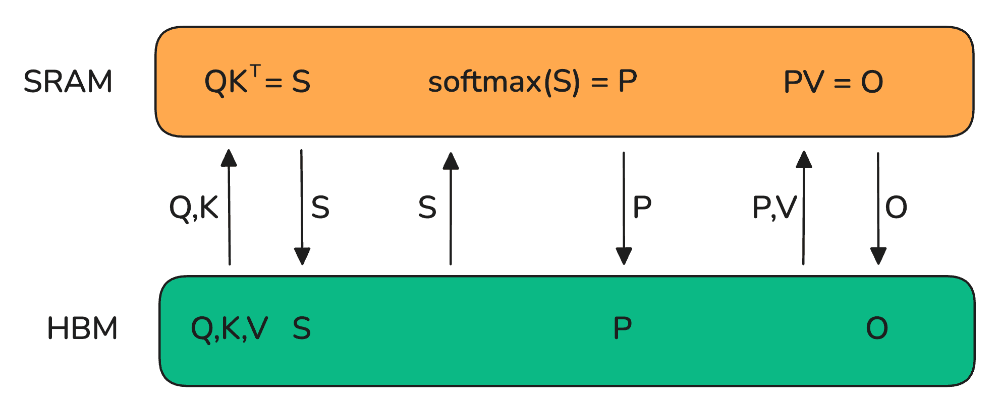

HBM에서의 대역폭은 훨씬 낮기 때문에, 이는 어텐션 계산에서 심각한 병목을 초래한다. 더 나은 방법이 있을까? Tri Dao는 그렇다고 말한다!

핵심 요소는 **S** 행렬을 SM의 더 작은 공유 메모리에 맞출 수 있는 작은 조각으로 나누어 계산하는 것이다. 그러나 우리는 더 나아가, softmax 정규화 계수를 계산하는 데 필요한 통계량만 유지하고, 매우 큰 S 행렬을 명시적으로 생성하는 것을 완전히 피할 수 있다. 따라서, 우리는 일부 O를 SRAM에서의 단일 계산으로 직접 계산할 수 있으며, 중간 결과를 전역 메모리로 이동시키고 다시 가져오는 작업을 피할 수 있다. 이 경우, 우리는 공유 메모리를 사용할 수 있을 뿐 아니라, 모델에서 (긴 컨텍스트 길이에서) 가장 큰 액티베이션 행렬 중 하나인 어텐션 행렬을 생성함으로써 발생하는 메모리 병목도 해소할 수 있다.

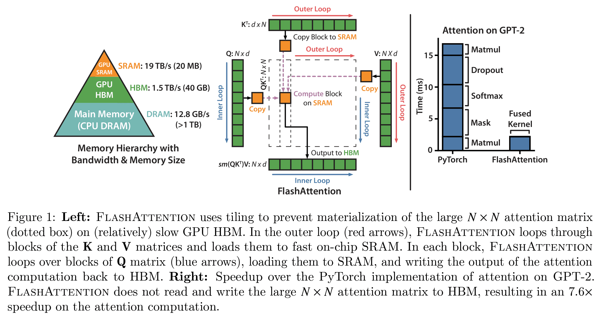

FlashAttention의 아이디어는 모델 학습의 많은 병목 현상을 해결하며, 모든 트랜스포머에서 어텐션을 수행하는 기본 방식으로 빠르게 자리 잡았다. 특히:

- **S** 행렬을 명시적으로 생성하지 않음으로써, **어텐션의 메모리 부담을 줄였다.**
- 또한 **어텐션의 O(S²) 비용이 주는 단순한 영향의 많은 부분을 제거**한다.

트랜스포머 아키텍처가 처음 등장한 이후 개발된 모든 선형 어텐션 및 준-제곱근 근사 어텐션 기법들은 대부분 이 정확하고 빠른 FlashAttention 구현과 메커니즘에 밀려 옆으로 밀려났다.

FlashAttention-1 이후, 같은 연구실에서 두 개의 향상된 버전인 FlashAttention-2와 3이 연이어 발표되었다. FlashAttention-1에 비해, FlashAttention-2와 3의 개선점은 일반적인 어텐션 메커니즘보다는 GPU에 더욱 특화된 저수준 구현에 초점이 맞춰져 있다. 구체적으로는 (1) 비-matmul 연산의 수를 가능한 한 줄이고, (2) 작업을 warp 및 thread block 단위로 정교하게 분할하며 (FlashAttention-2의 경우), (3) FlashAttention-3에서는 최신 Hopper(H100) 아키텍처에서 FP8 및 Tensor Core 지원을 최적화하는 방식으로 개선되었다.

(FlashAttention은 어떤 어텐션 패턴이 가속될 수 있는지에 몇 가지 제약을 둔다. FlexAttention을 확인해 보라. 이는 빠르고 유연한 변형이다.)
FlashAttention은 현재 GPU 가속기의 내부 메모리/연산 설계를 고려할 때, 어떤 혁신적 향상이 가능한지를 보여주는 대표적인 사례이다.

지금까지 이 섹션에서 설명한 기법들은 학습 속도를 높이기 위해 모델링 코드의 변경과 특정 연산에 대한 커널 구현을 필요로 했다.

이 책의 마지막 섹션에서는 모델링 코드와 무관하게 사용할 수 있는 다양한 방법들을 살펴보려 한다. 이 방법들은 어떤 모델에도 적용할 수 있으며, 그 활용도가 매우 높아 산업 전반에서 표준으로 자리잡았다. 다음으로 살펴볼 주제는 바로 **혼합 정밀도 학습이다!**

### 혼합 정밀도 학습

이 책의 여러 섹션에서 우리는 낮은 정밀도의 포맷이 액티베이션, 파라미터, 옵티마이저 상태를 저장할 때 메모리 요구에 어떤 영향을 주는지 이야기했다. 이제는 이 포맷들의 세부 사항을 더 깊이 살펴보고, 그들의 트레이드오프, 장점, 한계를 이해할 시간이다.

혼합 정밀도 학습(Mixed Precision Training)은 이름 그대로 훈련 중 서로 다른 정밀도의 수치 포맷을 혼합하여 사용하는 방법이다. PyTorch 텐서의 기본 수치 정밀도는 단정도 부동소수점 형식으로, FP32 또는 float32라고도 하며, 각 숫자는 32비트(4바이트)를 차지한다. 이 숫자를 표현하는 데 사용되는 비트는 세 부분으로 나뉜다:

- **부호(Sign)**: 첫 번째 비트는 숫자가 양수인지 음수인지를 결정한다.
- **지수부(Exponent)**: 숫자의 크기를 조절한다.
- **가수부(Mantissa)**: 숫자의 유효 숫자를 결정한다.

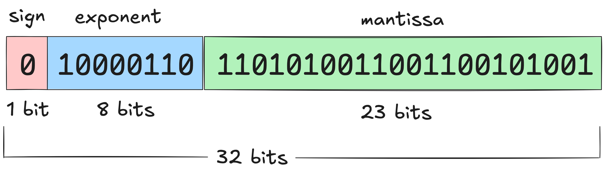

부동소수점 수의 원리는 과학적 표기법을 떠올리면 쉽게 이해할 수 있다. 예를 들어,

-5.734×10⁷의 경우처럼, 먼저 부호가 오고, 그 뒤에 가수와 지수가 따라온다. 이 방식 덕분에 다양한 크기의 숫자를 적응형 정밀도(adaptive precision)로 표현할 수 있다.

기본값은 `float32`이지만, PyTorch에서는 다양한 부동소수점 형식을 사용할 수 있다:

| 포맷          | 전체 비트 수 | 부호 비트 | 지수 비트 | 가수 비트 |
| ------------- | ------------ | --------- | --------- | --------- |
| float32       | 32           | 1         | 8         | 23        |
| float16       | 16           | 1         | 5         | 10        |
| bfloat16      | 16           | 1         | 8         | 7         |
| float8 (e4m3) | 8            | 1         | 4         | 3         |
| float8 (e5m2) | 8            | 1         | 5         | 2         |

(참고: `bfloat16`의 “b”는 어디서 왔을까요? 이 포맷은 Google Brain에서 개발되었기 때문에 “b”는 “brain”을 의미한다.)

전체 비트 수를 줄이는 것은 대가를 수반한다 (공짜 점심은 없습니다). 하지만 어떤 방식으로 그 대가를 치를지는 어느 정도 선택할 수 있다: 가수 비트를 희생하거나, 지수 비트를 희생하는 방식이다.

이러한 이유로 `float8`에는 두 가지 변형이 있으며, 각각 지수 비트 수와 가수 비트 수를 기준으로 `e4m3`, `e5m2`로 명명된다. 이를 통해 가장 적절한 형식을 유연하게 선택할 수 있다.

다음으로 각 포맷이 표현할 수 있는 수의 범위를 살펴보겠다.

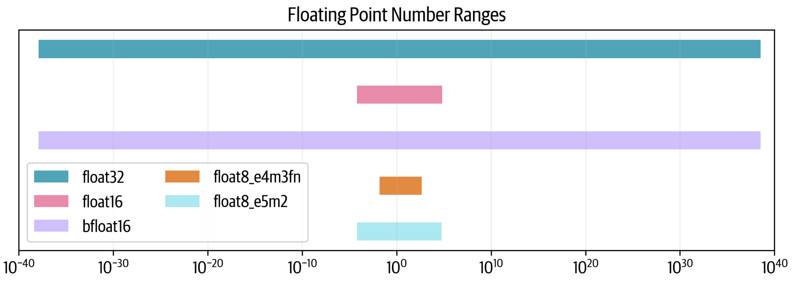

우리는 float32가 80 자릿수 범위를 커버하고 있으며, float16은 많은 범위를 희생하는 반면 bfloat16은 전체 범위를 유지하고 있음을 확인할 수 있다. 두 가지 float8 포맷은 범위를 더욱 줄이는데, e5m2는 float16 수준의 범위를 유지할 수 있는 반면, e4m3는 그보다 훨씬 좁은 범위만을 커버한다.

어떻게 어떤 포맷은 전체 범위를 유지할 수 있고, 다른 포맷은 그렇지 못할까? 이들의 해상도(resolution)를 살펴보면 그 이유를 이해할 수 있다. 1과 2 사이에서 10,000개의 점을 찍고, 각 점을 해당 포맷에서 표현 가능한 가장 가까운 수로 반올림하여 그래프로 나타내 보겠다.

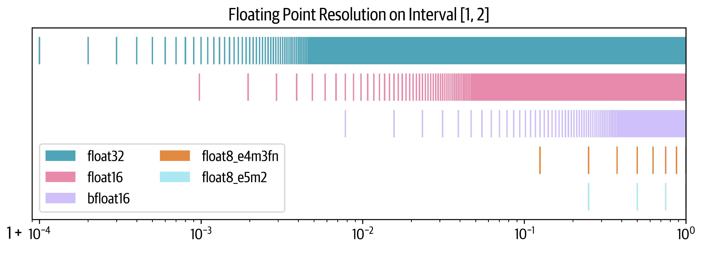

여기서 우리는 bfloat16이 float32의 범위를 유지하고는 있지만 (float16과는 달리), 그 대가로 정밀도를 더 많이 희생하고 있다는 것을 확인할 수 있다. float8의 경우는 상황이 더 심각한데, e4m3는 [1, 2] 구간 내에서 단 7개의 수만 표현할 수 있고, e5m2는 고작 3개의 수만 표현할 수 있다.

포맷의 해상도를 측정하는 일반적인 지표는 엡실론(epsilon)이다. 이는 1.0 다음으로 표현 가능한 첫 번째 수를 의미한다. float32 포맷의 경우, 엡실론은 대략 $10^{-4}$가 Uppor bound이고(실제로는 $1.19^{-7}$) float16의 경우는 약 ~$10^{-3}$, bfloat16의 경우는 이보다 10배 더 크다.

혼합 정밀도 학습(mixed precision training)의 핵심 아이디어는 일부 연산에서 이러한 저정밀 포맷을 사용하면서도, 전체 학습 성능은 고정밀 학습 수준으로 유지하는 것이다. 실제로는 float32를 완전히 버릴 수는 없으며, 일부 연산은 여전히 전체 정밀도로 수행해야 한다.

이제 우리는 16비트 포맷으로 모델을 학습하는 방법을 살펴본 후, 가능하다면 8비트 수준까지 낮출 수 있는지도 함께 살펴보겠다.

**FP16 및 BF16 학습**

모든 텐서와 연산을 단순히 float16으로 바꾸는 것만으로는 작동하지 않으며, 일반적으로 학습 손실이 발산하게 된다. 그러나 원래의 혼합 정밀도 학습 논문[1](https://www.notion.so/The-ultra-scale-playbook-21fd098d95798073bfcaeee8166bd16f?pvs=21)에서는 float32 학습과 동등한 성능을 내기 위한 세 가지 기법을 제시했다:

1. **FP32 가중치 복사본**: FP16 가중치에는 두 가지 문제가 있다. 학습 중 일부 가중치가 매우 작아져 0으로 반올림될 수 있다. 또한, 가중치 자체는 0에 가깝지 않더라도 업데이트 값이 너무 작으면 가중치에 더할 때 크기 차이로 인해 업데이트가 언더플로우할 수 있다. 가중치가 0이 되면, 더 이상 그래디언트 신호가 전달되지 않기 때문에 이후 학습 동안 계속 0으로 남게 된다.
2. **Loss scaling**: 그래디언트도 유사한 문제를 겪습니다. 그래디언트는 보통 1보다 작기 때문에 언더플로우 위험이 있다. 이에 대한 간단하고 효과적인 전략은 백워드 패스를 수행하기 전에 손실 값을 스케일링하고, 백워드 패스 이후 그래디언트를 다시 언스케일링하는 것이다. 이렇게 하면 역전파 동안 언더플로우를 방지할 수 있으며, 이후 그래디언트를 처리하기 전에 언스케일링하므로 (예: 클리핑 전), 이 스케일링은 학습에 영향을 주지 않는다.
3. **누적 연산**: 16비트 정밀도로 평균이나 합산과 같은 산술 연산을 수행할 때 언더플로우 또는 오버플로우가 발생할 수 있다. 이에 대한 해결책은 연산 도중 중간 결과를 FP32로 누적한 후, 최종 결과만 16비트로 캐스팅하는 것이다.

이러한 기법들을 통해, 우리는 낮은 정밀도 연산의 빠른 처리 속도라는 이점을 유지하면서도 안정적인 학습을 구현할 수 있다.

물론, 이제 throughput 극대화에 점점 중독된 호기심 많은 독자라면 다음과 같은 질문을 하게 될 것이다:

16비트 정밀도보다 더 낮은 수준으로, 더 빠르게 갈 수는 없을까?

어쩌면 가능할 수도!

**FP8 사전학습**

통신과 계산을 아무리 완벽하게 겹쳐 수행하더라도, 우리는 결국 하드웨어 자체의 이론적인 FLOPS 한계 — 즉, 각 연산의 개별 효율성 — 에 도달하게 된다. 이 지점에서 수치 정밀도는 매우 중요한 요소가 된다. 예를 들어, NVIDIA의 H100 GPU에서는 FP8 행렬 곱셈(GEMM 연산)의 이론적 FLOPS가 BF16의 두 배에 달하므로, 더 낮은 정밀도를 사용하는 학습은 추가적인 최적화를 위한 매력적인 경로가 된다.

최근 연구들 — FP8-LM[1](https://www.notion.so/The-ultra-scale-playbook-21fd098d95798073bfcaeee8166bd16f?pvs=21), torchao[2](https://www.notion.so/The-ultra-scale-playbook-21fd098d95798073bfcaeee8166bd16f?pvs=21), DeepSeek-V3 — 은 대규모 모델에 대한 FP8 학습의 가능성을 입증하고 있다. 그러나 FP8 사전학습에는 중대한 도전 과제가 있다: **안정성**이다. 낮은 정밀도에서는 수치적인 불안정성으로 인해 손실이 발산되기 쉬우며, 이로 인해 더 높은 정밀도의 학습 성능을 재현하기 어렵다.

또한, 모델 크기가 고정된 상태에서 학습률이 증가하면 불안정성이 높아진다는 것이 알려져 있으므로, FP8 사전학습은 특히 더 까다롭다.

다음은 FP8 학습에서 흔히 나타나는 손실 발산(loss divergence) 곡선의 예시이다:

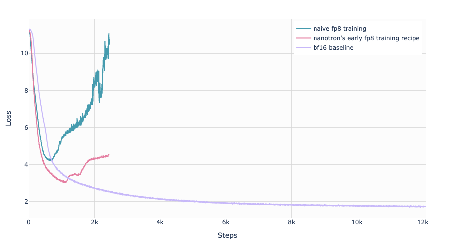

FP8 혼합 정밀도를 사용한 최초의 대규모 학습 성공 사례는 DeepSeek-V3 기술 보고서[1](https://www.notion.so/The-ultra-scale-playbook-21fd098d95798073bfcaeee8166bd16f?pvs=21)에서 공개적으로 보고되었다. 저자들은 순전파(Fprop)의 각 연산뿐만 아니라 활성화 그래디언트(Dgrad)와 가중치 그래디언트(Wgrad)를 포함한 역전파 경로를 세심하게 분석했다. BF16 혼합 정밀도 학습과 유사하게, 일부 집계 연산과 마스터 가중치는 더 높은 정밀도로 유지되며, 실제 연산은 FP8로 수행된다.

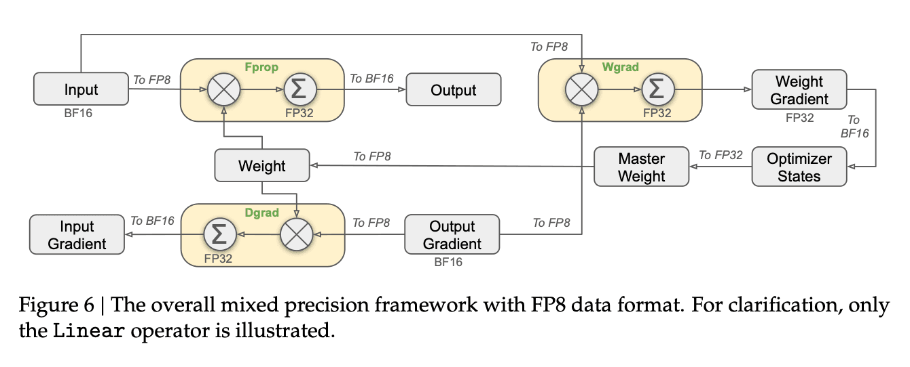

정밀도가 높은 형식(FP32 또는 BF16 등)에서 정밀도가 낮고 표현 범위가 더 작은 형식(FP16 또는 FP8 등)으로 전환하려면, 예를 들어 액티베이션의 절댓값 최댓값을 계산하여 그 범위를 정규화해야 한다. DeepSeek-V3에서는 이에 더해, 입력값/액티베이션은 1×128 타일 단위로, 가중치와 스케일 요소는 128×128 타일 단위로 정규화하는 특수 양자화 방식(quantization scheme)을 도입했다. 이렇게 하면 액티베이션 내 극단값(outlier)의 영향이 정규화 범위에 덜 미치게 된다.

또한 저자들은 메모리 및 통신 비용을 더욱 줄이기 위한 다양한 기법도 제안했으며, 이에 대해서는 기술 보고서의 3.3절에서 자세히 확인할 수 있다.

다음은 FP8 훈련에서 사용되는 몇 가지 주요 접근 방식의 요약이다:

| 접근 방식                      | GEMM 정밀도 | 마스터 가중치 | 누적 그래디언트 | 가중치 | 그래디언트 | 옵티마이저 상태 | 총 메모리                                   |
| ------------------------------ | ----------- | ------------- | --------------- | ------ | ---------- | --------------- | ------------------------------------------- |
| BF16 + FP32 혼합 정밀도 (기본) | BF16        | FP32          | FP32            | BF16   | BF16       | FP32 + FP32     | 4 + 4 + 2 + 2 + 4 + 4 = 20 bytes            |
| FP32 그래디언트 누적 제외      | BF16        | FP32          | n/a             | BF16   | BF16       | FP32 + FP32     | 4 + 2 + 2 + 4 + 4 = 16 bytes (20% 절감)     |
| Transformer engine             | FP8         | n/a           | n/a             | FP32   | FP32       | FP32 + FP32     | 4 + 4 + 4 + 4 = 16 bytes (20% 절감)         |
| FP8-LM의 O3 레벨               | FP8         | FP16          | FP16            | FP8    | FP8        | FP8 + FP16      | 2 + 2 + 1 + 1 + 1 + 2 = 9 bytes (55% 절감)  |
| DeepSeek-V3                    | FP8         | FP32          | FP32            | FP8    | BF16       | BF16 + BF16     | 4 + 4 + 1 + 2 + 2 + 2 = 15 bytes (25% 절감) |
| Nanotron의 FP8                 | FP8         | BF16          | FP32            | FP8    | FP8        | FP8 + FP8       | 2 + 4 + 1 + 1 + 1 + 1 = 10 bytes (50% 절감) |

요약하자면, FP8은 (2025년 초 시점 기준으로) 여전히 실험적인 기술이며, 방법론이 지속적으로 발전하고 있다. 그러나 그 명백한 이점 덕분에 곧 BF16 혼합 정밀도를 대체하여 업계 표준으로 자리 잡을 가능성이 높다. FP8 훈련 기술의 오픈소스 구현을 보고 싶다면, [Nanotron의 PR](https://github.com/HazyResearch/nanotron/pull/306)에서 확인할 수 있다.

더 나아가, 차세대 NVIDIA 칩인 Blackwell은 FP4 훈련을 지원한다고 발표되었다. 이는 훈련 속도를 더욱 높일 수 있지만, 동시에 새로운 훈련 안정성 문제도 수반할 것이다.

이 마지막 섹션은 수십에서 수천 개의 GPU를 사용하는 대규모 모델 훈련에 대한 긴 여정을 마무리하는 부분이다. 이제는 GPU 클러스터를 잠시 쉬게 하고, 우리가 배운 모든 내용을 되돌아볼 시간이다.

## 결론

축하합니다, 독자 여러분. 끝까지 오셨군요! 우리는 정말 긴 여정을 함께했다. 단일 GPU에서 간단한 모델을 훈련하는 방법을 탐색하는 것에서 시작하여, 이제는 Llama-405B나 DeepSeek-V3와 같은 거대한 언어 모델을 수천 개의 GPU 위에서 효율적으로 훈련하는 데 사용되는 복잡한 기법들을 숙달하게 되었다.

지금쯤이면, 여러분은 Llama-3의 4D 병렬화 구성도와 같은 도표도 (상대적으로) 무리 없이 읽을 수 있을 것이다.


수천 개의 GPU 클러스터를 조율하여 LLM을 효율적으로 훈련하는 일은 결코 쉬운 과제가 아니다. 그러나 여러분은 이제 GPU 간 연산 및 통신을 최적화하여 항상 최대 활용도로 작동하게 만드는 방법을 익혔다. 이를 위해서는 모델과 클러스터 크기에 따라 적절한 병렬화 전략을 선택하고, 가능할 때는 통신과 연산을 겹치게 하며, 하드웨어 구조를 고려한 커스텀 커널을 작성하여 GPU에서 연산을 가능한 한 빠르게 수행해야 한다는 사실을 확인했다.

아직 이 지식이 다소 마이너하고, LLM을 사전학습하는 극소수의 사람들에게만 해당된다고 생각할지도 모른다. 역사적으로는 그랬을 수 있지만, 최근 AI 개발자 커뮤니티와 모델 크기가 급격히 확장되면서 추론, 파인튜닝, 훈련을 위한 분산 기법을 사용하는 사람들의 수도 기하급수적으로 증가하고 있다. 이에 따라 분산 훈련 설정은 점점 더 보편적인 것이 되고 있으며, 지금 분산 시스템 전반에 대해 깊이 파고드는 일은 매우 시의적절하다고 할 수 있다.

이것은 여러분만의 긴 학습 여정이었을 뿐만 아니라, 저희에게도 그랬습니다! GPU 클러스터 위에서 수천 개의 벤치마크를 실행하는 일은 예상보다 훨씬 도전적인 일이었으며, 그 과정에서 얻은 몇 가지 배움의 순간들을 여러분과 함께 나누고자 합니다.

## 그 다음은 무엇일까요?

이제 여러분은 분산 학습의 핵심 개념들에 대해 충분히 이해하고 있다. 하지만 우리가 다룬 대부분의 도구와 기법들은 그저 표면을 살짝 긁었을 뿐이다. 특정 주제에 대해 더 깊이 파고드는 방법은 여러 가지가 있지만, 아래와 같은 몇 가지 실천적 단계를 추천드립니다:

- 주요 논문들을 꼼꼼히 읽어보세요. 고전적인 논문이나 최신 논문들 중에서 특히 영향력 있는 것들을 읽는 것이 좋습니다. 이 책 말미의 참고 문헌에는 우리가 알고 있는 가장 중요한 논문, 블로그 포스트, 책들이 폭넓게 정리되어 있다.
- 처음부터 알고리즘을 직접 구현해보세요. 많은 경우 어떤 기법이 진정으로 '이해된다'고 느껴지는 순간은 그것을 직접 구현해 봤을 때이다.
- 널리 사용되는 프레임워크에 기여해 보세요. 버그를 수정하거나, GitHub 이슈에 응답하거나, 새로운 기능을 구현하는 것이 그 분야에 진입하는 가장 좋은 방법입니다!

이 책이 여러분의 분산 학습 여정의 출발점이 되었기를 바랍니다. 여러분이 GPU 클러스터의 웅웅거리는 소리를 들으며 다음 세대의 멋진 모델들을 훈련하길 기대한다. 오픈소스와 오픈사이언스의 힘이 늘 여러분과 함께하길!

---

## 감사의 말

Elie에게 철저한 리뷰와 NotebookLM을 이용한 오디오 컴포넌트 제작에 감사드립니다. 프론트엔드 성능 최적화를 도와준 Hynek에게도 특별한 감사를 전합니다. 또한 허브 관련 문제들을 해결해준 Simon에게도 감사를 표합니다다.

---

## 토론 페이지

이 책의 내용에 대해 토론하거나, 질문을 하거나, 변경을 제안하거나, 그냥 인사하고 싶다면 토론 페이지에서 스레드를 열어주세요.

# **References**

### **Landmark LLM scaling papers**

[**Megatron-LM**](https://arxiv.org/abs/1909.08053)

Introduces tensor parallelism and efficient model parallelism techniques for training large language models.

[**Megatron-Turing NLG 530B**](https://developer.nvidia.com/blog/using-deepspeed-and-megatron-to-train-megatron-turing-nlg-530b-the-worlds-largest-and-most-powerful-generative-language-model/)

Describes the training of a 530B parameter model using a combination of DeepSpeed and Megatron-LM frameworks.

[**PaLM**](https://arxiv.org/abs/2204.02311)

Introduces Google's Pathways Language Model, demonstrating strong performance across hundreds of language tasks and reasoning capabilities.

[**Gemini**](https://arxiv.org/abs/2312.11805)

Presents Google's multimodal model architecture capable of processing text, images, audio, and video inputs.

[**Llama 3**](https://arxiv.org/abs/2407.21783)

Introduces the Llama 3 herd of models.

[**DeepSeek-V3**](https://arxiv.org/abs/2412.19437v1)

DeepSeek's report on the architecture and training of the DeepSeek-V3 model.

### **Training frameworks**

[**Nanotron**](https://github.com/huggingface/nanotron)

Our framework for training large language models, featuring various parallelism strategies.

[**Megatron-LM**](https://github.com/NVIDIA/Megatron-LM)

NVIDIA's framework for training large language models, featuring various parallelism strategies.

[**DeepSpeed**](https://www.deepspeed.ai/)

Microsoft's deep learning optimization library, featuring ZeRO optimization stages and various parallelism strategies.

[**FairScale**](https://github.com/facebookresearch/fairscale/tree/main)

A PyTorch extension library for large-scale training, offering various parallelism and optimization techniques.

[**Colossal-AI**](https://colossalai.org/)

An integrated large-scale model training system with various optimization techniques.

[**`torchtitan`**](https://github.com/pytorch/torchtitan)

A PyTorch native library for large model training.

[**GPT-NeoX**](https://github.com/EleutherAI/gpt-neox)

EleutherAI's framework for training large language models, used to train GPT-NeoX-20B.

[**LitGPT**](https://github.com/Lightning-AI/litgpt)

Lightning AI's implementation of 20+ state-of-the-art open source LLMs, with a focus on reproducibility.

[**OpenDiLoCo**](https://github.com/PrimeIntellect-ai/OpenDiLoCo)

An open source framework for training language models across compute clusters with DiLoCo.

[**torchgpipe**](https://github.com/kakaobrain/torchgpipe)

A GPipe implementation in PyTorch.

[**OSLO**](https://github.com/EleutherAI/oslo)

The Open Source for Large-scale Optimization framework for large-scale modeling.

### **Debugging**

[**Speed profiling**](https://pytorch.org/tutorials/recipes/recipes/profiler_recipe.html)

Official PyTorch tutorial on using the profiler to analyze model performance and bottlenecks.

[**Memory profiling**](https://pytorch.org/blog/understanding-gpu-memory-1/)

Comprehensive guide to understanding and optimizing GPU memory usage in PyTorch.

[**Memory profiling walkthrough on a simple example**](https://huggingface.co/blog/train_memory)

Guide to visualizing and understanding GPU memory in PyTorch.

[**TensorBoard profiler tutorial**](https://pytorch.org/tutorials/intermediate/tensorboard_profiler_tutorial.html)

Guide to using TensorBoard's profiling tools for PyTorch models.

### **Distribution techniques**

[**Data parallelism**](https://siboehm.com/articles/22/data-parallel-training)

Comprehensive explanation of data parallel training in deep learning.

[**ZeRO**](https://arxiv.org/abs/1910.02054)

Introduces the Zero Redundancy Optimizer for training large models with memory optimization.

[**FSDP**](https://arxiv.org/abs/2304.11277)

Fully Sharded Data Parallel training implementation in PyTorch.

[**Tensor and sequence parallelism + selective recomputation**](https://arxiv.org/abs/2205.05198)

Advanced techniques for efficient large-scale model training combining different parallelism strategies.

[**Pipeline parallelism**](https://developer.nvidia.com/blog/scaling-language-model-training-to-a-trillion-parameters-using-megatron/#pipeline_parallelism)

NVIDIA's guide to implementing pipeline parallelism for large model training.

[**Breadth-first pipeline parallelism**](https://arxiv.org/abs/2211.05953)

Includes broad discussions of PP schedules.

[**Ring all-reduce**](https://andrew.gibiansky.com/blog/machine-learning/baidu-allreduce/)

Detailed explanation of the ring all-reduce algorithm used in distributed training.

[**Ring Flash Attention**](https://github.com/zhuzilin/ring-flash-attention)

Implementation of the Ring Attention mechanism combined with FlashAttention for efficient training.

[**Ring Attention tutorial**](https://coconut-mode.com/posts/ring-attention/)

Tutorial explaining the concepts and implementation of Ring Attention.

[**ZeRO and 3D**](https://www.deepspeed.ai/tutorials/large-models-w-deepspeed/#understanding-performance-tradeoff-between-zero-and-3d-parallelism)

DeepSpeed's guide to understanding the trade-offs between ZeRO and 3D parallelism strategies.

[**Mixed precision training**](https://arxiv.org/abs/1710.03740)

Introduces mixed precision training techniques for deep learning models.

[**Visualizing 6D mesh parallelism**](https://main-horse.github.io/posts/visualizing-6d/)

Explains the collective communication involved in a 6D parallel mesh.

### **Hardware**

[**Fire-Flyer, a 10,000 PCI chip cluster**](https://www.arxiv.org/abs/2408.14158)

DeepSeek's report on designing a cluster with 10k PCI GPUs.

[**Meta's 24k H100 clusters**](https://engineering.fb.com/2024/03/12/data-center-engineering/building-metas-genai-infrastructure/)

Meta's detailed overview of their massive AI infrastructure built with NVIDIA H100 GPUs.

[**SemiAnalysis's 100k H100 cluster**](https://www.semianalysis.com/p/100000-h100-clusters-power-network)

Analysis of large-scale H100 GPU clusters and their implications for AI infrastructure.

[**Modal GPU glossary**](https://modal.com/gpu-glossary/readme)

CUDA docs for humans.

### **Others**

[**Stas Bekman's handbook**](https://github.com/stas00/ml-engineering)

Comprehensive handbook covering various aspects of training LLMs.

[**BLOOM training chronicles**](https://github.com/bigscience-workshop/bigscience/blob/master/train/tr11-176B-ml/chronicles.md)

Detailed documentation of the BLOOM model training process and challenges.

[**OPT logbook**](https://github.com/facebookresearch/metaseq/blob/main/projects/OPT/chronicles/OPT175B_Logbook.pdf)

Meta's detailed logbook documenting the training process of the OPT-175B model.

[**Harm's law for training smol models longer**](https://www.harmdevries.com/post/model-size-vs-compute-overhead/)

Investigation of the relationship between model size and training overhead.

[**Harm's blog on long contexts**](https://www.harmdevries.com/post/context-length/)

Investigation of long context training in terms of data and training cost.

[**GPU Mode**](https://www.youtube.com/@GPUMODE/videos)

A GPU reading group and community.

[**EleutherAI YouTube channel**](https://youtube.com/playlist?list=PLvtrkEledFjqOLuDB_9FWL3dgivYqc6-3&si=fKWPotx8BflLAUkf)

ML scalability & performance reading group.

[**Google JAX scaling book**](https://jax-ml.github.io/scaling-book/)

How to scale your model.

[**@fvsmassa & @TimDarcet FSDP**](https://github.com/facebookresearch/capi/blob/main/fsdp.py)

Standalone ~500 LoC FSDP implementation

[**thonking.ai**](https://www.thonking.ai/)

Some of Horace He's blog posts.

[**Aleksa's ELI5: FlashAttention**](https://gordicaleksa.medium.com/eli5-flash-attention-5c44017022ad)

Easy explanation of FlashAttention.

[**TunibAI's 3D parallelism tutorials**](https://github.com/tunib-ai/large-scale-lm-tutorials)

Large-scale language modeling tutorials with PyTorch.
